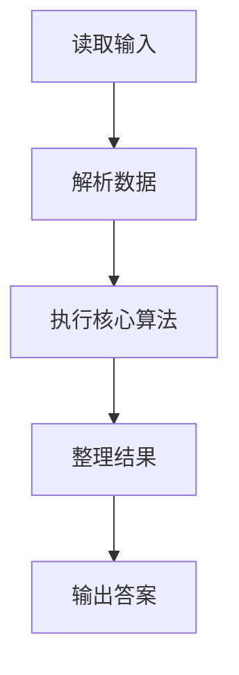
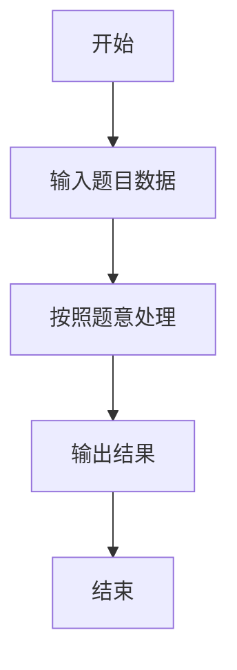

# L2-011 - 玩转二叉树（25 分）

- **时间限制**: 400 ms
- **内存限制**: 65536 KB
- **代码长度限制**: 16 KB

---

## 题目描述


给定一棵二叉树的中序遍历和前序遍历，请你先将树做个镜面反转，再输出反转后的层序遍历的序列。所谓镜面反转，是指将所有非叶结点的左右孩子对换。这里假设键值都是互不相等的正整数。

### 输入格式:

输入第一行给出一个正整数`N`（$$\le$$30），是二叉树中结点的个数。第二行给出其中序遍历序列。第三行给出其前序遍历序列。数字间以空格分隔。

### 输出格式:

在一行中输出该树反转后的层序遍历的序列。数字间以1个空格分隔，行首尾不得有多余空格。

### 输入样例:
```in
7
1 2 3 4 5 6 7
4 1 3 2 6 5 7
```

### 输出样例:
```out
4 6 1 7 5 3 2
```

## 示例

### 示例 1

**输入:**
```
7
1 2 3 4 5 6 7
4 1 3 2 6 5 7
```

**输出:**
```
4 6 1 7 5 3 2
```

### 解题思路

本题的 Ruby 实现采用字符串解析与规则处理。程序先读取题目输入，建立与题意对应的数据结构，按照约束完成核心计算，并按规定格式输出结果。具体实现以同目录的 main.rb 为准。

### 代码流程说明

1. 读取并解析标准输入，转换为题目所需的数据结构。
2. 按题意执行核心算法，维护中间状态并处理边界情况。
3. 整理计算结果，按照输出格式生成答案。

### 代码实现

完整实现位于同目录的 [main.rb](./main.rb)，以下代码与该入口文件保持一致。

```ruby
# frozen_string_literal: true
require_relative '../gplt_runtime'
v = py_tokens.map(&:to_i)
n = v.shift
ino = v.shift(n)
pre = v.shift(n)
pos = {}
ino.each_with_index { |x, i| pos[x] = i }
build = lambda do |pl, pr, il, ir|
  next nil if pl >= pr
  root = pre[pl]
  z = pos[root]
  [root, build.call(pl + 1, pl + 1 + z - il, il, z), build.call(pl + 1 + z - il, pr, z + 1, ir)]
end
root = build.call(0, n, 0, n)
mirror = lambda do |node|
  next unless node
  node[1], node[2] = node[2], node[1]
  mirror.call(node[1]); mirror.call(node[2])
end
mirror.call(root)
queue = [root]
out = []
until queue.empty?
  node = queue.shift
  out << node[0]
  queue.concat(node[1, 2].compact)
end
py_print(out.join(' '))
```

### 代码流程图



### 解题流程图


