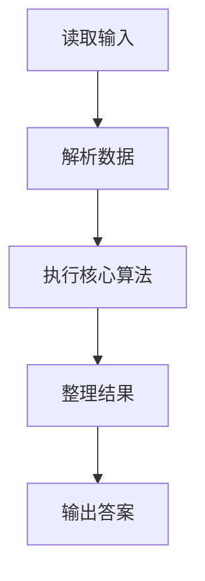
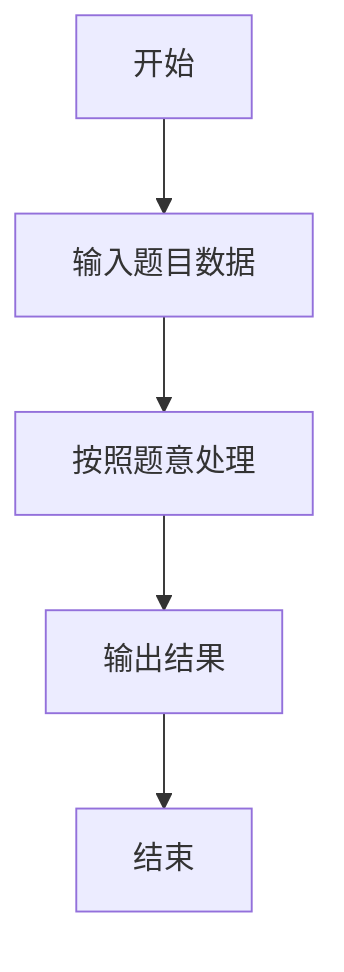

# L2-012 - 关于堆的判断（25 分）

- **时间限制**: 400 ms
- **内存限制**: 65536 KB
- **代码长度限制**: 16 KB

---

## 题目描述


将一系列给定数字顺序插入一个初始为空的小顶堆`H[]`。随后判断一系列相关命题是否为真。命题分下列几种：

- `x is the root`：`x`是根结点；
- `x and y are siblings`：`x`和`y`是兄弟结点；
- `x is the parent of y`：`x`是`y`的父结点；
- `x is a child of y`：`x`是`y`的一个子结点。

### 输入格式:

每组测试第1行包含2个正整数`N`（$$\le$$ 1000）和`M`（$$\le$$ 20），分别是插入元素的个数、以及需要判断的命题数。下一行给出区间$$[-10000, 10000]$$内的`N`个要被插入一个初始为空的小顶堆的整数。之后`M`行，每行给出一个命题。题目保证命题中的结点键值都是存在的。

### 输出格式:

对输入的每个命题，如果其为真，则在一行中输出`T`，否则输出`F`。

### 输入样例:
```in
5 4
46 23 26 24 10
24 is the root
26 and 23 are siblings
46 is the parent of 23
23 is a child of 10
```

### 输出样例:
```out
F
T
F
T
```

## 示例

### 示例 1

**输入:**
```
5 4
46 23 26 24 10
24 is the root
26 and 23 are siblings
46 is the parent of 23
23 is a child of 10
```

**输出:**
```
F
T
F
T
```

### 解题思路

本题的 Ruby 实现采用并查集或连通性维护。程序先读取题目输入，建立与题意对应的数据结构，按照约束完成核心计算，并按规定格式输出结果。具体实现以同目录的 main.rb 为准。

### 代码流程说明

1. 读取并解析标准输入，转换为题目所需的数据结构。
2. 按题意执行核心算法，维护中间状态并处理边界情况。
3. 整理计算结果，按照输出格式生成答案。

### 代码实现

完整实现位于同目录的 [main.rb](./L2-012_关于堆的判断/main.rb)，以下代码与该入口文件保持一致。

```ruby
# frozen_string_literal: true
require_relative '../gplt_runtime'
lines = py_lines
n, q = lines.shift.split.map(&:to_i)
heap = []
numbers = lines.shift.split.map(&:to_i)
n.times do |idx|
  heap << numbers[idx]
  i = heap.length - 1
  while i.positive?
    parent = (i - 1) / 2
    break if heap[parent] <= heap[i]
    heap[parent], heap[i] = heap[i], heap[parent]
    i = parent
  end
end
pos = {}
heap.each_with_index { |value, i| pos[value] ||= i }
answers = lines.filter_map do |line|
  next if line.strip.empty?
  nums = line.scan(/-?\d+/).map(&:to_i)
  next if nums.empty?
  if line.include?('root')
    pos[nums[0]] == 0 ? 'T' : 'F'
  elsif line.include?('siblings')
    a = pos[nums[0]]; b = pos[nums[1]]
    a && b && a.positive? && b.positive? && (a - 1) / 2 == (b - 1) / 2 ? 'T' : 'F'
  elsif line.include?('parent')
    a = pos[nums[0]]; b = pos[nums[1]]
    a && b && (b - 1) / 2 == a ? 'T' : 'F'
  else
    a = pos[nums[0]]; b = pos[nums[1]]
    a && b && (a - 1) / 2 == b ? 'T' : 'F'
  end
end
py_print(answers.first(q).join("\n"))
```

### 代码流程图



### 解题流程图


