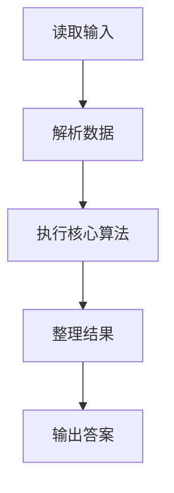
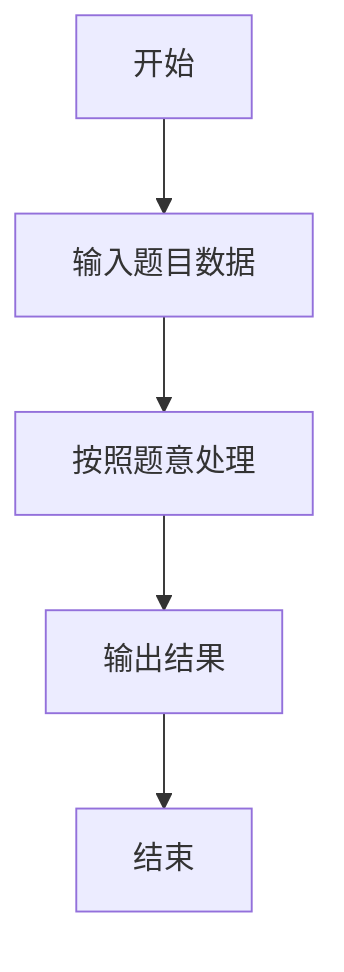

# L2-013 - 红色警报（25 分）

- **时间限制**: 400 ms
- **内存限制**: 65536 KB
- **代码长度限制**: 16 KB

---

## 题目描述


战争中保持各个城市间的连通性非常重要。本题要求你编写一个报警程序，当失去一个城市导致国家被分裂为多个无法连通的区域时，就发出红色警报。注意：若该国本来就不完全连通，是分裂的k个区域，而失去一个城市并不改变其他城市之间的连通性，则不要发出警报。

### 输入格式:

输入在第一行给出两个整数`N`（0 $$<$$ `N` $$\le$$ 500）和`M`（$$\le$$ 5000），分别为城市个数（于是默认城市从0到`N`-1编号）和连接两城市的通路条数。随后`M`行，每行给出一条通路所连接的两个城市的编号，其间以1个空格分隔。在城市信息之后给出被攻占的信息，即一个正整数`K`和随后的`K`个被攻占的城市的编号。

注意：输入保证给出的被攻占的城市编号都是合法的且无重复，但并不保证给出的通路没有重复。

### 输出格式:

对每个被攻占的城市，如果它会改变整个国家的连通性，则输出`Red Alert: City k is lost!`，其中`k`是该城市的编号；否则只输出`City k is lost.`即可。如果该国失去了最后一个城市，则增加一行输出`Game Over.`。

### 输入样例:
```in
5 4
0 1
1 3
3 0
0 4
5
1 2 0 4 3
```

### 输出样例:
```out
City 1 is lost.
City 2 is lost.
Red Alert: City 0 is lost!
City 4 is lost.
City 3 is lost.
Game Over.
```

## 示例

### 示例 1

**输入:**
```
5 4
0 1
1 3
3 0
0 4
5
1 2 0 4 3
```

**输出:**
```
City 1 is lost.
City 2 is lost.
Red Alert: City 0 is lost!
City 4 is lost.
City 3 is lost.
Game Over.
```

### 解题思路

本题的 Ruby 实现采用字符串解析与规则处理。程序先读取题目输入，建立与题意对应的数据结构，按照约束完成核心计算，并按规定格式输出结果。具体实现以同目录的 main.rb 为准。

### 代码流程说明

1. 读取并解析标准输入，转换为题目所需的数据结构。
2. 按题意执行核心算法，维护中间状态并处理边界情况。
3. 整理计算结果，按照输出格式生成答案。

### 代码实现

完整实现位于同目录的 [main.rb](./L2-013_红色警报/main.rb)，以下代码与该入口文件保持一致。

```ruby
# frozen_string_literal: true
require_relative '../gplt_runtime'
def entry
  v = (py_map(->(x) { py_int(x) }, py_tokens).to_a)
  n, m = py_slice(v, nil, 2, nil)
  k = 2
  g = py_iterable(py_range(n)).flat_map { |_|; [[]] }
  for _ in py_range(m)
    a, b = py_slice(v, k, (k + 2), nil)
    k += 2
    g[a].append(b)
    g[b].append(a)
  end
  q = v[k]
  attacks = py_slice(v, (k + 1), ((k + 1) + q), nil)
  lost = Set.new([])
  out = []
  comps = lambda do ||
    seen = Set.new([])
    c = 0
    for s in py_range(n)
      if ((py_in(s, lost)) || (py_in(s, seen)))
        next
      end
      c += 1
      st = [s]
      seen.add(s)
      while py_truth(st)
        for x in g[st.pop()]
          if ((!py_in(x, lost)) && (!py_in(x, seen)))
            seen.add(x)
            st.append(x)
          end
        end
      end
    end
    return c
  end
  last = comps.call()
  for x in attacks
    lost.add(x)
    now = comps.call()
    out.append((((now > last)) ? "Red Alert: City %s is lost!" % [x] : "City %s is lost." % [x]))
    last = now
    if ((py_len(lost) == n))
      out.append("Game Over.")
    end
  end
  py_print(out.join("\n"), sep: " ", ending: "\n")
end
entry
```

### 代码流程图



### 解题流程图


