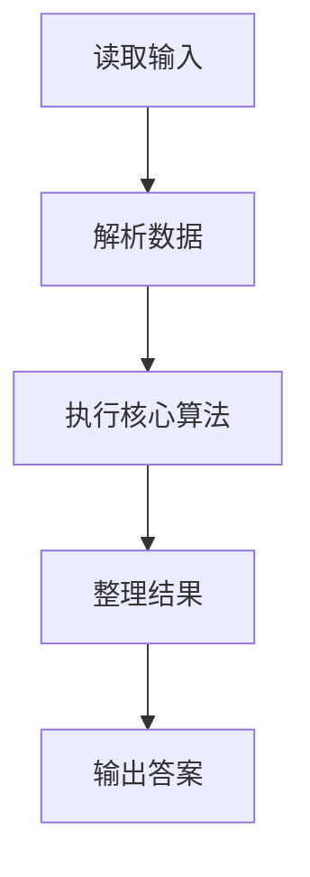
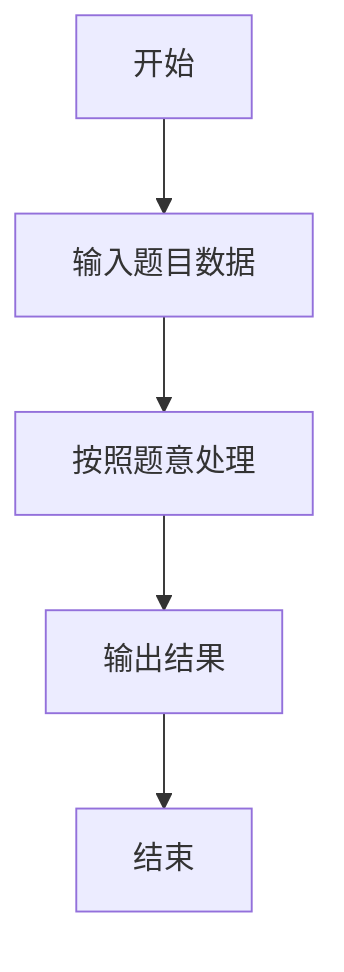

# L2-016 - 愿天下有情人都是失散多年的兄妹（25 分）

- **时间限制**: 200 ms
- **内存限制**: 65536 KB
- **代码长度限制**: 16 KB

---

## 题目描述


呵呵。大家都知道五服以内不得通婚，即两个人最近的共同祖先如果在五代以内（即本人、父母、祖父母、曾祖父母、高祖父母）则不可通婚。本题就请你帮助一对有情人判断一下，他们究竟是否可以成婚？

### 输入格式:

输入第一行给出一个正整数`N`（2 $$\le$$ `N` $$\le 10^4$$），随后`N`行，每行按以下格式给出一个人的信息：

```
本人ID 性别 父亲ID 母亲ID
```

其中`ID`是5位数字，每人不同；性别`M`代表男性、`F`代表女性。如果某人的父亲或母亲已经不可考，则相应的`ID`位置上标记为`-1`。

接下来给出一个正整数`K`，随后`K`行，每行给出一对有情人的`ID`，其间以空格分隔。

注意：题目保证两个人是同辈，每人只有一个性别，并且血缘关系网中没有乱伦或隔辈成婚的情况。

### 输出格式:

对每一对有情人，判断他们的关系是否可以通婚：如果两人是同性，输出`Never Mind`；如果是异性并且关系出了五服，输出`Yes`；如果异性关系未出五服，输出`No`。

### 输入样例:
```in
24
00001 M 01111 -1
00002 F 02222 03333
00003 M 02222 03333
00004 F 04444 03333
00005 M 04444 05555
00006 F 04444 05555
00007 F 06666 07777
00008 M 06666 07777
00009 M 00001 00002
00010 M 00003 00006
00011 F 00005 00007
00012 F 00008 08888
00013 F 00009 00011
00014 M 00010 09999
00015 M 00010 09999
00016 M 10000 00012
00017 F -1 00012
00018 F 11000 00013
00019 F 11100 00018
00020 F 00015 11110
00021 M 11100 00020
00022 M 00016 -1
00023 M 10012 00017
00024 M 00022 10013
9
00021 00024
00019 00024
00011 00012
00022 00018
00001 00004
00013 00016
00017 00015
00019 00021
00010 00011
```

### 输出样例:
```out
Never Mind
Yes
Never Mind
No
Yes
No
Yes
No
No
```

## 示例

### 示例 1

**输入:**
```
24
00001 M 01111 -1
00002 F 02222 03333
00003 M 02222 03333
00004 F 04444 03333
00005 M 04444 05555
00006 F 04444 05555
00007 F 06666 07777
00008 M 06666 07777
00009 M 00001 00002
00010 M 00003 00006
00011 F 00005 00007
00012 F 00008 08888
00013 F 00009 00011
00014 M 00010 09999
00015 M 00010 09999
00016 M 10000 00012
00017 F -1 00012
00018 F 11000 00013
00019 F 11100 00018
00020 F 00015 11110
00021 M 11100 00020
00022 M 00016 -1
00023 M 10012 00017
00024 M 00022 10013
9
00021 00024
00019 00024
00011 00012
00022 00018
00001 00004
00013 00016
00017 00015
00019 00021
00010 00011
```

**输出:**
```
Never Mind
Yes
Never Mind
No
Yes
No
Yes
No
No
```

### 解题思路

本题的 Ruby 实现采用字符串解析与规则处理。程序先读取题目输入，建立与题意对应的数据结构，按照约束完成核心计算，并按规定格式输出结果。具体实现以同目录的 main.rb 为准。

### 代码流程说明

1. 读取并解析标准输入，转换为题目所需的数据结构。
2. 按题意执行核心算法，维护中间状态并处理边界情况。
3. 整理计算结果，按照输出格式生成答案。

### 代码实现

完整实现位于同目录的 [main.rb](./main.rb)，以下代码与该入口文件保持一致。

```ruby
# frozen_string_literal: true
require_relative '../gplt_runtime'
v = py_tokens
n = v.shift.to_i
people = {}
n.times do
  id, gender, father, mother = v.shift(4)
  people[id] = [gender, father, mother]
end
ancestors = lambda do |start|
  seen = { start => 0 }
  queue = [[start, 0]]
  until queue.empty?
    id, depth = queue.shift
    next if depth >= 4
    info = people[id]
    next unless info
    [info[1], info[2]].each do |p|
      next if p == '-1' || seen.key?(p)
      seen[p] = depth + 1
      queue << [p, depth + 1]
    end
  end
  seen.keys
end
q = v.shift.to_i
answers = q.times.map do
  a, b = v.shift(2)
  if !people.key?(a) || !people.key?(b) || people[a][0] == people[b][0]
    'Never Mind'
  else
    (ancestors.call(a) & ancestors.call(b)).empty? ? 'Yes' : 'No'
  end
end
py_print(answers.join("\n"))
```

### 代码流程图



### 解题流程图


