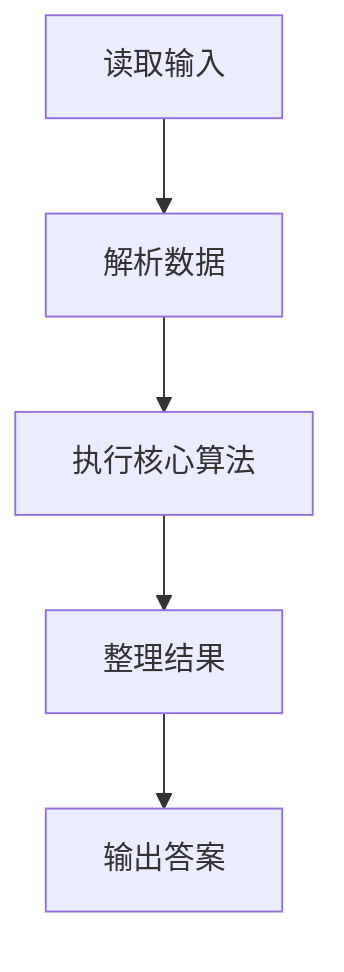
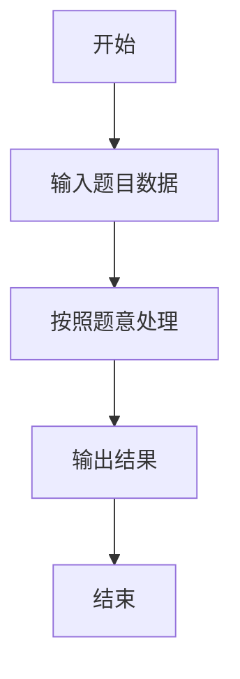

# L2-017 - 人以群分（25 分）

- **时间限制**: 150 ms
- **内存限制**: 65536 KB
- **代码长度限制**: 16 KB

---

## 题目描述


社交网络中我们给每个人定义了一个“活跃度”，现希望根据这个指标把人群分为两大类，即外向型（outgoing，即活跃度高的）和内向型（introverted，即活跃度低的）。要求两类人群的规模尽可能接近，而他们的总活跃度差距尽可能拉开。

### 输入格式:

输入第一行给出一个正整数$$N$$（$$2 \le N \le 10^5$$）。随后一行给出$$N$$个正整数，分别是每个人的活跃度，其间以空格分隔。题目保证这些数字以及它们的和都不会超过$$2^{31}$$。

### 输出格式:

按下列格式输出：

```
Outgoing #: N1
Introverted #: N2
Diff = N3
```

其中`N1`是外向型人的个数；`N2`是内向型人的个数；`N3`是两群人总活跃度之差的绝对值。

### 输入样例 1：
```in
10
23 8 10 99 46 2333 46 1 666 555
```

### 输出样例 1：
```out
Outgoing #: 5
Introverted #: 5
Diff = 3611
```

### 输入样例 2：
```in
13
110 79 218 69 3721 100 29 135 2 6 13 5188 85
```

### 输出样例 2：
```out
Outgoing #: 7
Introverted #: 6
Diff = 9359
```

## 示例

### 示例 1

**输入:**
```
10
23 8 10 99 46 2333 46 1 666 555
```

**输出:**
```
Outgoing #: 5
Introverted #: 5
Diff = 3611
```

### 示例 2

**输入:**
```
13
110 79 218 69 3721 100 29 135 2 6 13 5188 85
```

**输出:**
```
Outgoing #: 7
Introverted #: 6
Diff = 9359
```

### 解题思路

本题的 Ruby 实现采用排序、贪心与顺序模拟。程序先读取题目输入，建立与题意对应的数据结构，按照约束完成核心计算，并按规定格式输出结果。具体实现以同目录的 main.rb 为准。

### 代码流程说明

1. 读取并解析标准输入，转换为题目所需的数据结构。
2. 按题意执行核心算法，维护中间状态并处理边界情况。
3. 整理计算结果，按照输出格式生成答案。

### 代码实现

完整实现位于同目录的 [main.rb](./main.rb)，以下代码与该入口文件保持一致。

```ruby
# frozen_string_literal: true
require_relative '../gplt_runtime'
def entry
  v = (py_map(->(x) { py_int(x) }, py_tokens).to_a)
  n = v[0]
  a = py_sorted(py_slice(v, 1, (1 + n), nil))
  mid = (n.div(2))
  py_print("Outgoing #: %s" % [(n - mid)], sep: " ", ending: "\n")
  py_print("Introverted #: %s" % [mid], sep: " ", ending: "\n")
  py_print("Diff = %s" % [(py_sum(py_slice(a, mid, nil, nil)) - py_sum(py_slice(a, nil, mid, nil)))], sep: " ", ending: "\n")
end
entry
```

### 代码流程图



### 解题流程图


