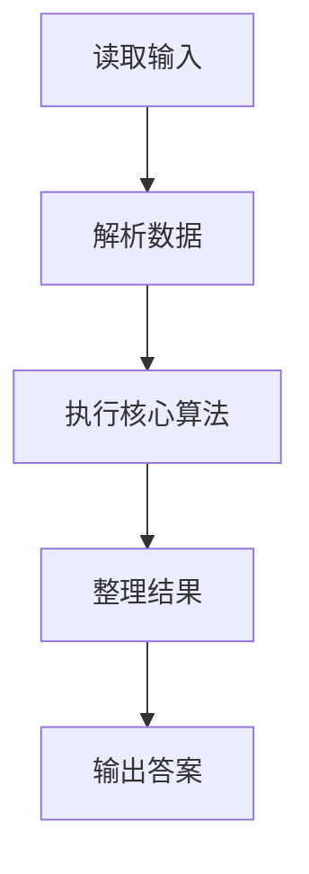
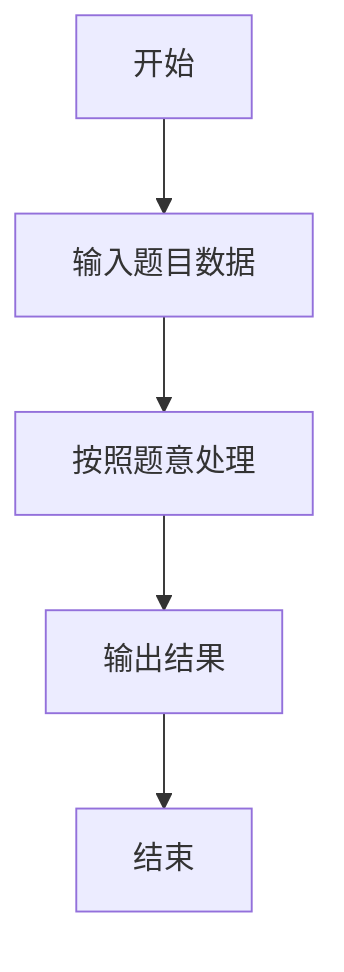

# L2-018 - 多项式A除以B（25 分）

- **时间限制**: 400 ms
- **内存限制**: 65536 KB
- **代码长度限制**: 16 KB

---

## 题目描述


这仍然是一道关于A/B的题，只不过A和B都换成了多项式。你需要计算两个多项式相除的商Q和余R，其中R的阶数必须小于B的阶数。

### 输入格式:

输入分两行，每行给出一个非零多项式，先给出A，再给出B。每行的格式如下：

```
N e[1] c[1] ... e[N] c[N]
```

其中`N`是该多项式非零项的个数，`e[i]`是第`i`个非零项的指数，`c[i]`是第`i`个非零项的系数。各项按照指数递减的顺序给出，保证所有指数是各不相同的非负整数，所有系数是非零整数，所有整数在整型范围内。

### 输出格式:

分两行先后输出商和余，输出格式与输入格式相同，输出的系数保留小数点后1位。同行数字间以1个空格分隔，行首尾不得有多余空格。注意：零多项式是一个特殊多项式，对应输出为`0 0 0.0`。但非零多项式不能输出零系数（包括舍入后为0.0）的项。在样例中，余多项式其实有常数项`-1/27`，但因其舍入后为0.0，故不输出。

### 输入样例:
```in
4 4 1 2 -3 1 -1 0 -1
3 2 3 1 -2 0 1
```

### 输出样例:
```out
3 2 0.3 1 0.2 0 -1.0
1 1 -3.1
```

## 示例

### 示例 1

**输入:**
```
4 4 1 2 -3 1 -1 0 -1
3 2 3 1 -2 0 1
```

**输出:**
```
3 2 0.3 1 0.2 0 -1.0
1 1 -3.1
```

### 解题思路

本题的 Ruby 实现采用排序、贪心与顺序模拟。程序先读取题目输入，建立与题意对应的数据结构，按照约束完成核心计算，并按规定格式输出结果。具体实现以同目录的 main.rb 为准。

### 代码流程说明

1. 读取并解析标准输入，转换为题目所需的数据结构。
2. 按题意执行核心算法，维护中间状态并处理边界情况。
3. 整理计算结果，按照输出格式生成答案。

### 代码实现

完整实现位于同目录的 [main.rb](./main.rb)，以下代码与该入口文件保持一致。

```ruby
# frozen_string_literal: true
require_relative '../gplt_runtime'
v = py_tokens.map(&:to_f)
k = 0
na = v[k].to_i; k += 1
a = {}
na.times do
  exponent = v[k].to_i
  coefficient = v[k + 1]
  k += 2
  a[exponent] = coefficient
end
nb = v[k].to_i; k += 1
b = {}
nb.times do
  exponent = v[k].to_i
  coefficient = v[k + 1]
  k += 2
  b[exponent] = coefficient
end
quotient = {}
eps = 1e-8
until a.empty? || b.empty? || a.keys.max < b.keys.max
  ea = a.keys.max
  eb = b.keys.max
  factor = a[ea] / b[eb]
  shift = ea - eb
  quotient[shift] = quotient.fetch(shift, 0.0) + factor
  b.each { |e, c| a[e + shift] = a.fetch(e + shift, 0.0) - factor * c }
  a.delete_if { |_, c| c.abs < eps }
end
format_poly = lambda do |poly|
  entries = poly.select { |_, c| c.abs >= 0.05 }.sort_by { |e, _| -e }
  ([entries.length] + entries.flat_map { |e, c| [e, format('%.1f', c)] }).join(' ')
end
py_print(format_poly.call(quotient) + "\n" + format_poly.call(a))
```

### 代码流程图



### 解题流程图


