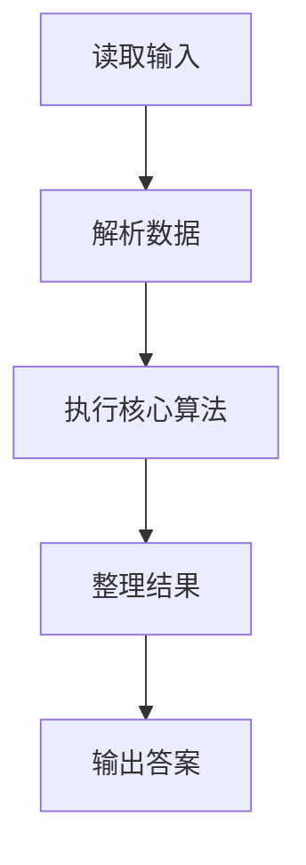
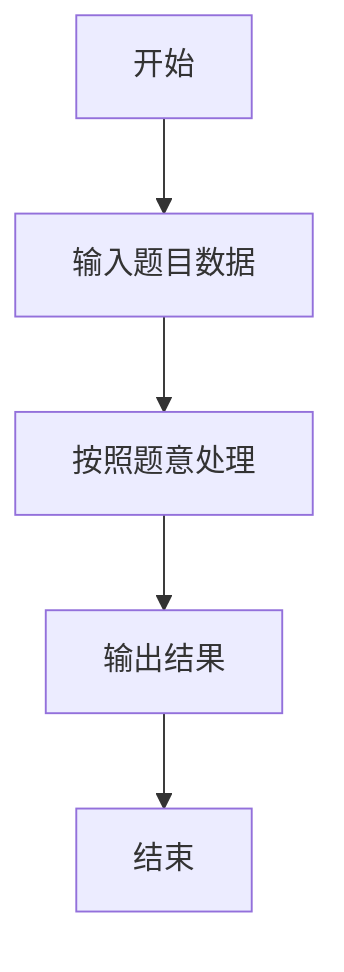

# L2-019 - 悄悄关注（25 分）

- **时间限制**: 150 ms
- **内存限制**: 65536 KB
- **代码长度限制**: 16 KB

---

## 题目描述


新浪微博上有个“悄悄关注”，一个用户悄悄关注的人，不出现在这个用户的关注列表上，但系统会推送其悄悄关注的人发表的微博给该用户。现在我们来做一回网络侦探，根据某人的关注列表和其对其他用户的点赞情况，扒出有可能被其悄悄关注的人。

### 输入格式:

输入首先在第一行给出某用户的关注列表，格式如下：

```
人数N 用户1 用户2 …… 用户N
```

其中`N`是不超过5000的正整数，每个`用户i`（`i`=1, ..., `N`）是被其关注的用户的ID，是长度为4位的由数字和英文字母组成的字符串，各项间以空格分隔。

之后给出该用户点赞的信息：首先给出一个不超过10000的正整数`M`，随后`M`行，每行给出一个被其点赞的用户ID和对该用户的点赞次数（不超过1000），以空格分隔。注意：用户ID是一个用户的唯一身份标识。题目保证在关注列表中没有重复用户，在点赞信息中也没有重复用户。

### 输出格式:

我们认为被该用户点赞次数大于其点赞平均数、且不在其关注列表上的人，很可能是其悄悄关注的人。根据这个假设，请你按用户ID字母序的升序输出可能是其悄悄关注的人，每行1个ID。如果其实并没有这样的人，则输出“Bing Mei You”。

### 输入样例 1：
```in
10 GAO3 Magi Zha1 Sen1 Quan FaMK LSum Eins FatM LLao
8
Magi 50
Pota 30
LLao 3
Ammy 48
Dave 15
GAO3 31
Zoro 1
Cath 60
```

### 输出样例 1：
```out
Ammy
Cath
Pota
```

### 输入样例 2：
```in
11 GAO3 Magi Zha1 Sen1 Quan FaMK LSum Eins FatM LLao Pota
7
Magi 50
Pota 30
LLao 48
Ammy 3
Dave 15
GAO3 31
Zoro 29
```

### 输出样例 2：
```out
Bing Mei You
```

## 示例

### 示例 1

**输入:**
```
10 GAO3 Magi Zha1 Sen1 Quan FaMK LSum Eins FatM LLao
8
Magi 50
Pota 30
LLao 3
Ammy 48
Dave 15
GAO3 31
Zoro 1
Cath 60
```

**输出:**
```
Ammy
Cath
Pota
```

### 示例 2

**输入:**
```
11 GAO3 Magi Zha1 Sen1 Quan FaMK LSum Eins FatM LLao Pota
7
Magi 50
Pota 30
LLao 48
Ammy 3
Dave 15
GAO3 31
Zoro 29
```

**输出:**
```
Bing Mei You
```

### 解题思路

本题的 Ruby 实现采用排序、贪心与顺序模拟。程序先读取题目输入，建立与题意对应的数据结构，按照约束完成核心计算，并按规定格式输出结果。具体实现以同目录的 main.rb 为准。

### 代码流程说明

1. 读取并解析标准输入，转换为题目所需的数据结构。
2. 按题意执行核心算法，维护中间状态并处理边界情况。
3. 整理计算结果，按照输出格式生成答案。

### 代码实现

完整实现位于同目录的 [main.rb](./L2-019_悄悄关注/main.rb)，以下代码与该入口文件保持一致。

```ruby
# frozen_string_literal: true
require_relative '../gplt_runtime'
def entry
  v = py_input_data.split
  k = 0
  n = py_int(v[k])
  k += 1
  follow = Set.new(py_slice(v, k, (k + n), nil))
  k += n
  m = py_int(v[k])
  k += 1
  a = []
  total = 0
  for _ in py_range(m)
    x = v[k]
    y = py_int(v[(k + 1)])
    k += 2
    a.append([x, y])
    total += y
  end
  avg = (py_truth(m) ? py_div(total, m) : 0)
  out = py_sorted(py_iterable(a).flat_map { |__item_0|; x, y = __item_0; next [] unless py_truth((((y > avg)) && (!py_in(x, follow)))); [x] })
  py_print((py_truth(out) ? out.join("\n") : "Bing Mei You"), sep: " ", ending: "\n")
end
entry
```

### 代码流程图



### 解题流程图


