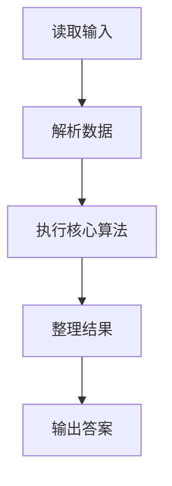
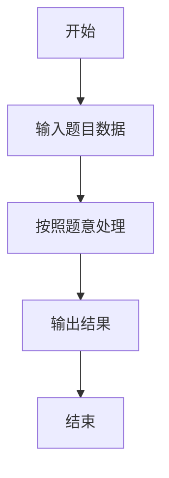

# L2-022 - 重排链表（25 分）

- **时间限制**: 500 ms
- **内存限制**: 65536 KB
- **代码长度限制**: 16 KB

---

## 题目描述


给定一个单链表 $$L_1$$→$$L_2$$→$$\cdots$$→$$L_{n-1}$$→$$L_n$$，请编写程序将链表重新排列为 $$L_n$$→$$L_1$$→$$L_{n-1}$$→$$L_2$$→$$\cdots$$。例如：给定$$L$$为1→2→3→4→5→6，则输出应该为6→1→5→2→4→3。

### 输入格式:

每个输入包含1个测试用例。每个测试用例第1行给出第1个结点的地址和结点总个数，即正整数$$N$$ ($$\le 10^5$$)。结点的地址是5位非负整数，NULL地址用$$-1$$表示。

接下来有$$N$$行，每行格式为：

```
Address Data Next
```

其中`Address`是结点地址；`Data`是该结点保存的数据，为不超过$$10^5$$的正整数；`Next`是下一结点的地址。题目保证给出的链表上至少有两个结点。

### 输出格式:

对每个测试用例，顺序输出重排后的结果链表，其上每个结点占一行，格式与输入相同。

### 输入样例:
```in
00100 6
00000 4 99999
00100 1 12309
68237 6 -1
33218 3 00000
99999 5 68237
12309 2 33218
```

### 输出样例:
```out
68237 6 00100
00100 1 99999
99999 5 12309
12309 2 00000
00000 4 33218
33218 3 -1
```

## 示例

### 示例 1

**输入:**
```
00100 6
00000 4 99999
00100 1 12309
68237 6 -1
33218 3 00000
99999 5 68237
12309 2 33218
```

**输出:**
```
68237 6 00100
00100 1 99999
99999 5 12309
12309 2 00000
00000 4 33218
33218 3 -1
```

### 解题思路

本题的 Ruby 实现采用字符串解析与规则处理。程序先读取题目输入，建立与题意对应的数据结构，按照约束完成核心计算，并按规定格式输出结果。具体实现以同目录的 main.rb 为准。

### 代码流程说明

1. 读取并解析标准输入，转换为题目所需的数据结构。
2. 按题意执行核心算法，维护中间状态并处理边界情况。
3. 整理计算结果，按照输出格式生成答案。

### 代码实现

完整实现位于同目录的 [main.rb](./main.rb)，以下代码与该入口文件保持一致。

```ruby
# frozen_string_literal: true
require_relative '../gplt_runtime'
def entry
  v = py_tokens
  head = py_int(v[0])
  n = py_int(v[1])
  d = {}
  u = {}
  for i in py_range(n)
    a = py_int(v[(2 + (3 * i))])
    d[a] = py_int(v[(3 + (3 * i))])
    u[a] = py_int(v[(4 + (3 * i))])
  end
  s = []
  seen = Set.new([])
  while (((head != (-1))) && (py_in(head, d)) && (!py_in(head, seen)))
    s.append(head)
    seen.add(head)
    head = u[head]
  end
  a = []
  l = 0
  r = (py_len(s) - 1)
  while ((l < r))
    a += [s[r], s[l]]
    l += 1
    r -= 1
  end
  if ((l == r))
    a.append(s[l])
  end
  py_print(py_iterable(py_enumerate(a)).flat_map { |__item_0|; i, x = __item_0; [("%05d %s " % [x, d[x]] + ((((i + 1) < py_len(a))) ? "%05d" % [a[(i + 1)]] : "-1"))] }.join("\n"), sep: " ", ending: "\n")
end
entry
```

### 代码流程图



### 解题流程图


