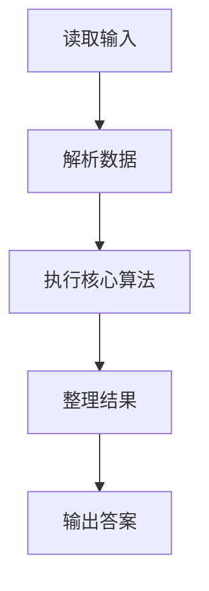
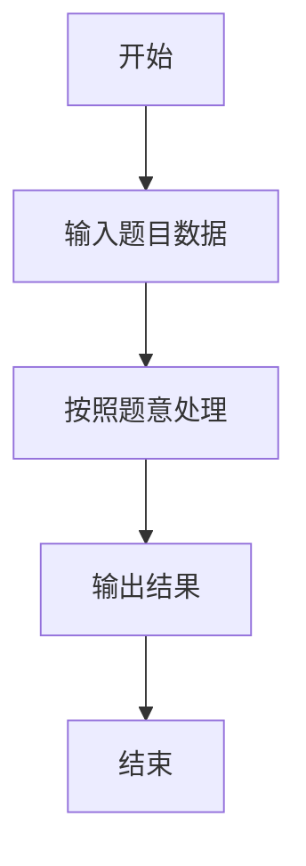

# L2-023 - 图着色问题（25 分）

- **时间限制**: 300 ms
- **内存限制**: 65536 KB
- **代码长度限制**: 16 KB

---

## 题目描述


图着色问题是一个著名的NP完全问题。给定无向图$$G = (V, E)$$，问可否用$$K$$种颜色为$$V$$中的每一个顶点分配一种颜色，使得不会有两个相邻顶点具有同一种颜色？

但本题并不是要你解决这个着色问题，而是对给定的一种颜色分配，请你判断这是否是图着色问题的一个解。

### 输入格式:

输入在第一行给出3个整数$$V$$（$$0 < V \le 500$$）、$$E$$（$$\ge 0$$）和$$K$$（$$0 < K \le V$$），分别是无向图的顶点数、边数、以及颜色数。顶点和颜色都从1到$$V$$编号。随后$$E$$行，每行给出一条边的两个端点的编号。在图的信息给出之后，给出了一个正整数$$N$$（$$\le 20$$），是待检查的颜色分配方案的个数。随后$$N$$行，每行顺次给出$$V$$个顶点的颜色（第$$i$$个数字表示第$$i$$个顶点的颜色），数字间以空格分隔。题目保证给定的无向图是合法的（即不存在自回路和重边）。

### 输出格式:

对每种颜色分配方案，如果是图着色问题的一个解则输出`Yes`，否则输出`No`，每句占一行。

### 输入样例:
```in
6 8 3
2 1
1 3
4 6
2 5
2 4
5 4
5 6
3 6
4
1 2 3 3 1 2
4 5 6 6 4 5
1 2 3 4 5 6
2 3 4 2 3 4
```

### 输出样例:
```out
Yes
Yes
No
No
```

## 示例

### 示例 1

**输入:**
```
6 8 3
2 1
1 3
4 6
2 5
2 4
5 4
5 6
3 6
4
1 2 3 3 1 2
4 5 6 6 4 5
1 2 3 4 5 6
2 3 4 2 3 4
```

**输出:**
```
Yes
Yes
No
No
```

### 解题思路

本题的 Ruby 实现采用字符串解析与规则处理。程序先读取题目输入，建立与题意对应的数据结构，按照约束完成核心计算，并按规定格式输出结果。具体实现以同目录的 main.rb 为准。

### 代码流程说明

1. 读取并解析标准输入，转换为题目所需的数据结构。
2. 按题意执行核心算法，维护中间状态并处理边界情况。
3. 整理计算结果，按照输出格式生成答案。

### 代码实现

完整实现位于同目录的 [main.rb](./main.rb)，以下代码与该入口文件保持一致。

```ruby
# frozen_string_literal: true
require_relative '../gplt_runtime'
def entry
  v = (py_map(->(x) { py_int(x) }, py_tokens).to_a)
  py_v, py_e, py_k = py_slice(v, nil, 3, nil)
  k = 3
  edges = py_iterable(py_range(py_e)).flat_map { |i|; [[v[(k + (2 * i))], v[((k + (2 * i)) + 1)]]] }
  k += (2 * py_e)
  q = v[k]
  k += 1
  out = []
  for _ in py_range(q)
    c = ([0] + py_slice(v, k, (k + py_v), nil))
    k += py_v
    out.append(((((py_len(Set.new(py_slice(c, 1, nil, nil))) == py_k)) && py_truth(py_iterable(edges).flat_map { |__item_0|; a, b = __item_0; [((c[a] != c[b]))] }.all?)) ? "Yes" : "No"))
  end
  py_print(out.join("\n"), sep: " ", ending: "\n")
end
entry
```

### 代码流程图



### 解题流程图


