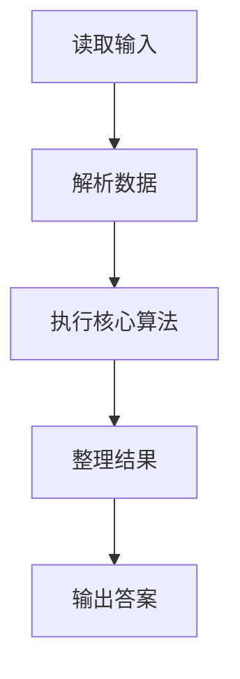
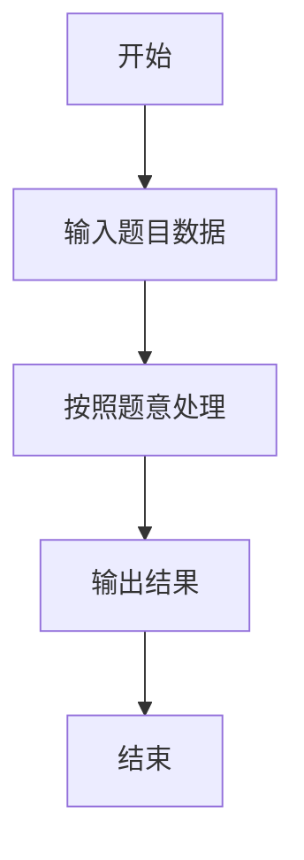

# L2-024 - 部落（25 分）

- **时间限制**: 150 ms
- **内存限制**: 65536 KB
- **代码长度限制**: 16 KB

---

## 题目描述


在一个社区里，每个人都有自己的小圈子，还可能同时属于很多不同的朋友圈。我们认为朋友的朋友都算在一个部落里，于是要请你统计一下，在一个给定社区中，到底有多少个互不相交的部落？并且检查任意两个人是否属于同一个部落。

### 输入格式:

输入在第一行给出一个正整数$$N$$（$$\le 10^4$$），是已知小圈子的个数。随后$$N$$行，每行按下列格式给出一个小圈子里的人：

$$K$$ $$P[1]$$ $$P[2]$$ $$\cdots$$ $$P[K]$$

其中$$K$$是小圈子里的人数，$$P[i]$$（$$i=1, \cdots , K$$）是小圈子里每个人的编号。这里所有人的编号从1开始连续编号，最大编号不会超过$$10^4$$。

之后一行给出一个非负整数$$Q$$（$$\le 10^4$$），是查询次数。随后$$Q$$行，每行给出一对被查询的人的编号。

### 输出格式:

首先在一行中输出这个社区的总人数、以及互不相交的部落的个数。随后对每一次查询，如果他们属于同一个部落，则在一行中输出`Y`，否则输出`N`。

### 输入样例:
```in
4
3 10 1 2
2 3 4
4 1 5 7 8
3 9 6 4
2
10 5
3 7
```

### 输出样例:
```out
10 2
Y
N
```

## 示例

### 示例 1

**输入:**
```
4
3 10 1 2
2 3 4
4 1 5 7 8
3 9 6 4
2
10 5
3 7
```

**输出:**
```
10 2
Y
N
```

### 解题思路

本题的 Ruby 实现采用字符串解析与规则处理。程序先读取题目输入，建立与题意对应的数据结构，按照约束完成核心计算，并按规定格式输出结果。具体实现以同目录的 main.rb 为准。

### 代码流程说明

1. 读取并解析标准输入，转换为题目所需的数据结构。
2. 按题意执行核心算法，维护中间状态并处理边界情况。
3. 整理计算结果，按照输出格式生成答案。

### 代码实现

完整实现位于同目录的 [main.rb](./L2-024_部落/main.rb)，以下代码与该入口文件保持一致。

```ruby
# frozen_string_literal: true
require_relative '../gplt_runtime'
def entry
  v = (py_map(->(x) { py_int(x) }, py_tokens).to_a)
  n = v[0]
  k = 1
  p = (py_range(10001).to_a)
  people = Set.new([])
  f = lambda do |x|
    while ((p[x] != x))
      p[x] = p[p[x]]
      x = p[x]
    end
    return x
  end
  for _ in py_range(n)
    z = v[k]
    k += 1
    ids = py_slice(v, k, (k + z), nil)
    k += z
    people.update(ids)
    for x in py_slice(ids, 1, nil, nil)
      p[f.call(ids[0])] = f.call(x)
    end
  end
  roots = py_len(Set.new(py_iterable(people).flat_map { |x|; [f.call(x)] }))
  q = v[k]
  k += 1
  out = ["%s %s" % [py_len(people), roots]]
  for _ in py_range(q)
    out.append((((f.call(v[k]) == f.call(v[(k + 1)]))) ? "Y" : "N"))
    k += 2
  end
  py_print(out.join("\n"), sep: " ", ending: "\n")
end
entry
```

### 代码流程图



### 解题流程图


