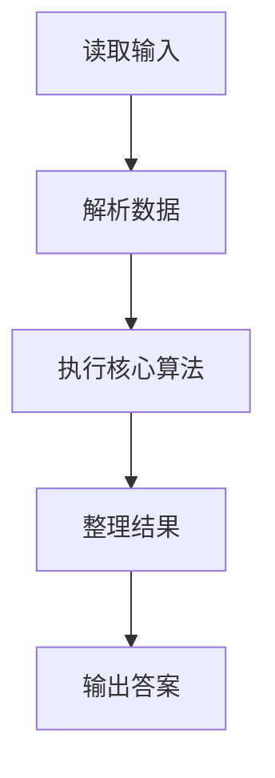
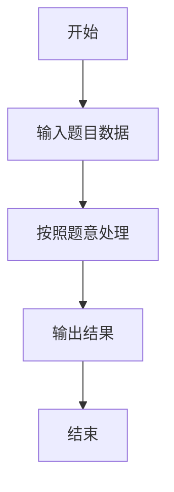

# L2-025 - 分而治之（25 分）

- **时间限制**: 600 ms
- **内存限制**: 65536 KB
- **代码长度限制**: 16 KB

---

## 题目描述


分而治之，各个击破是兵家常用的策略之一。在战争中，我们希望首先攻下敌方的部分城市，使其剩余的城市变成孤立无援，然后再分头各个击破。为此参谋部提供了若干打击方案。本题就请你编写程序，判断每个方案的可行性。

### 输入格式:

输入在第一行给出两个正整数 N 和 M（均不超过10 000），分别为敌方城市个数（于是默认城市从 1 到 N 编号）和连接两城市的通路条数。随后 M 行，每行给出一条通路所连接的两个城市的编号，其间以一个空格分隔。在城市信息之后给出参谋部的系列方案，即一个正整数 K （$$\le$$ 100）和随后的 K 行方案，每行按以下格式给出：

```
Np v[1] v[2] ... v[Np]
```

其中 `Np` 是该方案中计划攻下的城市数量，后面的系列 `v[i]` 是计划攻下的城市编号。

### 输出格式:

对每一套方案，如果可行就输出`YES`，否则输出`NO`。

### 输入样例:
```in
10 11
8 7
6 8
4 5
8 4
8 1
1 2
1 4
9 8
9 1
1 10
2 4
5
4 10 3 8 4
6 6 1 7 5 4 9
3 1 8 4
2 2 8
7 9 8 7 6 5 4 2
```

### 输出样例:
```out
NO
YES
YES
NO
NO
```

## 示例

### 示例 1

**输入:**
```
10 11
8 7
6 8
4 5
8 4
8 1
1 2
1 4
9 8
9 1
1 10
2 4
5
4 10 3 8 4
6 6 1 7 5 4 9
3 1 8 4
2 2 8
7 9 8 7 6 5 4 2
```

**输出:**
```
NO
YES
YES
NO
NO
```

### 解题思路

本题的 Ruby 实现采用字符串解析与规则处理。程序先读取题目输入，建立与题意对应的数据结构，按照约束完成核心计算，并按规定格式输出结果。具体实现以同目录的 main.rb 为准。

### 代码流程说明

1. 读取并解析标准输入，转换为题目所需的数据结构。
2. 按题意执行核心算法，维护中间状态并处理边界情况。
3. 整理计算结果，按照输出格式生成答案。

### 代码实现

完整实现位于同目录的 [main.rb](./main.rb)，以下代码与该入口文件保持一致。

```ruby
# frozen_string_literal: true
require_relative '../gplt_runtime'
def entry
  v = (py_map(->(x) { py_int(x) }, py_tokens).to_a)
  n, m = py_slice(v, nil, 2, nil)
  k = 2
  e = py_iterable(py_range(m)).flat_map { |i|; [[v[(k + (2 * i))], v[((k + (2 * i)) + 1)]]] }
  k += (2 * m)
  q = v[k]
  k += 1
  out = []
  for _ in py_range(q)
    z = v[k]
    dead = Set.new(py_slice(v, (k + 1), ((k + 1) + z), nil))
    k += (z + 1)
    out.append((py_iterable(e).flat_map { |__item_0|; a, b = __item_0; [((py_in(a, dead)) || (py_in(b, dead)))] }.all? ? "YES" : "NO"))
  end
  py_print(out.join("\n"), sep: " ", ending: "\n")
end
entry
```

### 代码流程图



### 解题流程图


