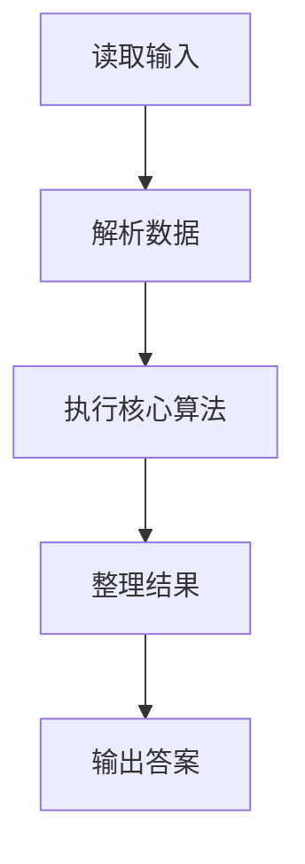
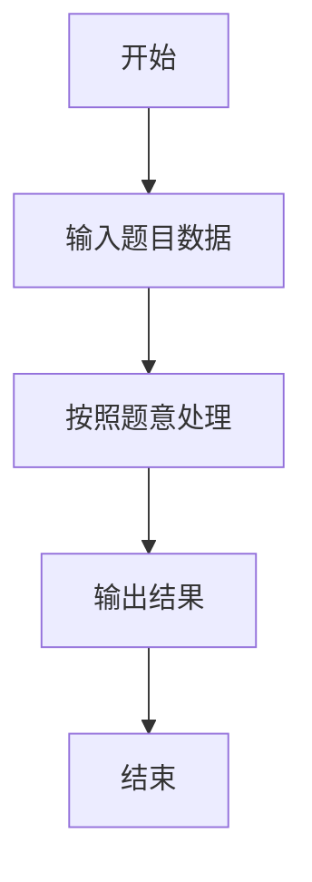

# L2-026 - 小字辈（25 分）

- **时间限制**: 400 ms
- **内存限制**: 65536 KB
- **代码长度限制**: 16 KB

---

## 题目描述


本题给定一个庞大家族的家谱，要请你给出最小一辈的名单。

### 输入格式:

输入在第一行给出家族人口总数 N（不超过 100 000 的正整数） —— 简单起见，我们把家族成员从 1 到 N 编号。随后第二行给出 N 个编号，其中第 i 个编号对应第 i 位成员的父/母。家谱中辈分最高的老祖宗对应的父/母编号为 -1。一行中的数字间以空格分隔。

### 输出格式:

首先输出最小的辈分（老祖宗的辈分为 1，以下逐级递增）。然后在第二行按递增顺序输出辈分最小的成员的编号。编号间以一个空格分隔，行首尾不得有多余空格。

### 输入样例:
```in
9
2 6 5 5 -1 5 6 4 7
```

### 输出样例:
```out
4
1 9
```

## 示例

### 示例 1

**输入:**
```
9
2 6 5 5 -1 5 6 4 7
```

**输出:**
```
4
1 9
```

### 解题思路

本题的 Ruby 实现采用字符串解析与规则处理。程序先读取题目输入，建立与题意对应的数据结构，按照约束完成核心计算，并按规定格式输出结果。具体实现以同目录的 main.rb 为准。

### 代码流程说明

1. 读取并解析标准输入，转换为题目所需的数据结构。
2. 按题意执行核心算法，维护中间状态并处理边界情况。
3. 整理计算结果，按照输出格式生成答案。

### 代码实现

完整实现位于同目录的 [main.rb](./main.rb)，以下代码与该入口文件保持一致。

```ruby
# frozen_string_literal: true
require_relative '../gplt_runtime'
def entry
  v = (py_map(->(x) { py_int(x) }, py_tokens).to_a)
  n = v[0]
  p = py_slice(v, 1, (1 + n), nil)
  root = (p.index((-1)) + 1)
  g = py_iterable(py_range((n + 1))).flat_map { |_|; [[]] }
  for i, x in py_enumerate(p, 1)
    if ((x != (-1)))
      g[x].append(i)
    end
  end
  q = [root]
  dep = {root => 1}
  for x in q
    for y in g[x]
      dep[y] = (dep[x] + 1)
      q.append(y)
    end
  end
  m = py_max(dep.values())
  py_print(m, sep: " ", ending: "\n")
  py_print(py_iterable(py_range(1, (n + 1))).flat_map { |x|; next [] unless py_truth(((dep[x] == m))); [py_str(x)] }.join(" "), sep: " ", ending: "\n")
end
entry
```

### 代码流程图



### 解题流程图


