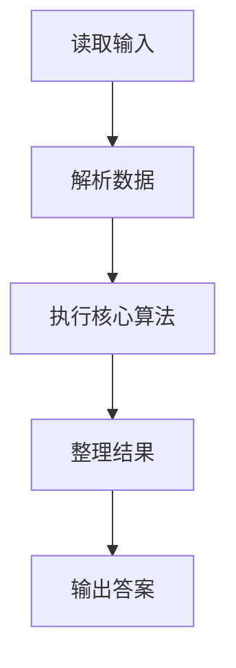
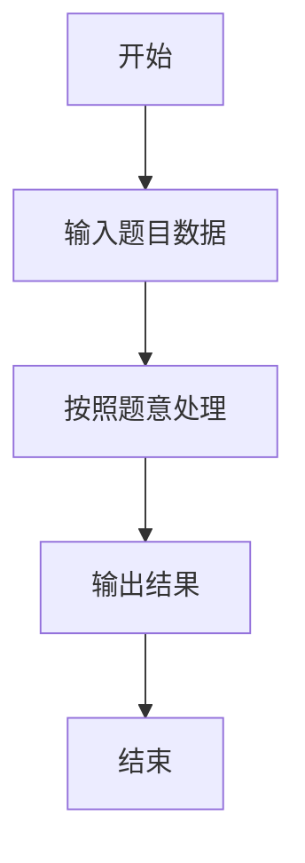

# L2-027 - 名人堂与代金券（25 分）

- **时间限制**: 150 ms
- **内存限制**: 65536 KB
- **代码长度限制**: 16 KB

---

## 题目描述


对于在中国大学MOOC（http://www.icourse163.org/ ）学习“数据结构”课程的学生，想要获得一张合格证书，总评成绩必须达到 60 分及以上，并且有另加福利：总评分在 [G, 100] 区间内者，可以得到 50 元 PAT 代金券；在 [60, G) 区间内者，可以得到 20 元PAT代金券。全国考点通用，一年有效。同时任课老师还会把总评成绩前 K 名的学生列入课程“名人堂”。本题就请你编写程序，帮助老师列出名人堂的学生，并统计一共发出了面值多少元的 PAT 代金券。

### 输入格式:

输入在第一行给出 3 个整数，分别是 N（不超过 10 000 的正整数，为学生总数）、G（在 (60,100) 区间内的整数，为题面中描述的代金券等级分界线）、K（不超过 100 且不超过 N 的正整数，为进入名人堂的最低名次）。接下来 N 行，每行给出一位学生的账号（长度不超过15位、不带空格的字符串）和总评成绩（区间 [0, 100] 内的整数），其间以空格分隔。题目保证没有重复的账号。

### 输出格式:

首先在一行中输出发出的 PAT 代金券的总面值。然后按总评成绩非升序输出进入名人堂的学生的名次、账号和成绩，其间以 1 个空格分隔。需要注意的是：成绩相同的学生享有并列的排名，排名并列时，按账号的字母序升序输出。

### 输入样例:
```in
10 80 5
cy@zju.edu.cn 78
cy@pat-edu.com 87
1001@qq.com 65
uh-oh@163.com 96
test@126.com 39
anyone@qq.com 87
zoe@mit.edu 80
jack@ucla.edu 88
bob@cmu.edu 80
ken@163.com 70
```

### 输出样例:
```out
360
1 uh-oh@163.com 96
2 jack@ucla.edu 88
3 anyone@qq.com 87
3 cy@pat-edu.com 87
5 bob@cmu.edu 80
5 zoe@mit.edu 80
```

## 示例

### 示例 1

**输入:**
```
10 80 5
cy@zju.edu.cn 78
cy@pat-edu.com 87
1001@qq.com 65
uh-oh@163.com 96
test@126.com 39
anyone@qq.com 87
zoe@mit.edu 80
jack@ucla.edu 88
bob@cmu.edu 80
ken@163.com 70
```

**输出:**
```
360
1 uh-oh@163.com 96
2 jack@ucla.edu 88
3 anyone@qq.com 87
3 cy@pat-edu.com 87
5 bob@cmu.edu 80
5 zoe@mit.edu 80
```

### 解题思路

本题的 Ruby 实现采用排序、贪心与顺序模拟。程序先读取题目输入，建立与题意对应的数据结构，按照约束完成核心计算，并按规定格式输出结果。具体实现以同目录的 main.rb 为准。

### 代码流程说明

1. 读取并解析标准输入，转换为题目所需的数据结构。
2. 按题意执行核心算法，维护中间状态并处理边界情况。
3. 整理计算结果，按照输出格式生成答案。

### 代码实现

完整实现位于同目录的 [main.rb](./L2-027_名人堂与代金券/main.rb)，以下代码与该入口文件保持一致。

```ruby
# frozen_string_literal: true
require_relative '../gplt_runtime'
v = py_tokens
n, goal, k = v.shift(3).map(&:to_i)
students = n.times.map { [v.shift, v.shift.to_i] }
coupon = students.sum { |_, score| score >= goal ? 50 : score >= 60 ? 20 : 0 }
students.sort_by! { |id, score| [-score, id] }
ranked = []
students.each_with_index do |(id, score), index|
  rank = index.zero? || score != students[index - 1][1] ? index + 1 : ranked[-1][0]
  break if rank > k
  ranked << [rank, id, score]
end
py_print(coupon.to_s + "\n" + ranked.map { |rank, id, score| "#{rank} #{id} #{score}" }.join("\n"))
```

### 代码流程图



### 解题流程图


