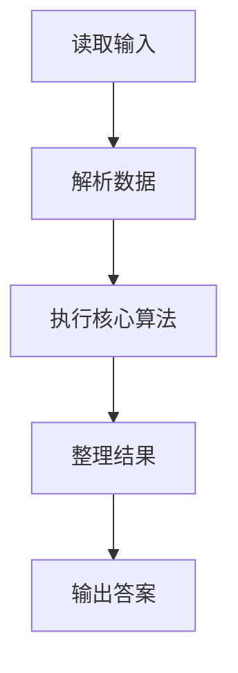
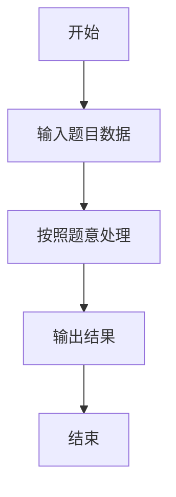

# L2-028 - 秀恩爱分得快（25 分）

- **时间限制**: 500 ms
- **内存限制**: 65536 KB
- **代码长度限制**: 16 KB

---

## 题目描述


古人云：秀恩爱，分得快。

互联网上每天都有大量人发布大量照片，我们通过分析这些照片，可以分析人与人之间的亲密度。如果一张照片上出现了 K 个人，这些人两两间的亲密度就被定义为 1/K。任意两个人如果同时出现在若干张照片里，他们之间的亲密度就是所有这些同框照片对应的亲密度之和。下面给定一批照片，请你分析一对给定的情侣，看看他们分别有没有亲密度更高的异性朋友？

### 输入格式:

输入在第一行给出 2 个正整数：N（不超过1000，为总人数——简单起见，我们把所有人从 0 到 N-1 编号。为了区分性别，我们用编号前的负号表示女性）和 M（不超过1000，为照片总数）。随后 M 行，每行给出一张照片的信息，格式如下：

```
K P[1] ... P[K]
```

其中 K（$$\le$$ 500）是该照片中出现的人数，P[1] ~ P[K] 就是这些人的编号。最后一行给出一对异性情侣的编号 A 和 B。同行数字以空格分隔。题目保证每个人只有一个性别，并且不会在同一张照片里出现多次。

### 输出格式:

首先输出 `A PA`，其中 `PA` 是与 `A` 最亲密的异性。如果 `PA` 不唯一，则按他们编号的绝对值递增输出；然后类似地输出 `B PB`。但如果 `A` 和 `B` 正是彼此亲密度最高的一对，则只输出他们的编号，无论是否还有其他人并列。

### 输入样例 1：
```in
10 4
4 -1 2 -3 4
4 2 -3 -5 -6
3 2 4 -5
3 -6 0 2
-3 2
```

### 输出样例 1：
```out
-3 2
2 -5
2 -6
```

### 输入样例 2：
```in
4 4
4 -1 2 -3 0
2 0 -3
2 2 -3
2 -1 2 
-3 2
```

### 输出样例 2：
```out
-3 2
```

## 示例

### 示例 1

**输入:**
```
10 4
4 -1 2 -3 4
4 2 -3 -5 -6
3 2 4 -5
3 -6 0 2
-3 2
```

**输出:**
```
-3 2
2 -5
2 -6
```

### 示例 2

**输入:**
```
4 4
4 -1 2 -3 0
2 0 -3
2 2 -3
2 -1 2 
-3 2
```

**输出:**
```
-3 2
```

### 解题思路

本题的 Ruby 实现采用字符串解析与规则处理。程序先读取题目输入，建立与题意对应的数据结构，按照约束完成核心计算，并按规定格式输出结果。具体实现以同目录的 main.rb 为准。

### 代码流程说明

1. 读取并解析标准输入，转换为题目所需的数据结构。
2. 按题意执行核心算法，维护中间状态并处理边界情况。
3. 整理计算结果，按照输出格式生成答案。

### 代码实现

完整实现位于同目录的 [main.rb](./L2-028_秀恩爱分得快/main.rb)，以下代码与该入口文件保持一致。

```ruby
# frozen_string_literal: true
require_relative '../gplt_runtime'
def entry
  v = py_input_data.split
  n, m = py_map(->(x) { py_int(x) }, py_slice(v, nil, 2, nil))
  k = 2
  g = ([0] * n)
  close = py_iterable(py_range(n)).flat_map { |_|; [([0.0] * n)] }
  for _ in py_range(m)
    z = py_int(v[k])
    k += 1
    ids = []
    for _ in py_range(z)
      x = v[k]
      k += 1
      ids.append(py_abs(py_int(x)))
      g[py_abs(py_int(x))] = (((x[0] == "-")) ? (-1) : 1)
    end
    for i in py_range(z)
      for j in py_range(i)
        close[ids[i]][ids[j]] += py_div(1, z)
        close[ids[j]][ids[i]] += py_div(1, z)
      end
    end
  end
  py_a, py_b = py_slice(v, k, (k + 2), nil)
  a, b = [py_abs(py_int(py_a)), py_abs(py_int(py_b))]
  best = lambda do |x|
    mx = py_max(py_iterable(py_range(n)).flat_map { |i|; next [] unless py_truth((py_truth(g[i]) && ((g[i] != g[x])))); [close[x][i]] }, default: 0)
    return [mx, py_iterable(py_range(n)).flat_map { |i|; next [] unless py_truth((py_truth(g[i]) && ((g[i] != g[x])) && ((py_abs((close[x][i] - mx)) < 1e-09)))); [i] }]
  end
  ma, la = best.call(a)
  mb, lb = best.call(b)
  fmt = lambda { |x| ((((g[x] < 0)) ? "-" : "") + py_str(x)) }
  if ((py_in(b, la)) && (py_in(a, lb)))
    py_print(py_a, py_b, sep: " ", ending: "\n")
    else
      py_print(((py_iterable(la).flat_map { |x|; ["%s %s" % [py_a, fmt.call(x)]] }.join("\n") + "\n") + py_iterable(lb).flat_map { |x|; ["%s %s" % [py_b, fmt.call(x)]] }.join("\n")), sep: " ", ending: "\n")
  end
end
entry
```

### 代码流程图



### 解题流程图


