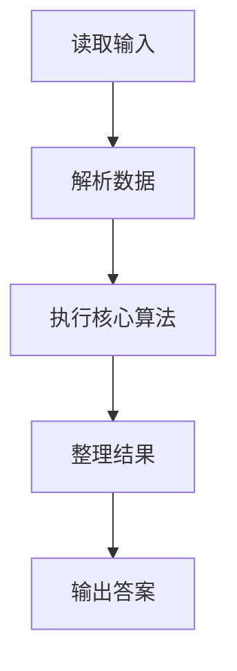
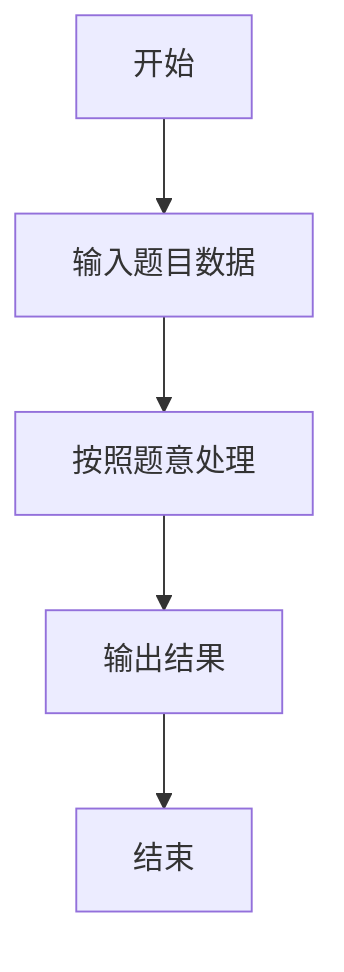

# L2-029 - 特立独行的幸福（25 分）

- **时间限制**: 400 ms
- **内存限制**: 65536 KB
- **代码长度限制**: 16 KB

---

## 题目描述


对一个十进制数的各位数字做一次平方和，称作一次迭代。如果一个十进制数能通过若干次迭代得到 1，就称该数为幸福数。1 是一个幸福数。此外，例如 19 经过 1 次迭代得到 82，2 次迭代后得到 68，3 次迭代后得到 100，最后得到 1。则 19 就是幸福数。显然，在一个幸福数迭代到 1 的过程中经过的数字都是幸福数，它们的幸福是依附于初始数字的。例如 82、68、100 的幸福是依附于 19 的。而一个**特立独行**的幸福数，是在一个有限的区间内不依附于任何其它数字的；其**独立性**就是依附于它的的幸福数的个数。如果这个数还是个素数，则其独立性加倍。例如 19 在区间[1, 100] 内就是一个特立独行的幸福数，其独立性为 $$2\times 4 = 8$$。

另一方面，如果一个大于1的数字经过数次迭代后进入了死循环，那这个数就不幸福。例如 29 迭代得到 85、89、145、42、20、4、16、37、58、89、…… 可见 89 到 58 形成了死循环，所以 29 就不幸福。

本题就要求你编写程序，列出给定区间内的所有特立独行的幸福数和它的独立性。

### 输入格式:

输入在第一行给出闭区间的两个端点：$$1<A<B\le 10^4$$。

### 输出格式:

按递增顺序列出给定闭区间 $$[A,B]$$ 内的所有特立独行的幸福数和它的独立性。每对数字占一行，数字间以 1 个空格分隔。

如果区间内没有幸福数，则在一行中输出 `SAD`。

### 输入样例 1：
```in
10 40
```

### 输出样例 1：
```out
19 8
23 6
28 3
31 4
32 3
```

### 输入样例 2：
```in
110 120
```

### 输出样例 2：
```out
SAD
```

## 示例

### 示例 1

**输入:**
```
10 40
```

**输出:**
```
19 8
23 6
28 3
31 4
32 3
```

### 示例 2

**输入:**
```
110 120
```

**输出:**
```
SAD
```

### 解题思路

本题的 Ruby 实现采用字符串解析与规则处理。程序先读取题目输入，建立与题意对应的数据结构，按照约束完成核心计算，并按规定格式输出结果。具体实现以同目录的 main.rb 为准。

### 代码流程说明

1. 读取并解析标准输入，转换为题目所需的数据结构。
2. 按题意执行核心算法，维护中间状态并处理边界情况。
3. 整理计算结果，按照输出格式生成答案。

### 代码实现

完整实现位于同目录的 [main.rb](./main.rb)，以下代码与该入口文件保持一致。

```ruby
# frozen_string_literal: true
require_relative '../gplt_runtime'
a, b = py_tokens.map(&:to_i)
next_value = ->(x) { x.to_s.chars.sum { |c| c.to_i**2 } }
happy = lambda do |start|
  seen = {}
  chain = []
  x = start
  while x != 1 && !seen[x]
    seen[x] = true
    x = next_value.call(x)
    chain << x
  end
  [x == 1, chain]
end
info = (a..b).to_h { |x| [x, happy.call(x)] }
dependent = {}
info.each do |x, (ok, chain)|
  next unless ok
  chain.each { |y| dependent[y] = true if info[y]&.first }
end
prime = ->(x) { x > 1 && (2..Math.sqrt(x).to_i).none? { |d| (x % d).zero? } }
out = info.filter_map do |x, (ok, chain)|
  next if !ok || dependent[x]
  "#{x} #{chain.length * (prime.call(x) ? 2 : 1)}"
end
py_print(out.empty? ? 'SAD' : out.join("\n"))
```

### 代码流程图



### 解题流程图


