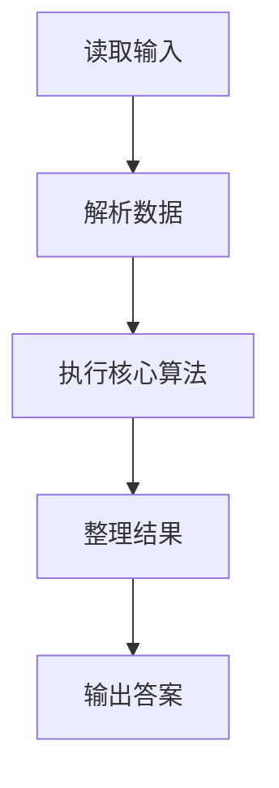
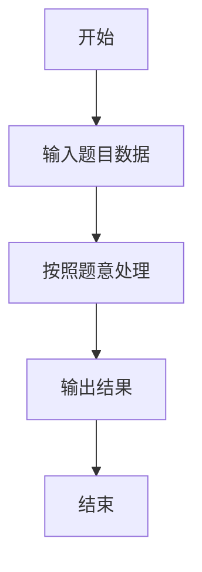

# L2-033 - 简单计算器（25 分）

- **时间限制**: 400 ms
- **内存限制**: 65536 KB
- **代码长度限制**: 16 KB

---

## 题目描述


本题要求你为初学数据结构的小伙伴设计一款简单的利用堆栈执行的计算器。如上图所示，计算器由两个堆栈组成，一个堆栈 $$S_1$$ 存放数字，另一个堆栈 $$S_2$$ 存放运算符。计算器的最下方有一个等号键，每次按下这个键，计算器就执行以下操作：

1. 从 $$S_1$$ 中弹出两个数字，顺序为 $$n_1$$ 和 $$n_2$$；
1. 从 $$S_2$$ 中弹出一个运算符 op；
1. 执行计算 $$n_2$$ op $$n_1$$；
1. 将得到的结果压回 $$S_1$$。

直到两个堆栈都为空时，计算结束，最后的结果将显示在屏幕上。

### 输入格式:

输入首先在第一行给出正整数 $$N$$（$$1 < N \le 10^3$$），为 $$S_1$$ 中数字的个数。

第二行给出 $$N$$ 个绝对值不超过 100 的整数；第三行给出 $$N-1$$ 个运算符 —— 这里仅考虑 `+`、`-`、`*`、`/` 这四种运算。一行中的数字和符号都以空格分隔。

### 输出格式:

将输入的数字和运算符按给定顺序分别压入堆栈 $$S_1$$ 和 $$S_2$$，将执行计算的最后结果输出。注意所有的计算都只取结果的整数部分。题目保证计算的中间和最后结果的绝对值都不超过 $$10^9$$。

如果执行除法时出现分母为零的非法操作，则在一行中输出：`ERROR: X/0`，其中 `X` 是当时的分子。然后结束程序。

### 输入样例 1：
```in
5
40 5 8 3 2
/ * - +
```

### 输出样例 1：
```out
2
```

### 输入样例 2：
```in
5
2 5 8 4 4
* / - +
```

### 输出样例 2：
```out
ERROR: 5/0
```

## 示例

### 示例 1

**输入:**
```
5
40 5 8 3 2
/ * - +
```

**输出:**
```
2
```

### 示例 2

**输入:**
```
5
2 5 8 4 4
* / - +
```

**输出:**
```
ERROR: 5/0
```

### 解题思路

本题的 Ruby 实现采用字符串解析与规则处理。程序先读取题目输入，建立与题意对应的数据结构，按照约束完成核心计算，并按规定格式输出结果。具体实现以同目录的 main.rb 为准。

### 代码流程说明

1. 读取并解析标准输入，转换为题目所需的数据结构。
2. 按题意执行核心算法，维护中间状态并处理边界情况。
3. 整理计算结果，按照输出格式生成答案。

### 代码实现

完整实现位于同目录的 [main.rb](./L2-033_简单计算器/main.rb)，以下代码与该入口文件保持一致。

```ruby
# frozen_string_literal: true
require_relative '../gplt_runtime'
v = py_tokens
n = v.shift.to_i
nums = v.shift(n).map(&:to_i)
ops = v.shift(n - 1).reverse
stack = nums
error = nil
ops.each do |op|
  a = stack.pop
  b = stack.pop
  if op == '/' && a.zero?
    error = "ERROR: #{b}/0"
    break
  end
  stack << case op
           when '+' then b + a
           when '-' then b - a
           when '*' then b * a
           else b / a
           end
end
py_print(error || stack[-1].to_s)
```

### 代码流程图



### 解题流程图


