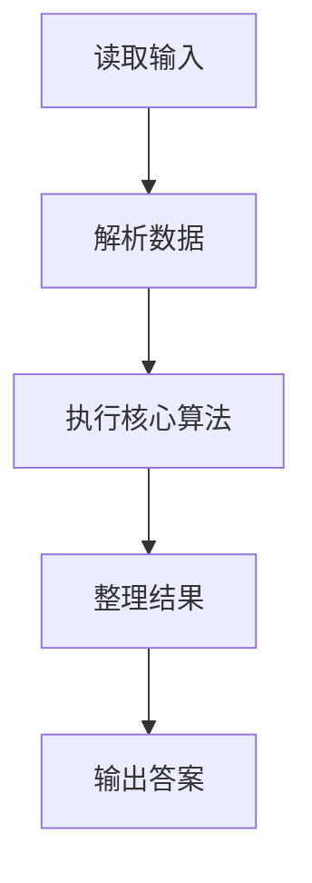
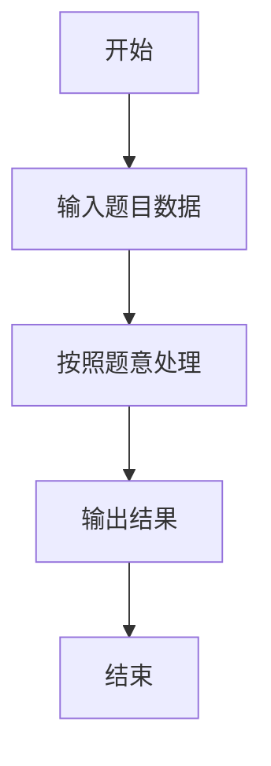

# L2-034 - 口罩发放（25 分）

- **时间限制**: 400 ms
- **内存限制**: 65536 KB
- **代码长度限制**: 16 KB

---

## 题目描述


为了抗击来势汹汹的  COVID19 新型冠状病毒，全国各地均启动了各项措施控制疫情发展，其中一个重要的环节是口罩的发放。

某市出于给市民发放口罩的需要，推出了一款小程序让市民填写信息，方便工作的开展。小程序收集了各种信息，包括市民的姓名、身份证、身体情况、提交时间等，但因为数据量太大，需要根据一定规则进行筛选和处理，请你编写程序，按照给定规则输出口罩的寄送名单。

### 输入格式:

输入第一行是两个正整数 $$D$$ 和 $$P$$（$$1 \le D, P \le 30$$），表示有 $$D$$ 天的数据，市民两次获得口罩的时间至少需要间隔 $$P$$ 天。

接下来 $$D$$ 块数据，每块给出一天的申请信息。第 $$i$$ 块数据（$$i=1, \cdots , D$$）的第一行是两个整数 $$T_i$$ 和 $$S_i$$（$$1 \le T_i \le 1000, 0 \le S_i \le 1000$$），表示在第 $$i$$ 天有 $$T_i$$ 条申请，总共有 $$S_i$$ 个口罩发放名额。随后 $$T_i$$ 行，每行给出一条申请信息，格式如下：
```
姓名 身份证号 身体情况 提交时间
```
给定数据约束如下：
* `姓名` 是一个长度不超过 10 的不包含空格的非空字符串；
* `身份证号` 是一个长度不超过 20 的非空字符串；
* `身体情况` 是 0 或者 1，0 表示自觉良好，1 表示有相关症状；
* `提交时间` 是 hh:mm，为24小时时间（由 ``00:00`` 到 ``23:59``。例如 09:08。）。注意，给定的记录的提交时间不一定有序；
* `身份证号` 各不相同，同一个身份证号被认为是同一个人，数据保证同一个身份证号姓名是相同的。

能发放口罩的记录要求如下：
* `身份证号` 必须是 18 位的**数字**（可以包含前导0）；
* 同一个身份证号若在第 $$i$$ 天申请成功，则接下来的 $$P$$ 天不能再次申请。也就是说，若第 $$i$$ 天申请成功，则等到第 $$i + P + 1$$ 天才能再次申请；
* 在上面两条都符合的情况下，按照提交时间的先后顺序发放，直至全部记录处理完毕或 $$S_i$$ 个名额用完。如果提交时间相同，则按照在列表中出现的先后顺序决定。

### 输出格式:

对于每一天的申请记录，每行输出一位得到口罩的人的姓名及身份证号，用一个空格隔开。顺序按照发放顺序确定。

在输出完发放记录后，你还需要输出有合法记录的、身体状况为 1 的申请人的姓名及身份证号，用空格隔开。顺序按照申请记录中出现的顺序确定，同一个人只需要输出一次。

### 输入样例:
```in
4 2
5 3
A 123456789012345670 1 13:58
B 123456789012345671 0 13:58
C 12345678901234567 0 13:22
D 123456789012345672 0 03:24
C 123456789012345673 0 13:59
4 3
A 123456789012345670 1 13:58
E 123456789012345674 0 13:59
C 123456789012345673 0 13:59
F F 0 14:00
1 3
E 123456789012345674 1 13:58
1 1
A 123456789012345670 0 14:11
```

### 输出样例:
```out
D 123456789012345672
A 123456789012345670
B 123456789012345671
E 123456789012345674
C 123456789012345673
A 123456789012345670
A 123456789012345670
E 123456789012345674
```

## 示例

### 示例 1

**输入:**
```
4 2
5 3
A 123456789012345670 1 13:58
B 123456789012345671 0 13:58
C 12345678901234567 0 13:22
D 123456789012345672 0 03:24
C 123456789012345673 0 13:59
4 3
A 123456789012345670 1 13:58
E 123456789012345674 0 13:59
C 123456789012345673 0 13:59
F F 0 14:00
1 3
E 123456789012345674 1 13:58
1 1
A 123456789012345670 0 14:11
```

**输出:**
```
D 123456789012345672
A 123456789012345670
B 123456789012345671
E 123456789012345674
C 123456789012345673
A 123456789012345670
A 123456789012345670
E 123456789012345674
```

### 解题思路

本题的 Ruby 实现采用排序、贪心与顺序模拟。程序先读取题目输入，建立与题意对应的数据结构，按照约束完成核心计算，并按规定格式输出结果。具体实现以同目录的 main.rb 为准。

### 代码流程说明

1. 读取并解析标准输入，转换为题目所需的数据结构。
2. 按题意执行核心算法，维护中间状态并处理边界情况。
3. 整理计算结果，按照输出格式生成答案。

### 代码实现

完整实现位于同目录的 [main.rb](./L2-034_口罩发放/main.rb)，以下代码与该入口文件保持一致。

```ruby
# frozen_string_literal: true
require_relative '../gplt_runtime'
def entry
  lines = py_lines
  py_d, py_p = py_map(->(x) { py_int(x) }, lines[0].split())
  k = 1
  allr = []
  last = {}
  out = []
  valid = lambda do |s|
    return (((py_len(s) == 18)) && py_truth((s.to_s.match?(/\A[0-9]+\z/))))
  end
  for day in py_range(1, (py_d + 1))
    py_t, py_s = py_map(->(x) { py_int(x) }, lines[k].split())
    k += 1
    r = []
    for j in py_range(py_t)
      z = lines[k].split()
      k += 1
      name, id_, ill, time = z
      hh, mm = py_map(->(x) { py_int(x) }, time.split(":"))
      r.append([((hh * 60) + mm), j, name, id_, ill])
      allr.append([name, id_, ill])
    end
    for _, _, name, id_, _ in py_sorted(r)
      if (((py_len(out) >= 0)) && py_truth(py_s) && py_truth(valid.call(id_)) && ((!py_in(id_, last)) || ((day > (last[id_] + py_p)))) && ((py_s > 0)))
        out.append(((name + " ") + id_))
        last[id_] = day
        py_s -= 1
      end
    end
  end
  seen = Set.new([])
  for name, id_, ill in allr
    if (((ill == "1")) && py_truth(valid.call(id_)) && (!py_in(id_, seen)))
      out.append(((name + " ") + id_))
      seen.add(id_)
    end
  end
  py_print(out.join("\n"), sep: " ", ending: "\n")
end
entry
```

### 代码流程图



### 解题流程图


