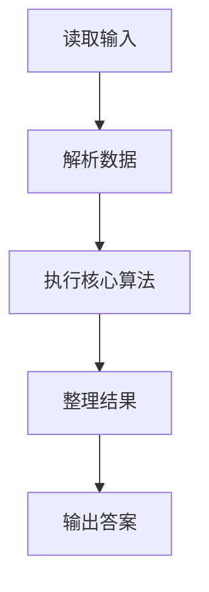
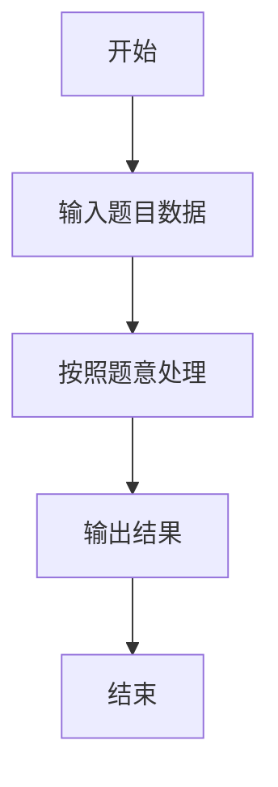

# L2-035 - 完全二叉树的层序遍历（25 分）

- **时间限制**: 400 ms
- **内存限制**: 65536 KB
- **代码长度限制**: 16 KB

---

## 题目描述


一个二叉树，如果每一个层的结点数都达到最大值，则这个二叉树就是**完美二叉树**。对于深度为 $$D$$ 的，有 $$N$$ 个结点的二叉树，若其结点对应于相同深度完美二叉树的层序遍历的前 $$N$$ 个结点，这样的树就是**完全二叉树**。

给定一棵完全二叉树的后序遍历，请你给出这棵树的层序遍历结果。

### 输入格式:

输入在第一行中给出正整数 $$N$$（$$\le 30$$），即树中结点个数。第二行给出后序遍历序列，为 $$N$$ 个不超过 100 的正整数。同一行中所有数字都以空格分隔。

### 输出格式:

在一行中输出该树的层序遍历序列。所有数字都以 1 个空格分隔，行首尾不得有多余空格。

### 输入样例:
```in
8
91 71 2 34 10 15 55 18
```

### 输出样例:
```out
18 34 55 71 2 10 15 91
```

## 示例

### 示例 1

**输入:**
```
8
91 71 2 34 10 15 55 18
```

**输出:**
```
18 34 55 71 2 10 15 91
```

### 解题思路

本题的 Ruby 实现采用图遍历或搜索。程序先读取题目输入，建立与题意对应的数据结构，按照约束完成核心计算，并按规定格式输出结果。具体实现以同目录的 main.rb 为准。

### 代码流程说明

1. 读取并解析标准输入，转换为题目所需的数据结构。
2. 按题意执行核心算法，维护中间状态并处理边界情况。
3. 整理计算结果，按照输出格式生成答案。

### 代码实现

完整实现位于同目录的 [main.rb](./L2-035_完全二叉树的层序遍历/main.rb)，以下代码与该入口文件保持一致。

```ruby
# frozen_string_literal: true
require_relative '../gplt_runtime'
def entry
  v = (py_map(->(x) { py_int(x) }, py_tokens).to_a)
  n = v[0]
  post = py_slice(v, 1, nil, nil)
  a = ([0] * n)
  k = 0
  dfs = lambda do |i|
    if ((i >= n))
      return
    end
    dfs.call(((2 * i) + 1))
    dfs.call(((2 * i) + 2))
    a[i] = post[k]
    k += 1
  end
  dfs.call(0)
  py_print(py_map(->(x) { py_str(x) }, a).join(" "), sep: " ", ending: "\n")
end
entry
```

### 代码流程图



### 解题流程图


