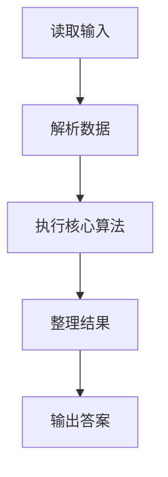
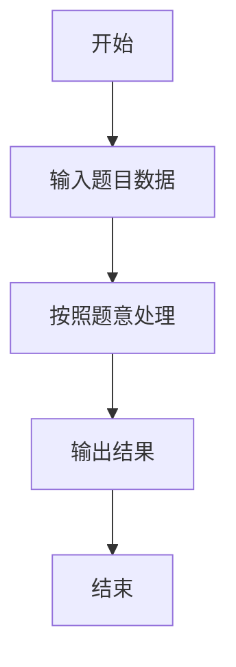

# L2-038 - 病毒溯源（25 分）

- **时间限制**: 400 ms
- **内存限制**: 65536 KB
- **代码长度限制**: 16 KB

---

## 题目描述


病毒容易发生变异。某种病毒可以通过突变产生若干变异的毒株，而这些变异的病毒又可能被诱发突变产生第二代变异，如此继续不断变化。

现给定一些病毒之间的变异关系，要求你找出其中最长的一条变异链。

在此假设给出的变异都是由突变引起的，不考虑复杂的基因重组变异问题 —— 即每一种病毒都是由唯一的一种病毒突变而来，并且不存在循环变异的情况。

### 输入格式:

输入在第一行中给出一个正整数 $$N$$（$$\le 10^4$$），即病毒种类的总数。于是我们将所有病毒从 0 到 $$N-1$$ 进行编号。

随后 $$N$$ 行，每行按以下格式描述一种病毒的变异情况：

```
k 变异株1 …… 变异株k
```

其中 `k` 是该病毒产生的变异毒株的种类数，后面跟着每种变异株的编号。第 $$i$$ 行对应编号为 $$i$$ 的病毒（$$0\le i <N$$）。题目保证病毒源头有且仅有一个。

### 输出格式:

首先输出从源头开始最长变异链的长度。

在第二行中输出从源头开始最长的一条变异链，编号间以 1 个空格分隔，行首尾不得有多余空格。如果最长链不唯一，则输出最小序列。

注：我们称序列 { $$a_1, \cdots , a_n$$ } 比序列 { $$b_1, \cdots , b_n$$ } “小”，如果存在 $$1\le k \le n$$ 满足 $$a_i = b_i$$ 对所有 $$i<k$$ 成立，且 $$a_k < b_k$$。

### 输入样例:
```in
10
3 6 4 8
0
0
0
2 5 9
0
1 7
1 2
0
2 3 1
```

### 输出样例:
```out
4
0 4 9 1
```

## 示例

### 示例 1

**输入:**
```
10
3 6 4 8
0
0
0
2 5 9
0
1 7
1 2
0
2 3 1
```

**输出:**
```
4
0 4 9 1
```

### 解题思路

本题的 Ruby 实现采用排序、贪心与顺序模拟。程序先读取题目输入，建立与题意对应的数据结构，按照约束完成核心计算，并按规定格式输出结果。具体实现以同目录的 main.rb 为准。

### 代码流程说明

1. 读取并解析标准输入，转换为题目所需的数据结构。
2. 按题意执行核心算法，维护中间状态并处理边界情况。
3. 整理计算结果，按照输出格式生成答案。

### 代码实现

完整实现位于同目录的 [main.rb](./main.rb)，以下代码与该入口文件保持一致。

```ruby
# frozen_string_literal: true
require_relative '../gplt_runtime'
def entry
  v = (py_map(->(x) { py_int(x) }, py_tokens).to_a)
  n = v[0]
  k = 1
  g = py_iterable(py_range(n)).flat_map { |_|; [[]] }
  has = ([0] * n)
  for i in py_range(n)
    z = v[k]
    k += 1
    g[i] = py_sorted(py_slice(v, k, (k + z), nil))
    k += z
    for x in g[i]
      has[x] = 1
    end
  end
  root = py_next(py_iterable(py_range(n)).flat_map { |i|; next [] unless py_truth((!py_truth(has[i]))); [i] })
  dfs = lambda do |x|
    if (!py_truth(g[x]))
      return [x]
    end
    p = py_iterable(g[x]).flat_map { |y|; [dfs.call(y)] }
    q = py_max(p, key: lambda { |z| [py_len(z), [py_iterable(z).flat_map { |x|; [(-x)] }]] })
    return ([x] + q)
  end
  a = dfs.call(root)
  py_print(py_len(a), sep: " ", ending: "\n")
  py_print(py_map(->(x) { py_str(x) }, a).join(" "), sep: " ", ending: "\n")
end
entry
```

### 代码流程图



### 解题流程图


