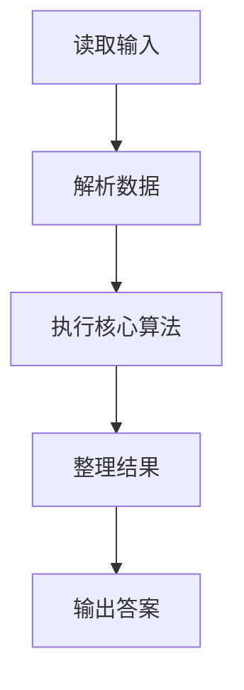
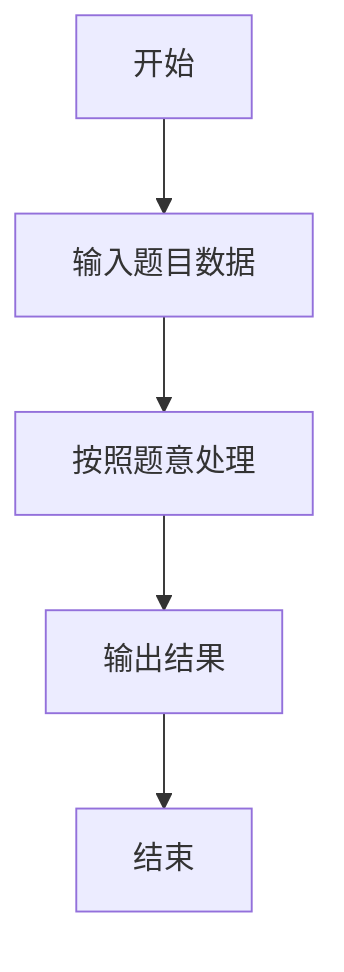

# L2-040 - 哲哲打游戏（25 分）

- **时间限制**: 400 ms
- **内存限制**: 65536 KB
- **代码长度限制**: 16 KB

---

## 题目描述


哲哲是一位硬核游戏玩家。最近一款名叫《达诺达诺》的新游戏刚刚上市，哲哲自然要快速攻略游戏，守护硬核游戏玩家的一切！

为简化模型，我们不妨假设游戏有 $$N$$ 个剧情点，通过游戏里不同的操作或选择可以从某个剧情点去往另外一个剧情点。此外，游戏还设置了一些**存档**，在某个剧情点可以将玩家的游戏进度保存在一个档位上，读取存档后可以回到剧情点，重新进行操作或者选择，到达不同的剧情点。

为了追踪硬核游戏玩家哲哲的攻略进度，你打算写一个程序来完成这个工作。假设你已经知道了游戏的全部剧情点和流程，以及哲哲的游戏操作，请你输出哲哲的游戏进度。

### 输入格式:

输入第一行是两个正整数 $$N$$ 和 $$M$$ ($$1\le N , M \le 10^5$$)，表示总共有 $$N$$ 个剧情点，哲哲有 $$M$$ 个游戏操作。

接下来的 $$N$$ 行，每行对应一个剧情点的发展设定。第 $$i$$ 行的第一个数字是 $$K_i$$，表示剧情点 $$i$$ 通过一些操作或选择能去往下面 $$K_i$$ 个剧情点；接下来有 $$K_i$$ 个数字，第 $$k$$ 个数字表示做第 $$k$$ 个操作或选择可以去往的剧情点编号。

最后有 $$M$$ 行，每行第一个数字是 0、1 或 2，分别表示：

* 0 表示哲哲做出了某个操作或选择，后面紧接着一个数字 $$j$$，表示哲哲在当前剧情点做出了第 $$j$$ 个选择。我们保证哲哲的选择永远是合法的。
* 1 表示哲哲进行了一次存档，后面紧接着是一个数字 $$j$$，表示存档放在了第 $$j$$ 个档位上。
* 2 表示哲哲进行了一次读取存档的操作，后面紧接着是一个数字 $$j$$，表示读取了放在第 $$j$$ 个位置的存档。

约定：所有操作或选择以及剧情点编号都从 1 号开始。存档的档位不超过 100 个，编号也从 1 开始。游戏默认从 1 号剧情点开始。总的选项数（即 $$\sum K_i$$）不超过 $$10^6$$。

### 输出格式:

对于每个 1（即存档）操作，在一行中输出存档的剧情点编号。

最后一行输出哲哲最后到达的剧情点编号。

### 输入样例:
```in
10 11
3 2 3 4
1 6
3 4 7 5
1 3
1 9
2 3 5
3 1 8 5
1 9
2 8 10
0
1 1
0 3
0 1
1 2
0 2
0 2
2 2
0 3
0 1
1 1
0 2
```

### 输出样例:
```out
1
3
9
10
```

## 示例

### 示例 1

**输入:**
```
10 11
3 2 3 4
1 6
3 4 7 5
1 3
1 9
2 3 5
3 1 8 5
1 9
2 8 10
0
1 1
0 3
0 1
1 2
0 2
0 2
2 2
0 3
0 1
1 1
0 2
```

**输出:**
```
1
3
9
10
```

### 解题思路

本题的 Ruby 实现采用字符串解析与规则处理。程序先读取题目输入，建立与题意对应的数据结构，按照约束完成核心计算，并按规定格式输出结果。具体实现以同目录的 main.rb 为准。

### 代码流程说明

1. 读取并解析标准输入，转换为题目所需的数据结构。
2. 按题意执行核心算法，维护中间状态并处理边界情况。
3. 整理计算结果，按照输出格式生成答案。

### 代码实现

完整实现位于同目录的 [main.rb](./L2-040_哲哲打游戏/main.rb)，以下代码与该入口文件保持一致。

```ruby
# frozen_string_literal: true
require_relative '../gplt_runtime'
def entry
  v = (py_map(->(x) { py_int(x) }, py_tokens).to_a)
  n, m = py_slice(v, nil, 2, nil)
  k = 2
  g = py_iterable(py_range((n + 1))).flat_map { |_|; [[]] }
  for i in py_range(1, (n + 1))
    z = v[k]
    k += 1
    g[i] = py_slice(v, k, (k + z), nil)
    k += z
  end
  cur = 1
  save = ([0] * 101)
  out = []
  for _ in py_range(m)
    typ = v[k]
    j = v[(k + 1)]
    k += 2
    if ((typ == 0))
      cur = g[cur][(j - 1)]
      else
        if ((typ == 1))
          save[j] = cur
          out.append(py_str(cur))
          else
            cur = save[j]
        end
    end
  end
  out.append(py_str(cur))
  py_print(out.join("\n"), sep: " ", ending: "\n")
end
entry
```

### 代码流程图



### 解题流程图


