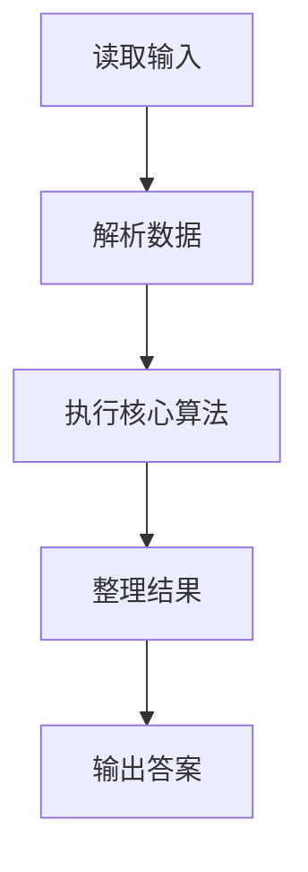
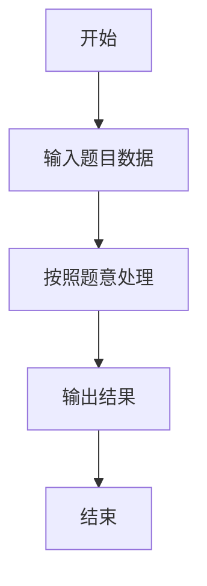

# L2-041 - 插松枝（25 分）

- **时间限制**: 400 ms
- **内存限制**: 65536 KB
- **代码长度限制**: 16 KB

---

## 题目描述


人造松枝加工场的工人需要将各种尺寸的塑料松针插到松枝干上，做成大大小小的松枝。他们的工作流程（并不）是这样的：

- 每人手边有一只小盒子，初始状态为空。
- 每人面前有用不完的松枝干和一个推送器，每次推送一片随机型号的松针片。
- 工人首先捡起一根空的松枝干，从小盒子里摸出最上面的一片松针 —— 如果小盒子是空的，就从推送器上取一片松针。将这片松针插到枝干的最下面。
- 工人在插后面的松针时，需要保证，每一步插到一根非空松枝干上的松针片，不能比前一步插上的松针片大。如果小盒子中最上面的松针满足要求，就取之插好；否则去推送器上取一片。如果推送器上拿到的仍然不满足要求，就把拿到的这片堆放到小盒子里，继续去推送器上取下一片。注意这里假设小盒子里的松针片是按放入的顺序堆叠起来的，工人每次只能取出最上面（即最后放入）的一片。
- 当下列三种情况之一发生时，工人会结束手里的松枝制作，开始做下一个：

（1）小盒子已经满了，但推送器上取到的松针仍然不满足要求。此时将手中的松枝放到成品篮里，推送器上取到的松针压回推送器，开始下一根松枝的制作。

（2）小盒子中最上面的松针不满足要求，但推送器上已经没有松针了。此时将手中的松枝放到成品篮里，开始下一根松枝的制作。

（3）手中的松枝干上已经插满了松针，将之放到成品篮里，开始下一根松枝的制作。

现在给定推送器上顺序传过来的 $$N$$ 片松针的大小，以及小盒子和松枝的容量，请你编写程序自动列出每根成品松枝的信息。

### 输入格式:

输入在第一行中给出 3 个正整数：$$N$$（$$\le 10^3$$），为推送器上松针片的数量；$$M$$（$$\le 20$$）为小盒子能存放的松针片的最大数量；$$K$$（$$\le 5$$）为一根松枝干上能插的松针片的最大数量。

随后一行给出 $$N$$ 个不超过 $$100$$ 的正整数，为推送器上顺序推出的松针片的大小。

### 输出格式:

每支松枝成品的信息占一行，顺序给出自底向上每片松针的大小。数字间以 1 个空格分隔，行首尾不得有多余空格。

### 输入样例:
```in
8 3 4
20 25 15 18 20 18 8 5
```

### 输出样例:
```out
20 15
20 18 18 8
25 5
```

## 示例

### 示例 1

**输入:**
```
8 3 4
20 25 15 18 20 18 8 5
```

**输出:**
```
20 15
20 18 18 8
25 5
```

### 解题思路

本题的 Ruby 实现采用字符串解析与规则处理。程序先读取题目输入，建立与题意对应的数据结构，按照约束完成核心计算，并按规定格式输出结果。具体实现以同目录的 main.rb 为准。

### 代码流程说明

1. 读取并解析标准输入，转换为题目所需的数据结构。
2. 按题意执行核心算法，维护中间状态并处理边界情况。
3. 整理计算结果，按照输出格式生成答案。

### 代码实现

完整实现位于同目录的 [main.rb](./L2-041_插松枝/main.rb)，以下代码与该入口文件保持一致。

```ruby
# frozen_string_literal: true
require_relative '../gplt_runtime'
v = py_tokens.map(&:to_i)
n, m, limit = v.shift(3)
branches = v.shift(n)
i = 0
box = []
current = []
out = []
while i < n || !box.empty? || !current.empty?
  if !box.empty? && (current.empty? || box[-1] <= current[-1])
    current << box.pop
  elsif i < n
    x = branches[i]
    i += 1
    if current.empty? || x <= current[-1]
      current << x
    elsif box.length < m
      box << x
    else
      i -= 1
      out << current.join(' ')
      current = []
    end
  elsif !current.empty?
    out << current.join(' ')
    current = []
  end
  if current.length == limit
    out << current.join(' ')
    current = []
  end
end
py_print(out.join("\n"))
```

### 代码流程图



### 解题流程图


