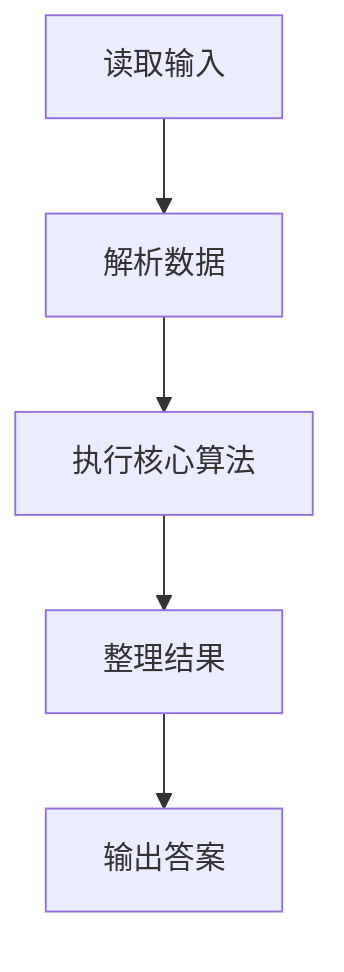
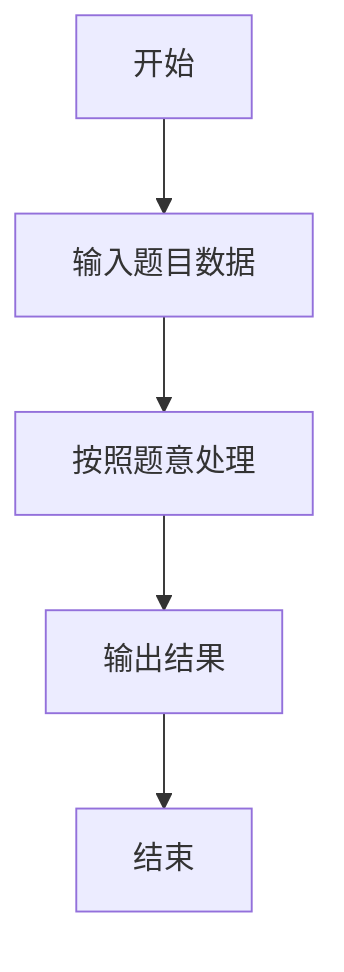

# L2-042 - 老板的作息表（25 分）

- **时间限制**: 200 ms
- **内存限制**: 65536 KB
- **代码长度限制**: 16 KB

---

## 题目描述


新浪微博上有人发了某老板的作息时间表，表示其每天 4:30 就起床了。但立刻有眼尖的网友问：这时间表不完整啊，早上九点到下午一点干啥了？

本题就请你编写程序，检查任意一张时间表，找出其中没写出来的时间段。

### 输入格式:

输入第一行给出一个正整数 $$N$$，为作息表上列出的时间段的个数。随后 $$N$$ 行，每行给出一个时间段，格式为：

```
hh:mm:ss - hh:mm:ss
```
其中 `hh`、`mm`、`ss` 分别是两位数表示的小时、分钟、秒。第一个时间是开始时间，第二个是结束时间。题目保证所有时间都在一天之内（即从 00:00:00 到 23:59:59）；每个区间间隔至少 1 秒；并且任意两个给出的时间区间最多只在一个端点有重合，没有区间重叠的情况。

### 输出格式:

按照时间顺序列出时间表中没有出现的区间，每个区间占一行，格式与输入相同。题目保证至少存在一个区间需要输出。

### 输入样例:
```in
8
13:00:00 - 18:00:00
00:00:00 - 01:00:05
08:00:00 - 09:00:00
07:10:59 - 08:00:00
01:00:05 - 04:30:00
06:30:00 - 07:10:58
05:30:00 - 06:30:00
18:00:00 - 19:00:00
```

### 输出样例:
```out
04:30:00 - 05:30:00
07:10:58 - 07:10:59
09:00:00 - 13:00:00
19:00:00 - 23:59:59
```

## 示例

### 示例 1

**输入:**
```
8
13:00:00 - 18:00:00
00:00:00 - 01:00:05
08:00:00 - 09:00:00
07:10:59 - 08:00:00
01:00:05 - 04:30:00
06:30:00 - 07:10:58
05:30:00 - 06:30:00
18:00:00 - 19:00:00
```

**输出:**
```
04:30:00 - 05:30:00
07:10:58 - 07:10:59
09:00:00 - 13:00:00
19:00:00 - 23:59:59
```

### 解题思路

本题的 Ruby 实现采用数据结构维护与区间处理。程序先读取题目输入，建立与题意对应的数据结构，按照约束完成核心计算，并按规定格式输出结果。具体实现以同目录的 main.rb 为准。

### 代码流程说明

1. 读取并解析标准输入，转换为题目所需的数据结构。
2. 按题意执行核心算法，维护中间状态并处理边界情况。
3. 整理计算结果，按照输出格式生成答案。

### 代码实现

完整实现位于同目录的 [main.rb](./main.rb)，以下代码与该入口文件保持一致。

```ruby
# frozen_string_literal: true
require_relative '../gplt_runtime'
lines = py_lines.reject(&:empty?)
n = lines.shift.to_i
to_seconds = ->(s) { h, m, sec = s.split(':').map(&:to_i); h * 3600 + m * 60 + sec }
segments = lines.first(n).map { |line| line.split('-').map(&:strip).map { |x| to_seconds.call(x) } }.sort
out = []
last = 0
format_time = ->(t) { format('%02d:%02d:%02d', t / 3600, t / 60 % 60, t % 60) }
segments.each do |a, b|
  out << "#{format_time.call(last)} - #{format_time.call(a)}" if a > last
  last = [last, b].max
end
out << "#{format_time.call(last)} - 23:59:59" if last < 86_399
py_print(out.join("\n"))
```

### 代码流程图



### 解题流程图


