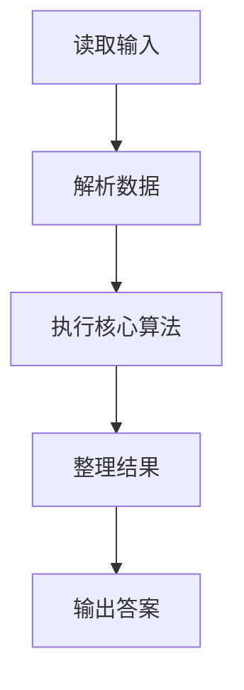
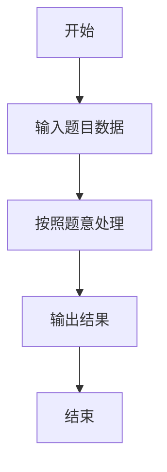

# L2-044 - 大众情人（25 分）

- **时间限制**: 400 ms
- **内存限制**: 65536 KB
- **代码长度限制**: 16 KB

---

## 题目描述


人与人之间总有一点距离感。我们假定两个人之间的亲密程度跟他们之间的距离感成反比，并且距离感是单向的。例如小蓝对小红患了单相思，从小蓝的眼中看去，他和小红之间的距离为 1，只差一层窗户纸；但在小红的眼里，她和小蓝之间的距离为 108000，差了十万八千里…… 另外，我们进一步假定，距离感在认识的人之间是可传递的。例如小绿觉得自己跟小蓝之间的距离为 2，则即使小绿并不直接认识小红，我们也默认小绿早晚会认识小红，并且因为跟小蓝很亲近的关系，小绿会觉得自己跟小红之间的距离为 1+2=3。当然这带来一个问题，如果小绿本来也认识小红，或者他通过其他人也能认识小红，但通过不同渠道推导出来的距离感不一样，该怎么算呢？我们在这里做个简单定义，就将小绿对小红的距离感定义为所有推导出来的距离感的最小值。

一个人的异性缘不是由最喜欢他/她的那个异性决定的，而是由对他/她最无感的那个异性决定的。我们记一个人 $$i$$ 在一个异性 $$j$$ 眼中的距离感为 $$D_{ij}$$；将 $$i$$ 的“异性缘”定义为 $$1/\max_{j\in S(i)} \{ D_{ij}\}$$，其中 $$S(i)$$ 是相对于 $$i$$ 的所有异性的集合。那么“大众情人”就是异性缘最好（值最大）的那个人。

本题就请你从给定的一批人与人之间的距离感中分别找出两个性别中的“大众情人”。

### 输入格式:

输入在第一行中给出一个正整数 $$N$$（$$\le 500$$），为总人数。于是我们默认所有人从 1 到 $$N$$ 编号。

随后 $$N$$ 行，第 $$i$$ 行描述了编号为 $$i$$ 的人与其他人的关系，格式为：

```
性别 K 朋友1:距离1 朋友2:距离2 …… 朋友K:距离K
```

其中 `性别` 是这个人的性别，`F` 表示女性，`M` 表示男性；`K`（$$<N$$ 的非负整数）为这个人直接认识的朋友数；随后给出的是这 `K` 个朋友的编号、以及这个人对该朋友的距离感。距离感是不超过 $$10^6$$ 的正整数。

题目保证给出的关系中一定两种性别的人都有，不会出现重复给出的关系，并且每个人的朋友中都不包含自己。

### 输出格式:

第一行给出自身为女性的“大众情人”的编号，第二行给出自身为男性的“大众情人”的编号。如果存在并列，则按编号递增的顺序输出所有。数字间以一个空格分隔，行首尾不得有多余空格。

### 输入样例:
```in
6
F 1 4:1
F 2 1:3 4:10
F 2 4:2 2:2
M 2 5:1 3:2
M 2 2:2 6:2
M 2 3:1 2:5
```

### 输出样例:
```out
2 3
4
```

## 示例

### 示例 1

**输入:**
```
6
F 1 4:1
F 2 1:3 4:10
F 2 4:2 2:2
M 2 5:1 3:2
M 2 2:2 6:2
M 2 3:1 2:5
```

**输出:**
```
2 3
4
```

### 解题思路

本题的 Ruby 实现采用字符串解析与规则处理。程序先读取题目输入，建立与题意对应的数据结构，按照约束完成核心计算，并按规定格式输出结果。具体实现以同目录的 main.rb 为准。

### 代码流程说明

1. 读取并解析标准输入，转换为题目所需的数据结构。
2. 按题意执行核心算法，维护中间状态并处理边界情况。
3. 整理计算结果，按照输出格式生成答案。

### 代码实现

完整实现位于同目录的 [main.rb](./main.rb)，以下代码与该入口文件保持一致。

```ruby
# frozen_string_literal: true
require_relative '../gplt_runtime'
def entry
  v = py_input_data.split
  n = py_int(v[0])
  k = 1
  g = ([""] * (n + 1))
  d = py_iterable(py_range((n + 1))).flat_map { |_|; [([(10 ** 12)] * (n + 1))] }
  for i in py_range(1, (n + 1))
    g[i] = v[k]
    z = py_int(v[(k + 1)])
    k += 2
    d[i][i] = 0
    for _ in py_range(z)
      x, w = v[k].split(":")
      k += 1
      d[i][py_int(x)] = py_int(w)
    end
  end
  for z in py_range(1, (n + 1))
    for i in py_range(1, (n + 1))
      for j in py_range(1, (n + 1))
        d[i][j] = py_min(d[i][j], (d[i][z] + d[z][j]))
      end
    end
  end
  score = py_iterable(py_range(1, (n + 1))).flat_map { |i|; [py_max(py_iterable(py_range(1, (n + 1))).flat_map { |j|; next [] unless py_truth(((g[j] != g[i]))); [d[j][i]] })] }
  bf = py_min(py_iterable(py_range(1, (n + 1))).flat_map { |i|; next [] unless py_truth(((g[i] == "F"))); [score[(i - 1)]] })
  bm = py_min(py_iterable(py_range(1, (n + 1))).flat_map { |i|; next [] unless py_truth(((g[i] == "M"))); [score[(i - 1)]] })
  py_print(py_iterable(py_range(1, (n + 1))).flat_map { |i|; next [] unless py_truth((((g[i] == "F")) && ((score[(i - 1)] == bf)))); [py_str(i)] }.join(" "), sep: " ", ending: "\n")
  py_print(py_iterable(py_range(1, (n + 1))).flat_map { |i|; next [] unless py_truth((((g[i] == "M")) && ((score[(i - 1)] == bm)))); [py_str(i)] }.join(" "), sep: " ", ending: "\n")
end
entry
```

### 代码流程图



### 解题流程图


