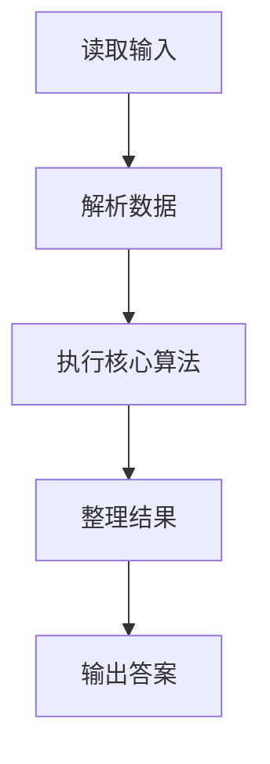
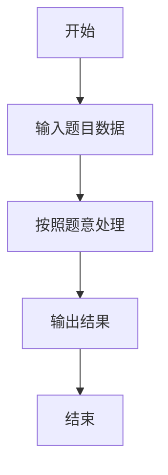

# L2-045 - 堆宝塔（25 分）

- **时间限制**: 400 ms
- **内存限制**: 65536 KB
- **代码长度限制**: 16 KB

---

## 题目描述


堆宝塔游戏是让小朋友根据抓到的彩虹圈的直径大小，按照从大到小的顺序堆起宝塔。但彩虹圈不一定是按照直径的大小顺序抓到的。聪明宝宝采取的策略如下：
- 首先准备两根柱子，一根 A 柱串宝塔，一根 B 柱用于临时叠放。
- 把第 1 块彩虹圈作为第 1 座宝塔的基座，在 A 柱放好。
- 将抓到的下一块彩虹圈 C 跟当前 A 柱宝塔最上面的彩虹圈比一下，如果比最上面的小，就直接放上去；否则把 C 跟 B 柱最上面的彩虹圈比一下：
-- 如果 B 柱是空的、或者 C 大，就在 B 柱上放好；
-- 否则把 A 柱上串好的宝塔取下来作为一件成品；然后把 B 柱上所有比 C 大的彩虹圈逐一取下放到 A 柱上，最后把 C 也放到 A 柱上。

重复此步骤，直到所有的彩虹圈都被抓完。最后 A 柱上剩下的宝塔作为一件成品，B 柱上剩下的彩虹圈被逐一取下，堆成另一座宝塔。问：宝宝一共堆出了几个宝塔？最高的宝塔有多少层？

### 输入格式:

输入第一行给出一个正整数 $$N$$（$$\le 10^3$$），为彩虹圈的个数。第二行按照宝宝抓取的顺序给出 $$N$$ 个不超过 100 的正整数，对应每个彩虹圈的直径。

### 输出格式:

在一行中输出宝宝堆出的宝塔个数，和最高的宝塔的层数。数字间以 1 个空格分隔，行首尾不得有多余空格。

### 输入样例:
```in
11
10 8 9 5 12 11 4 3 1 9 15
```

### 输出样例:
```out
4 5
```

## 示例

### 示例 1

**输入:**
```
11
10 8 9 5 12 11 4 3 1 9 15
```

**输出:**
```
4 5
```

### 解题思路

本题的 Ruby 实现采用字符串解析与规则处理。程序先读取题目输入，建立与题意对应的数据结构，按照约束完成核心计算，并按规定格式输出结果。具体实现以同目录的 main.rb 为准。

### 代码流程说明

1. 读取并解析标准输入，转换为题目所需的数据结构。
2. 按题意执行核心算法，维护中间状态并处理边界情况。
3. 整理计算结果，按照输出格式生成答案。

### 代码实现

完整实现位于同目录的 [main.rb](./main.rb)，以下代码与该入口文件保持一致。

```ruby
# frozen_string_literal: true
require_relative '../gplt_runtime'
def entry
  v = (py_map(->(x) { py_int(x) }, py_tokens).to_a)
  n = v[0]
  a = py_slice(v, 1, nil, nil)
  py_a = [a[0]]
  py_b = []
  hs = []
  for x in py_slice(a, 1, nil, nil)
    if (py_truth(py_a) && ((x < py_a[(-1)])))
      py_a.append(x)
      else
        if ((!py_truth(py_b)) || ((x > py_b[(-1)])))
          py_b.append(x)
          else
            hs.append(py_len(py_a))
            py_a = []
            while (py_truth(py_b) && ((py_b[(-1)] > x)))
              py_a.append(py_b.pop())
            end
            py_a.append(x)
        end
    end
  end
  if py_truth(py_a)
    hs.append(py_len(py_a))
  end
  if py_truth(py_b)
    hs.append(py_len(py_b))
  end
  py_print(py_len(hs), py_max(hs, default: 0), sep: " ", ending: "\n")
end
entry
```

### 代码流程图



### 解题流程图


