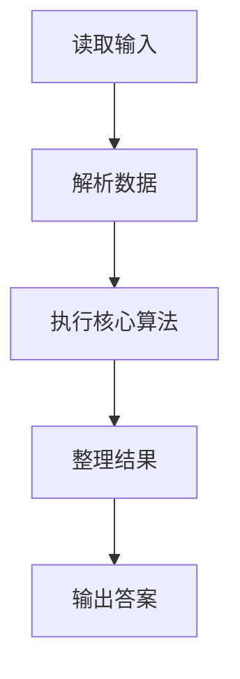
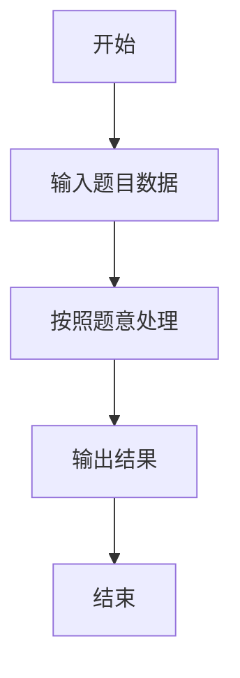

# L2-047 - 锦标赛（25 分）

- **时间限制**: 400 ms
- **内存限制**: 65536 KB
- **代码长度限制**: 16 KB

---

## 题目描述


有 $2^k$ 名选手将要参加一场锦标赛。锦标赛共有 $k$ 轮，其中第 $i$ 轮的比赛共有 $2^{k - i}$ 场，每场比赛恰有两名选手参加并从中产生一名胜者。每场比赛的安排如下：

* 对于第 $1$ 轮的第 $j$ 场比赛，由第 $(2j - 1)$ 名选手对抗第 $2j$ 名选手。
* 对于第 $i$ 轮的第 $j$ 场比赛（$i > 1$），由第 $(i - 1)$ 轮第 $(2j - 1)$ 场比赛的胜者对抗第 $(i - 1)$ 轮第 $2j$ 场比赛的胜者。

第 $k$ 轮唯一一场比赛的胜者就是整个锦标赛的最终胜者。\
举个例子，假如共有 $8$ 名选手参加锦标赛，则比赛的安排如下：

* 第 $1$ 轮共 $4$ 场比赛：选手 $1$ vs 选手 $2$，选手 $3$ vs 选手 $4$，选手 $5$ vs 选手 $6$，选手 $7$ vs 选手 $8$。
* 第 $2$ 轮共 $2$ 场比赛：第 $1$ 轮第 $1$ 场的胜者 vs 第 $1$ 轮第 $2$ 场的胜者，第 $1$ 轮第 $3$ 场的胜者 vs 第 $1$ 轮第 $4$ 场的胜者。
* 第 $3$ 轮共 $1$ 场比赛：第 $2$ 轮第 $1$ 场的胜者 vs 第 $2$ 轮第 $2$ 场的胜者。

已知每一名选手都有一个能力值，其中第 $i$ 名选手的能力值为 $a_i$。在一场比赛中，若两名选手的能力值不同，则能力值较大的选手一定会打败能力值较小的选手；若两名选手的能力值相同，则两名选手都有可能成为胜者。

令 $l_{i, j}$ 表示第 $i$ 轮第 $j$ 场比赛 **败者** 的能力值，令 $w$ 表示整个锦标赛最终胜者的能力值。给定所有满足 $1 \le i \le k$ 且 $1 \le j \le 2^{k - i}$ 的 $l_{i, j}$ 以及 $w$，请还原出 $a_1, a_2, \cdots, a_n$。

### 输入格式:

第一行输入一个整数 $k$（$1 \le k \le 18$）表示锦标赛的轮数。\
对于接下来 $k$ 行，第 $i$ 行输入 $2^{k - i}$ 个整数 $l_{i, 1}, l_{i, 2}, \cdots, l_{i, 2^{k - i}}$（$1 \le l_{i, j} \le 10^9$），其中 $l_{i, j}$ 表示第 $i$ 轮第 $j$ 场比赛 **败者** 的能力值。\
接下来一行输入一个整数 $w$（$1 \le w \le 10^9$）表示锦标赛最终胜者的能力值。

### 输出格式:

输出一行 $n$ 个由单个空格分隔的整数 $a_1, a_2, \cdots, a_n$，其中 $a_i$ 表示第 $i$ 名选手的能力值。如果有多种合法答案，请输出任意一种。如果无法还原出能够满足输入数据的答案，输出一行 `No Solution`。\
请勿在行末输出多余空格。

### 输入样例 1：
```in
3
4 5 8 5
7 6
8
9
```

### 输出样例 1：
```out
7 4 8 5 9 8 6 5
```

### 输入样例 2：
```in
2
5 8
3
9
```

### 输出样例 2：
```out
No Solution
```

## 示例

### 示例 1

**输入:**
```
3
4 5 8 5
7 6
8
9
```

**输出:**
```
7 4 8 5 9 8 6 5
```

### 示例 2

**输入:**
```
2
5 8
3
9
```

**输出:**
```
No Solution
```

### 解题思路

本题的 Ruby 实现采用排序、贪心与顺序模拟。程序先读取题目输入，建立与题意对应的数据结构，按照约束完成核心计算，并按规定格式输出结果。具体实现以同目录的 main.rb 为准。

### 代码流程说明

1. 读取并解析标准输入，转换为题目所需的数据结构。
2. 按题意执行核心算法，维护中间状态并处理边界情况。
3. 整理计算结果，按照输出格式生成答案。

### 代码实现

完整实现位于同目录的 [main.rb](./L2-047_锦标赛/main.rb)，以下代码与该入口文件保持一致。

```ruby
# frozen_string_literal: true
require_relative '../gplt_runtime'
def entry
  v = (py_map(->(x) { py_int(x) }, py_tokens).to_a)
  k = v[0]
  n = (1 << k)
  idx = 1
  py_l = [nil]
  for lev in py_range(1, (k + 1))
    z = (1 << (k - lev))
    py_l.append(([0] + py_slice(v, idx, (idx + z), nil)))
    idx += z
  end
  w = v[idx]
  need = ([nil] + py_iterable(py_slice(py_l, 1, nil, nil)).flat_map { |x|; [([(10 ** 30)] * py_len(x))] })
  for lev in py_range(1, (k + 1))
    for j in py_range(1, py_len(py_l[lev]))
      if ((lev == 1))
        need[lev][j] = py_l[lev][j]
        else
          x, y = [need[(lev - 1)][((2 * j) - 1)], need[(lev - 1)][(2 * j)]]
          small, large = py_sorted([x, y])
          need[lev][j] = (((small <= py_l[lev][j])) ? py_max(py_l[lev][j], large) : (10 ** 30))
      end
    end
  end
  if ((need[k][1] > w))
    py_print("No Solution", sep: " ", ending: "\n")
    else
      ans = ([0] * (n + 1))
      go = lambda do |lev, j, py_w|
        if ((lev == 0))
          ans[j] = py_w
          return
        end
        if ((lev == 1))
          ans[((2 * j) - 1)] = py_w
          ans[(2 * j)] = py_l[1][j]
          return
        end
        x, y = [need[(lev - 1)][((2 * j) - 1)], need[(lev - 1)][(2 * j)]]
        small, large = py_sorted([x, y])
        if ((x <= y))
          go.call((lev - 1), ((2 * j) - 1), py_l[lev][j])
          go.call((lev - 1), (2 * j), py_w)
          else
            go.call((lev - 1), ((2 * j) - 1), py_w)
            go.call((lev - 1), (2 * j), py_l[lev][j])
        end
      end
      go.call(k, 1, w)
      py_print(py_map(->(x) { py_str(x) }, py_slice(ans, 1, nil, nil)).join(" "), sep: " ", ending: "\n")
  end
end
entry
```

### 代码流程图



### 解题流程图


