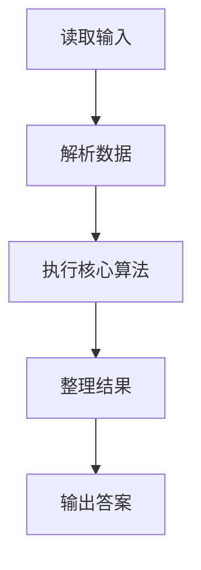
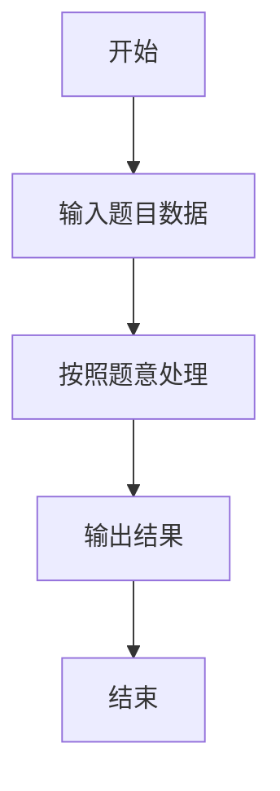

# L2-048 - 寻宝图（25 分）

- **时间限制**: 400 ms
- **内存限制**: 65536 KB
- **代码长度限制**: 16 KB

---

## 题目描述


给定一幅地图，其中有水域，有陆地。被水域完全环绕的陆地是岛屿。有些岛屿上埋藏有宝藏，这些有宝藏的点也被标记出来了。本题就请你统计一下，给定的地图上一共有多少岛屿，其中有多少是有宝藏的岛屿。

### 输入格式:

输入第一行给出 2 个正整数 $N$ 和 $M$（$1 < N\times M\le 10^5$），是地图的尺寸，表示地图由 $N$ 行 $M$ 列格子构成。随后 $N$ 行，每行给出 $M$ 位个位数，其中 `0` 表示水域，`1` 表示陆地，`2`\-`9` 表示宝藏。\
注意：两个格子共享一条边时，才是“相邻”的。宝藏都埋在陆地上。默认地图外围全是水域。

### 输出格式:

在一行中输出 2 个整数，分别是岛屿的总数量和有宝藏的岛屿的数量。

### 输入样例:
```in
10 11
01000000151
11000000111
00110000811
00110100010
00000000000
00000111000
00114111000
00110010000
00019000010
00120000001
```

### 输出样例:
```out
7 2
```

## 示例

### 示例 1

**输入:**
```
10 11
01000000151
11000000111
00110000811
00110100010
00000000000
00000111000
00114111000
00110010000
00019000010
00120000001
```

**输出:**
```
7 2
```

### 解题思路

本题的 Ruby 实现采用字符串解析与规则处理。程序先读取题目输入，建立与题意对应的数据结构，按照约束完成核心计算，并按规定格式输出结果。具体实现以同目录的 main.rb 为准。

### 代码流程说明

1. 读取并解析标准输入，转换为题目所需的数据结构。
2. 按题意执行核心算法，维护中间状态并处理边界情况。
3. 整理计算结果，按照输出格式生成答案。

### 代码实现

完整实现位于同目录的 [main.rb](./main.rb)，以下代码与该入口文件保持一致。

```ruby
# frozen_string_literal: true
require_relative '../gplt_runtime'
v = py_input_data.split
n = v.shift.to_i
m = v.shift.to_i
grid = v.shift(n)
seen = {}
islands = 0
treasures = 0
n.times do |i|
  m.times do |j|
    next if grid[i][j] == '0' || seen[[i, j]]
    islands += 1
    stack = [[i, j]]
    seen[[i, j]] = true
    has_treasure = false
    until stack.empty?
      x, y = stack.pop
      has_treasure = true if grid[x][y] != '1'
      [[x - 1, y], [x + 1, y], [x, y - 1], [x, y + 1]].each do |nx, ny|
        next unless nx.between?(0, n - 1) && ny.between?(0, m - 1)
        next if grid[nx][ny] == '0' || seen[[nx, ny]]
        seen[[nx, ny]] = true
        stack << [nx, ny]
      end
    end
    treasures += 1 if has_treasure
  end
end
py_print("#{islands} #{treasures}")
```

### 代码流程图



### 解题流程图


