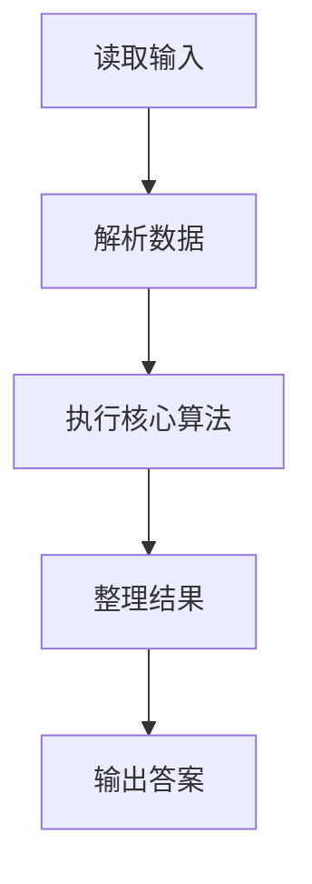
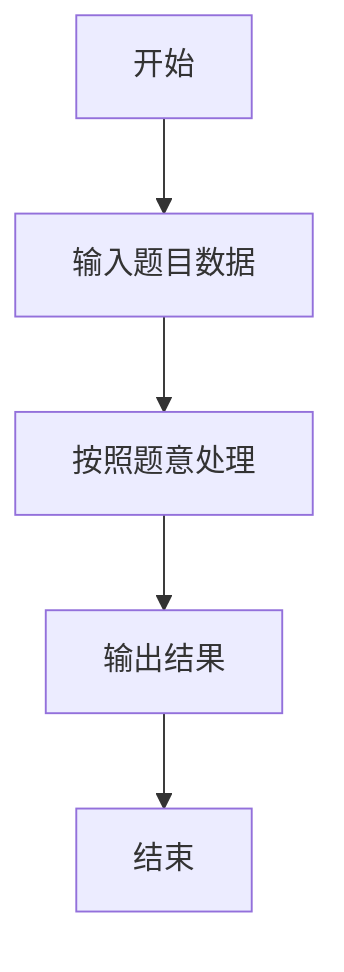

# L2-051 - 满树的遍历（25 分）

- **时间限制**: 400 ms
- **内存限制**: 65536 KB
- **代码长度限制**: 16 KB

---

## 题目描述


一棵“$k$ 阶满树”是指树中所有非叶结点的度都是 $k$ 的树。给定一棵树，你需要判断其是否为 $k$ 阶满树，并输出其前序遍历序列。

注：树中结点的度是其拥有的子树的个数，而树的度是树内各结点的度的最大值。

### 输入格式:

输入首先在第一行给出一个正整数 $n$（$\le 10^5$），是树中结点的个数。于是设所有结点从 1 到 $n$ 编号。
随后 $n$ 行，第 $i$ 行（$1\le i \le n$）给出第 $i$ 个结点的父结点编号。根结点没有父结点，则对应的父结点编号为 `0`。题目保证给出的是一棵合法多叉树，只有唯一根结点。

### 输出格式:

首先在一行中输出该树的度。如果输入的树是 $k$ 阶满树，则加 1 个空格后输出 `yes`，否则输出 `no`。最后在第二行输出该树的前序遍历序列，数字间以 1 个空格分隔，行首尾不得有多余空格。
注意：兄弟结点按编号升序访问。

### 输入样例 1：
```in
7
6
5
5
6
6
0
5
```

### 输出样例 1：
```out
3 yes
6 1 4 5 2 3 7
```

### 输入样例 2：
```in
7
6
5
5
6
6
0
4
```

### 输出样例 2：
```out
3 no
6 1 4 7 5 2 3
```

## 示例

### 示例 1

**输入:**
```
7
6
5
5
6
6
0
5
```

**输出:**
```
3 yes
6 1 4 5 2 3 7
```

### 示例 2

**输入:**
```
7
6
5
5
6
6
0
4
```

**输出:**
```
3 no
6 1 4 7 5 2 3
```

### 解题思路

本题的 Ruby 实现采用排序、贪心与顺序模拟。程序先读取题目输入，建立与题意对应的数据结构，按照约束完成核心计算，并按规定格式输出结果。具体实现以同目录的 main.rb 为准。

### 代码流程说明

1. 读取并解析标准输入，转换为题目所需的数据结构。
2. 按题意执行核心算法，维护中间状态并处理边界情况。
3. 整理计算结果，按照输出格式生成答案。

### 代码实现

完整实现位于同目录的 [main.rb](./L2-051_满树的遍历/main.rb)，以下代码与该入口文件保持一致。

```ruby
# frozen_string_literal: true
require_relative '../gplt_runtime'
def entry
  v = (py_map(->(x) { py_int(x) }, py_tokens).to_a)
  n = v[0]
  p = py_slice(v, 1, (1 + n), nil)
  g = py_iterable(py_range((n + 1))).flat_map { |_|; [[]] }
  root = 0
  for i, x in py_enumerate(p, 1)
    if ((x == 0))
      root = i
      else
        g[x].append(i)
    end
  end
  d = py_max(py_map(->(x) { py_len(x) }, g))
  full = py_iterable(g).flat_map { |x|; [((!py_truth(x)) || ((py_len(x) == d)))] }.all?
  out = []
  dfs = lambda do |x|
    out.append(x)
    py_iterable(py_sorted(g[x])).flat_map { |y|; [dfs.call(y)] }
  end
  dfs.call(root)
  py_print(d, (full ? "yes" : "no"), sep: " ", ending: "\n")
  py_print(py_map(->(x) { py_str(x) }, out).join(" "), sep: " ", ending: "\n")
end
entry
```

### 代码流程图



### 解题流程图


