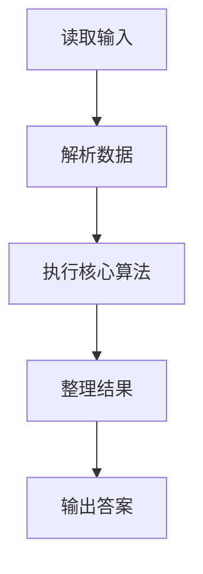
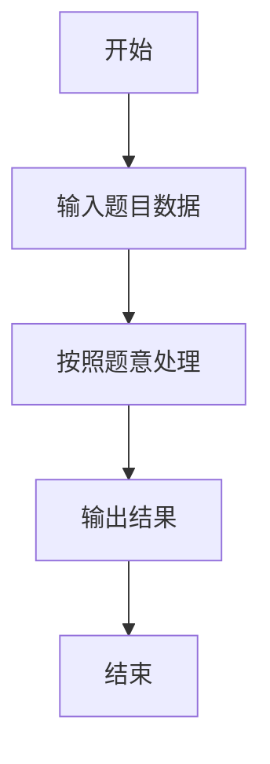

# L2-052 - 吉利矩阵（25 分）

- **时间限制**: 1000 ms
- **内存限制**: 65536 KB
- **代码长度限制**: 16 KB

---

## 题目描述


所有元素为非负整数，且各行各列的元素和都等于 $7$ 的 $3 \times 3$ 方阵称为“吉利矩阵”，因为这样的矩阵一共有 $666$ 种。
本题就请你统计一下，把 $7$ 换成任何一个 $[2, 9]$ 区间内的正整数 $L$，把矩阵阶数换成任何一个 $[2, 4]$ 区间内的正整数 $N$，满足条件“所有元素为非负整数，且各行各列的元素和都等于 $L$”的 $N \times N$ 方阵一共有多少种？

### 输入格式:

输入在一行中给出 2 个正整数 $L$ 和 $N$，意义如题面所述。数字间以空格分隔。

### 输出格式:

在一行中输出满足题目要求条件的方阵的个数。

### 输入样例:
```in
7 3
```

### 输出样例:
```out
666
```

## 示例

### 示例 1

**输入:**
```
7 3
```

**输出:**
```
666
```

### 解题思路

本题的 Ruby 实现采用动态规划或状态转移。程序先读取题目输入，建立与题意对应的数据结构，按照约束完成核心计算，并按规定格式输出结果。具体实现以同目录的 main.rb 为准。

### 代码流程说明

1. 读取并解析标准输入，转换为题目所需的数据结构。
2. 按题意执行核心算法，维护中间状态并处理边界情况。
3. 整理计算结果，按照输出格式生成答案。

### 代码实现

完整实现位于同目录的 [main.rb](./L2-052_吉利矩阵/main.rb)，以下代码与该入口文件保持一致。

```ruby
# frozen_string_literal: true
require_relative '../gplt_runtime'
limit, size = py_tokens.map(&:to_i)
rows = []
build = lambda do |prefix, remaining|
  if prefix.length == size - 1
    rows << prefix + [remaining]
  else
    (0..remaining).each { |x| build.call(prefix + [x], remaining - x) }
  end
end
build.call([], limit)
dp = { Array.new(size, 0) => 1 }
size.times do
  next_dp = Hash.new(0)
  dp.each do |current, ways|
    rows.each do |row|
      sums = current.zip(row).map { |a, b| a + b }
      next if sums.max > limit
      next_dp[sums] += ways
    end
  end
  dp = next_dp
end
py_print(dp.fetch(Array.new(size, limit), 0).to_s)
```

### 代码流程图



### 解题流程图


