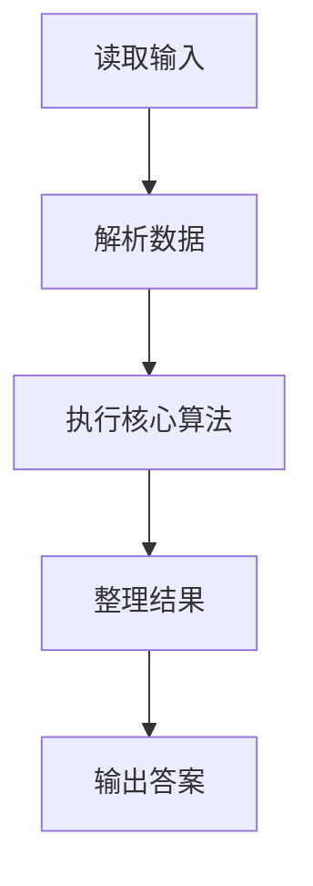
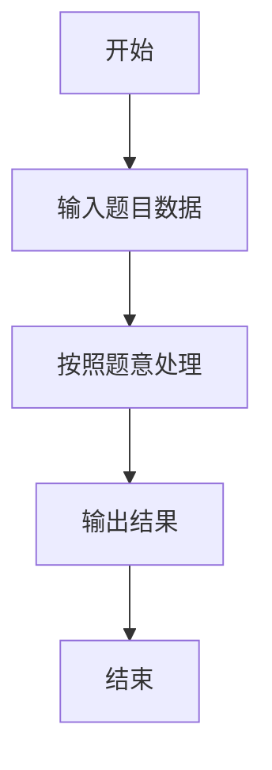

# L3-001 - 凑零钱（30 分）

- **时间限制**: 300 ms
- **内存限制**: 65536 KB
- **代码长度限制**: 16 KB

---

## 题目描述


韩梅梅喜欢满宇宙到处逛街。现在她逛到了一家火星店里，发现这家店有个特别的规矩：你可以用任何星球的硬币付钱，但是绝不找零，当然也不能欠债。韩梅梅手边有 $$10^4$$ 枚来自各个星球的硬币，需要请你帮她盘算一下，是否可能精确凑出要付的款额。

### 输入格式:

输入第一行给出两个正整数：$$N$$（$$\le 10^4$$）是硬币的总个数，$$M$$（$$\le 10^2$$）是韩梅梅要付的款额。第二行给出 $$N$$ 枚硬币的正整数面值。数字间以空格分隔。

### 输出格式:

在一行中输出硬币的面值 $$V_1 \le V_2 \le \cdots \le V_k$$，满足条件 $$V_1 + V_2 + ... + V_k = M$$。数字间以 1 个空格分隔，行首尾不得有多余空格。若解不唯一，则输出最小序列。若无解，则输出 `No Solution`。

注：我们说序列{ $$A[1], A[2], \cdots$$ }比{ $$B[1], B[2], \cdots$$ }“小”，是指存在 $$k \ge 1$$ 使得 $$A[i]=B[i]$$ 对所有 $$i < k$$ 成立，并且 $$A[k] < B[k]$$。

### 输入样例 1：
```in
8 9
5 9 8 7 2 3 4 1
```

### 输出样例 1：
```out
1 3 5
```

### 输入样例 2：
```in
4 8
7 2 4 3
```

### 输出样例 2：
```out
No Solution
```

## 示例

### 示例 1

**输入:**
```
8 9
5 9 8 7 2 3 4 1
```

**输出:**
```
1 3 5
```

### 示例 2

**输入:**
```
4 8
7 2 4 3
```

**输出:**
```
No Solution
```

### 解题思路

本题的 Ruby 实现采用排序、贪心与顺序模拟。程序先读取题目输入，建立与题意对应的数据结构，按照约束完成核心计算，并按规定格式输出结果。具体实现以同目录的 main.rb 为准。

### 代码流程说明

1. 读取并解析标准输入，转换为题目所需的数据结构。
2. 按题意执行核心算法，维护中间状态并处理边界情况。
3. 整理计算结果，按照输出格式生成答案。

### 代码实现

完整实现位于同目录的 [main.rb](./L3-001_凑零钱/main.rb)，以下代码与该入口文件保持一致。

```ruby
# frozen_string_literal: true
require_relative '../gplt_runtime'
def entry
  main = lambda do ||
    a = (py_map(->(x) { py_int(x) }, py_tokens).to_a)
    if (!py_truth(a))
      return
    end
    n, target = py_slice(a, nil, 2, nil)
    coins = py_sorted(py_slice(a, 2, (2 + n), nil))
    can = py_iterable(py_range((n + 1))).flat_map { |_|; [([false] * (target + 1))] }
    can[n][0] = true
    for i in py_range((n - 1), (-1), (-1))
      row, nxt = [can[i], can[(i + 1)]]
      for s in py_range((target + 1))
        row[s] = (py_truth(nxt[s]) || (((s >= coins[i])) && py_truth(nxt[(s - coins[i])])))
      end
    end
    if (!py_truth(can[0][target]))
      py_print("No Solution", sep: " ", ending: "\n")
      return
    end
    ans, rest = [[], target]
    for i, x in py_enumerate(coins)
      if (((rest >= x)) && py_truth(can[(i + 1)][(rest - x)]))
        ans.append(x)
        rest -= x
      end
    end
    py_print(*ans, sep: " ", ending: "\n")
  end
  main.call
end
entry
```

### 代码流程图



### 解题流程图


