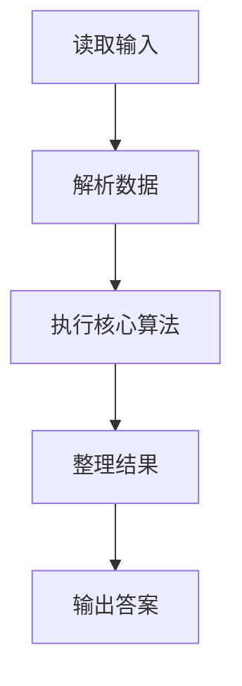
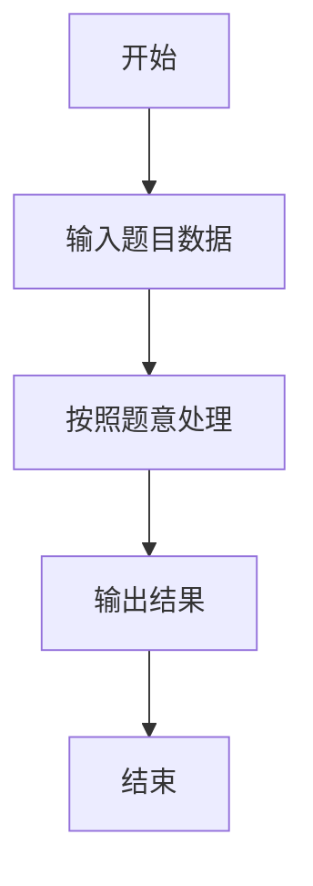

# L3-002 - 特殊堆栈（30 分）

- **时间限制**: 400 ms
- **内存限制**: 65536 KB
- **代码长度限制**: 16 KB

---

## 题目描述


堆栈是一种经典的后进先出的线性结构，相关的操作主要有“入栈”（在堆栈顶插入一个元素）和“出栈”（将栈顶元素返回并从堆栈中删除）。本题要求你实现另一个附加的操作：“取中值”——即返回所有堆栈中元素键值的中值。给定 N 个元素，如果 N 是偶数，则中值定义为第 N/2 小元；若是奇数，则为第 (N+1)/2 小元。

### 输入格式:

输入的第一行是正整数 N（$$\le 10^5$$）。随后 N 行，每行给出一句指令，为以下 3 种之一：

```
Push key
Pop
PeekMedian
```

其中 `key` 是不超过 $$10^5$$ 的正整数；`Push` 表示“入栈”；`Pop` 表示“出栈”；`PeekMedian` 表示“取中值”。

### 输出格式:

对每个 `Push` 操作，将 `key` 插入堆栈，无需输出；对每个 `Pop` 或 `PeekMedian` 操作，在一行中输出相应的返回值。若操作非法，则对应输出 `Invalid`。

### 输入样例:
```in
17
Pop
PeekMedian
Push 3
PeekMedian
Push 2
PeekMedian
Push 1
PeekMedian
Pop
Pop
Push 5
Push 4
PeekMedian
Pop
Pop
Pop
Pop
```

### 输出样例:
```out
Invalid
Invalid
3
2
2
1
2
4
4
5
3
Invalid
```

## 示例

### 示例 1

**输入:**
```
17
Pop
PeekMedian
Push 3
PeekMedian
Push 2
PeekMedian
Push 1
PeekMedian
Pop
Pop
Push 5
Push 4
PeekMedian
Pop
Pop
Pop
Pop
```

**输出:**
```
Invalid
Invalid
3
2
2
1
2
4
4
5
3
Invalid
```

### 解题思路

本题的 Ruby 实现采用字符串解析与规则处理。程序先读取题目输入，建立与题意对应的数据结构，按照约束完成核心计算，并按规定格式输出结果。具体实现以同目录的 main.rb 为准。

### 代码流程说明

1. 读取并解析标准输入，转换为题目所需的数据结构。
2. 按题意执行核心算法，维护中间状态并处理边界情况。
3. 整理计算结果，按照输出格式生成答案。

### 代码实现

完整实现位于同目录的 [main.rb](./main.rb)，以下代码与该入口文件保持一致。

```ruby
# frozen_string_literal: true
require_relative '../gplt_runtime'
tokens = py_lines
n = tokens.shift.to_i
stack = []
bit = Array.new(100_002, 0)
add = lambda do |x, delta|
  i = x
  while i < bit.length
    bit[i] += delta
    i += i & -i
  end
end
kth = lambda do |rank|
  index = 0
  step = 1
  step <<= 1 while (step << 1) < bit.length
  while step.positive?
    nxt = index + step
    if nxt < bit.length && bit[nxt] < rank
      rank -= bit[nxt]
      index = nxt
    end
    step >>= 1
  end
  index + 1
end
answers = []
n.times do
  parts = tokens.shift.to_s.split
  case parts[0]
  when 'Push'
    value = parts[1].to_i
    stack << value
    add.call(value, 1)
  when 'Pop'
    if stack.empty?
      answers << 'Invalid'
    else
      value = stack.pop
      add.call(value, -1)
      answers << value.to_s
    end
  when 'PeekMedian'
    answers << (stack.empty? ? 'Invalid' : kth.call((stack.length + 1) / 2).to_s)
  end
end
py_print(answers.join("\n"))
```

### 代码流程图



### 解题流程图


