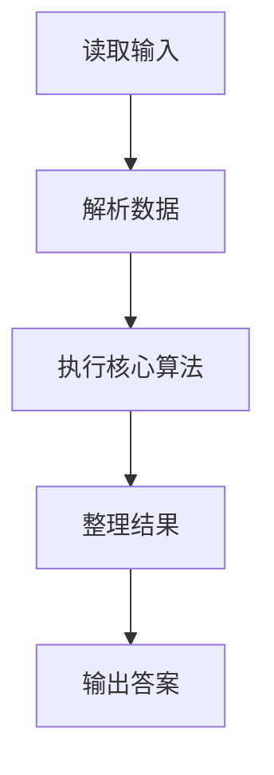
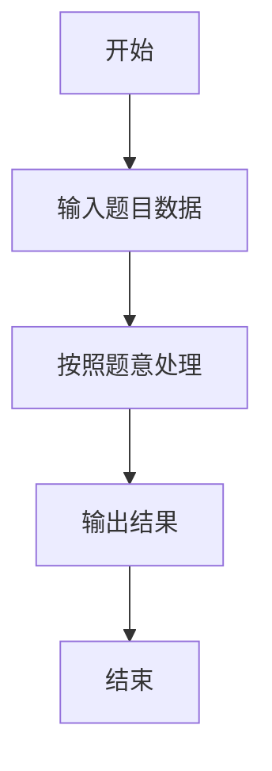

# L3-003 - 社交集群（30 分）

- **时间限制**: 1200 ms
- **内存限制**: 65536 KB
- **代码长度限制**: 16 KB

---

## 题目描述


当你在社交网络平台注册时，一般总是被要求填写你的个人兴趣爱好，以便找到具有相同兴趣爱好的潜在的朋友。一个“社交集群”是指部分兴趣爱好相同的人的集合。你需要找出所有的社交集群。

### 输入格式:

输入在第一行给出一个正整数 N（$$\le 1000$$），为社交网络平台注册的所有用户的人数。于是这些人从 1 到 N 编号。随后 N 行，每行按以下格式给出一个人的兴趣爱好列表：

$$K_i$$: $$h_i[1]$$ $$h_i[2]$$ ... $$h_i[K_i]$$

其中$$K_i (>0)$$是兴趣爱好的个数，$$h_i[j]$$是第$$j$$个兴趣爱好的编号，为区间 [1, 1000] 内的整数。

### 输出格式:

首先在一行中输出不同的社交集群的个数。随后第二行按非增序输出每个集群中的人数。数字间以一个空格分隔，行末不得有多余空格。

### 输入样例:
```in
8
3: 2 7 10
1: 4
2: 5 3
1: 4
1: 3
1: 4
4: 6 8 1 5
1: 4
```

### 输出样例:
```out
3
4 3 1
```

## 示例

### 示例 1

**输入:**
```
8
3: 2 7 10
1: 4
2: 5 3
1: 4
1: 3
1: 4
4: 6 8 1 5
1: 4
```

**输出:**
```
3
4 3 1
```

### 解题思路

本题的 Ruby 实现采用并查集或连通性维护。程序先读取题目输入，建立与题意对应的数据结构，按照约束完成核心计算，并按规定格式输出结果。具体实现以同目录的 main.rb 为准。

### 代码流程说明

1. 读取并解析标准输入，转换为题目所需的数据结构。
2. 按题意执行核心算法，维护中间状态并处理边界情况。
3. 整理计算结果，按照输出格式生成答案。

### 代码实现

完整实现位于同目录的 [main.rb](./L3-003_社交集群/main.rb)，以下代码与该入口文件保持一致。

```ruby
# frozen_string_literal: true
require_relative '../gplt_runtime'
def entry
  main = lambda do ||
    data = py_lines
    if (!py_truth(data))
      return
    end
    n = py_int(data[0])
    parent = (py_range((n + 1)).to_a)
    size = ([1] * (n + 1))
    owner = {}
    find = lambda do |x|
      while ((parent[x] != x))
        parent[x] = parent[parent[x]]
        x = parent[x]
      end
      return x
    end
    union = lambda do |a, b|
      a, b = [find.call(a), find.call(b)]
      if ((a == b))
        return
      end
      if ((size[a] < size[b]))
        a, b = [b, a]
      end
      parent[b] = a
      size[a] += size[b]
    end
    for i in py_range(1, (n + 1))
      tok = data[i].gsub(":", " ").split()
      for h in py_map(->(x) { py_int(x) }, py_slice(tok, 1, nil, nil))
        if (py_in(h, owner))
          union.call(i, owner[h])
          else
            owner[h] = i
        end
      end
    end
    groups = {}
    for i in py_range(1, (n + 1))
      r = find.call(i)
      groups[r] = (groups.fetch(r, 0) + 1)
    end
    ans = py_sorted(groups.values(), reverse: true)
    py_print(py_len(ans), sep: " ", ending: "\n")
    py_print(*ans, sep: " ", ending: "\n")
  end
  main.call
end
entry
```

### 代码流程图



### 解题流程图


