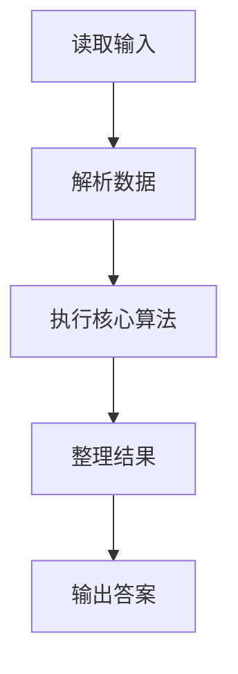
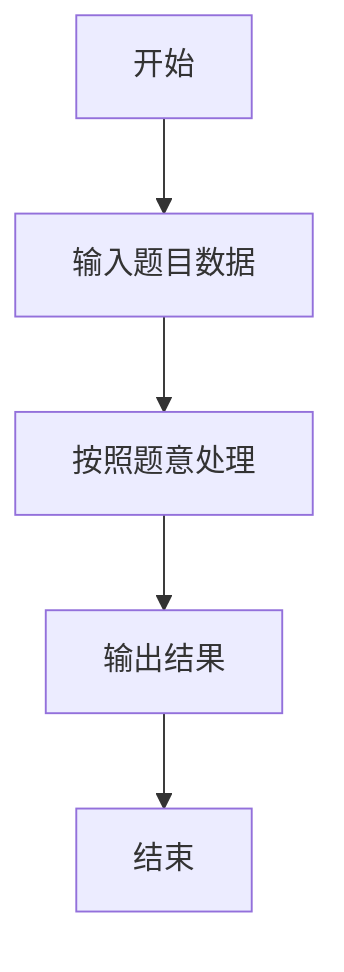

# L3-004 - 肿瘤诊断（30 分）

- **时间限制**: 600 ms
- **内存限制**: 65536 KB
- **代码长度限制**: 16 KB

---

## 题目描述


在诊断肿瘤疾病时，计算肿瘤体积是很重要的一环。给定病灶扫描切片中标注出的疑似肿瘤区域，请你计算肿瘤的体积。

### 输入格式:

输入第一行给出4个正整数：$$M$$、$$N$$、$$L$$、$$T$$，其中$$M$$和$$N$$是每张切片的尺寸（即每张切片是一个$$M\times N$$的像素矩阵。最大分辨率是$$1286\times 128$$）；$$L$$（$$\le 60$$）是切片的张数；$$T$$是一个整数阈值（若疑似肿瘤的连通体体积小于$$T$$，则该小块忽略不计）。

最后给出$$L$$张切片。每张用一个由0和1组成的$$M\times N$$的矩阵表示，其中1表示疑似肿瘤的像素，0表示正常像素。由于切片厚度可以认为是一个常数，于是我们只要数连通体中1的个数就可以得到体积了。麻烦的是，可能存在多个肿瘤，这时我们只统计那些体积不小于$$T$$的。两个像素被认为是“连通的”，如果它们有一个共同的切面，如下图所示，所有6个红色的像素都与蓝色的像素连通。


### 输出格式:

在一行中输出肿瘤的总体积。

### 输入样例:
```in
3 4 5 2
1 1 1 1
1 1 1 1
1 1 1 1
0 0 1 1
0 0 1 1
0 0 1 1
1 0 1 1
0 1 0 0
0 0 0 0
1 0 1 1
0 0 0 0
0 0 0 0
0 0 0 1
0 0 0 1
1 0 0 0
```

### 输出样例:
```out
26
```

## 示例

### 示例 1

**输入:**
```
3 4 5 2
1 1 1 1
1 1 1 1
1 1 1 1
0 0 1 1
0 0 1 1
0 0 1 1
1 0 1 1
0 1 0 0
0 0 0 0
1 0 1 1
0 0 0 0
0 0 0 0
0 0 0 1
0 0 0 1
1 0 0 0
```

**输出:**
```
26
```

### 解题思路

本题的 Ruby 实现采用字符串解析与规则处理。程序先读取题目输入，建立与题意对应的数据结构，按照约束完成核心计算，并按规定格式输出结果。具体实现以同目录的 main.rb 为准。

### 代码流程说明

1. 读取并解析标准输入，转换为题目所需的数据结构。
2. 按题意执行核心算法，维护中间状态并处理边界情况。
3. 整理计算结果，按照输出格式生成答案。

### 代码实现

完整实现位于同目录的 [main.rb](./main.rb)，以下代码与该入口文件保持一致。

```ruby
# frozen_string_literal: true
require_relative '../gplt_runtime'
def entry
  main = lambda do ||
    a = (py_map(->(x) { py_int(x) }, py_tokens).to_a)
    if (!py_truth(a))
      return
    end
    m, n, layers, threshold = py_slice(a, nil, 4, nil)
    total = ((m * n) * layers)
    cells = (py_slice(a, 4, (4 + total), nil)).to_a
    q = []
    answer = 0
    plane = (m * n)
    for start in py_range(total)
      if (!py_truth(cells[start]))
        next
      end
      cells[start] = 0
      q.append(start)
      count = 0
      while py_truth(q)
        cur = q.popleft()
        count += 1
        z, rem = py_divmod(cur, plane)
        r, c = py_divmod(rem, n)
        for nxt in [(cur - 1), (cur + 1), (cur - n), (cur + n), (cur - plane), (cur + plane)]
          if (((nxt < 0)) || ((nxt >= total)) || (!py_truth(cells[nxt])))
            next
          end
          nz, nr = py_divmod(nxt, plane)
          rr, cc = py_divmod(nr, n)
          if ((((nz == z)) && ((rr == r)) && ((py_abs((cc - c)) == 1))) || (((nz == z)) && ((cc == c)) && ((py_abs((rr - r)) == 1))) || (((cc == c)) && ((rr == r)) && ((py_abs((nz - z)) == 1))))
            cells[nxt] = 0
            q.append(nxt)
          end
        end
      end
      if ((count >= threshold))
        answer += count
      end
    end
    py_print(answer, sep: " ", ending: "\n")
  end
  main.call
end
entry
```

### 代码流程图



### 解题流程图


