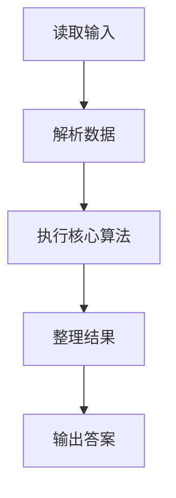
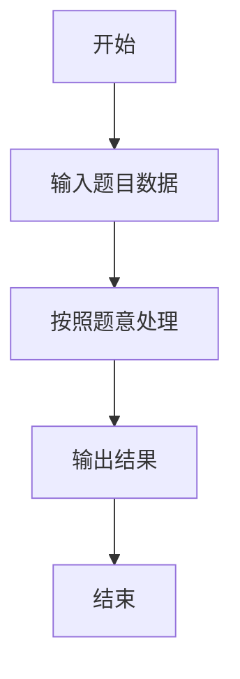

# L3-005 - 垃圾箱分布（30 分）

- **时间限制**: 200 ms
- **内存限制**: 65536 KB
- **代码长度限制**: 16 KB

---

## 题目描述


大家倒垃圾的时候，都希望垃圾箱距离自己比较近，但是谁都不愿意守着垃圾箱住。所以垃圾箱的位置必须选在到所有居民点的最短距离最长的地方，同时还要保证每个居民点都在距离它一个不太远的范围内。

现给定一个居民区的地图，以及若干垃圾箱的候选地点，请你推荐最合适的地点。如果解不唯一，则输出到所有居民点的平均距离最短的那个解。如果这样的解还是不唯一，则输出编号最小的地点。

### 输入格式:

输入第一行给出4个正整数：$$N$$（$$\le 10^3$$）是居民点的个数；$$M$$（$$\le 10$$）是垃圾箱候选地点的个数；$$K$$（$$\le 10^4$$）是居民点和垃圾箱候选地点之间的道路的条数；$$D_S$$是居民点与垃圾箱之间不能超过的最大距离。所有的居民点从1到$$N$$编号，所有的垃圾箱候选地点从$$G1$$到$$GM$$编号。

随后$$K$$行，每行按下列格式描述一条道路：
```
P1 P2 Dist
```
其中`P1`和`P2`是道路两端点的编号，端点可以是居民点，也可以是垃圾箱候选点。`Dist`是道路的长度，是一个正整数。

### 输出格式:

首先在第一行输出最佳候选地点的编号。然后在第二行输出该地点到所有居民点的最小距离和平均距离。数字间以空格分隔，保留小数点后1位。如果解不存在，则输出`No Solution`。

### 输入样例 1：
```in
4 3 11 5
1 2 2
1 4 2
1 G1 4
1 G2 3
2 3 2
2 G2 1
3 4 2
3 G3 2
4 G1 3
G2 G1 1
G3 G2 2
```

### 输出样例 1：
```out
G1
2.0 3.3
```

### 输入样例 2：
```in
2 1 2 10
1 G1 9
2 G1 20
```

### 输出样例 2：
```out
No Solution
```

## 示例

### 示例 1

**输入:**
```
4 3 11 5
1 2 2
1 4 2
1 G1 4
1 G2 3
2 3 2
2 G2 1
3 4 2
3 G3 2
4 G1 3
G2 G1 1
G3 G2 2
```

**输出:**
```
G1
2.0 3.3
```

### 示例 2

**输入:**
```
2 1 2 10
1 G1 9
2 G1 20
```

**输出:**
```
No Solution
```

### 解题思路

本题的 Ruby 实现采用排序、贪心与顺序模拟。程序先读取题目输入，建立与题意对应的数据结构，按照约束完成核心计算，并按规定格式输出结果。具体实现以同目录的 main.rb 为准。

### 代码流程说明

1. 读取并解析标准输入，转换为题目所需的数据结构。
2. 按题意执行核心算法，维护中间状态并处理边界情况。
3. 整理计算结果，按照输出格式生成答案。

### 代码实现

完整实现位于同目录的 [main.rb](./L3-005_垃圾箱分布/main.rb)，以下代码与该入口文件保持一致。

```ruby
# frozen_string_literal: true
require_relative '../gplt_runtime'
v = py_tokens
n, m, roads, limit = v.shift(4).map(&:to_i)
total = n + m
graph = Array.new(total) { [] }
node = ->(s) { s.start_with?('G') ? n + s[1..].to_i - 1 : s.to_i - 1 }
roads.times do
  a, b, d = v.shift(3)
  u = node.call(a); w = node.call(b); d = d.to_i
  graph[u] << [w, d]; graph[w] << [u, d]
end
best = nil
m.times do |station|
  source = n + station
  dist = Array.new(total, Float::INFINITY)
  dist[source] = 0
  heap = [[0, source]]
  until heap.empty?
    d, u = heap.shift
    next if d != dist[u]
    graph[u].each do |w, weight|
      nd = d + weight
      if nd < dist[w]
        dist[w] = nd
        heap << [nd, w]
        heap.sort_by!(&:first)
      end
    end
  end
  residents = dist.first(n)
  next if residents.any? { |d| d > limit }
  minimum = residents.min
  average = residents.sum.fdiv(n)
  key = [minimum, -average, -station]
  best = [key, station, minimum, average] if best.nil? || key > best[0]
end
if best
  _, station, minimum, average = best
  py_print("G#{station + 1}\n#{format('%.1f', minimum + 1e-8)} #{format('%.1f', average + 1e-8)}")
else
  py_print('No Solution')
end
```

### 代码流程图



### 解题流程图


