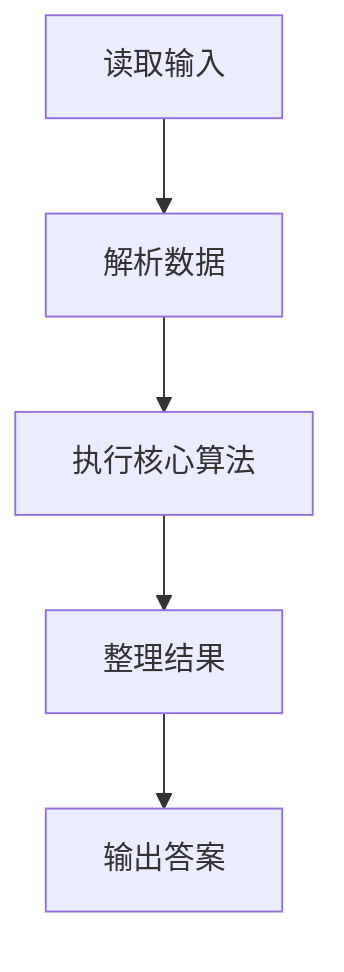
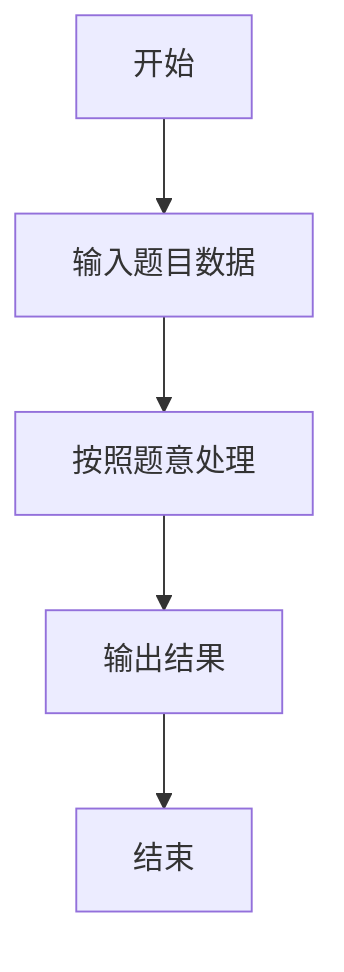

# L3-006 - 迎风一刀斩（30 分）

- **时间限制**: 150 ms
- **内存限制**: 65536 KB
- **代码长度限制**: 16 KB

---

## 题目描述


迎着一面矩形的大旗一刀斩下，如果你的刀够快的话，这笔直一刀可以切出两块多边形的残片。反过来说，如果有人拿着两块残片来吹牛，说这是自己迎风一刀斩落的，你能检查一下这是不是真的吗？

注意摆在你面前的两个多边形可不一定是端端正正摆好的，它们可能被平移、被旋转（逆时针90度、180度、或270度），或者被（镜像）翻面。

这里假设原始大旗的四边都与坐标轴是平行的。

### 输入格式:

输入第一行给出一个正整数$$N$$（$$\le 20$$），随后给出$$N$$对多边形。每个多边形按下列格式给出：

$$k\quad x_1\quad y_1\cdots x_k\quad y_k$$

其中$$k$$（$$2 < k \le 10$$）是多边形顶点个数；$$(x_i, y_i)$$（$$0 \le x_i, y_i \le 10^8$$）是顶点坐标，按照顺时针或逆时针的顺序给出。

注意：题目保证没有多余顶点。即每个多边形的顶点都是不重复的，任意3个相邻顶点不共线。

### 输出格式:

对每一对多边形，输出`YES`或者`NO`。

### 输入样例:
```in
8
3 0 0 1 0 1 1
3 0 0 1 1 0 1
3 0 0 1 0 1 1
3 0 0 1 1 0 2
4 0 4 1 4 1 0 0 0
4 4 0 4 1 0 1 0 0
3 0 0 1 1 0 1
4 2 3 1 4 1 7 2 7
5 10 10 10 12 12 12 14 11 14 10
3 28 35 29 35 29 37
3 7 9 8 11 8 9
5 87 26 92 26 92 23 90 22 87 22
5 0 0 2 0 1 1 1 2 0 2
4 0 0 1 1 2 1 2 0
4 0 0 0 1 1 1 2 0
4 0 0 0 1 1 1 2 0
```

### 输出样例:
```out
YES
NO
YES
YES
YES
YES
NO
YES
```

## 示例

### 示例 1

**输入:**
```
8
3 0 0 1 0 1 1
3 0 0 1 1 0 1
3 0 0 1 0 1 1
3 0 0 1 1 0 2
4 0 4 1 4 1 0 0 0
4 4 0 4 1 0 1 0 0
3 0 0 1 1 0 1
4 2 3 1 4 1 7 2 7
5 10 10 10 12 12 12 14 11 14 10
3 28 35 29 35 29 37
3 7 9 8 11 8 9
5 87 26 92 26 92 23 90 22 87 22
5 0 0 2 0 1 1 1 2 0 2
4 0 0 1 1 2 1 2 0
4 0 0 0 1 1 1 2 0
4 0 0 0 1 1 1 2 0
```

**输出:**
```
YES
NO
YES
YES
YES
YES
NO
YES
```

### 解题思路

本题的 Ruby 实现采用字符串解析与规则处理。程序先读取题目输入，建立与题意对应的数据结构，按照约束完成核心计算，并按规定格式输出结果。具体实现以同目录的 main.rb 为准。

### 代码流程说明

1. 读取并解析标准输入，转换为题目所需的数据结构。
2. 按题意执行核心算法，维护中间状态并处理边界情况。
3. 整理计算结果，按照输出格式生成答案。

### 代码实现

完整实现位于同目录的 [main.rb](./L3-006_迎风一刀斩/main.rb)，以下代码与该入口文件保持一致。

```ruby
# frozen_string_literal: true
require_relative '../gplt_runtime'

def area2(points)
  points.each_with_index.sum do |(x, y), i|
    x2, y2 = points[(i + 1) % points.length]
    x * y2 - y * x2
  end
end

def transforms(points)
  points.map do |x, y|
    [[x, y], [x, -y], [-x, y], [-x, -y], [y, x], [y, -x], [-y, x], [-y, -x]]
  end.transpose.map { |rows| rows }
end

def glue(a, ia, b, ib)
  a1 = a[ia]; a2 = a[(ia + 1) % a.length]
  b1 = b[ib]; b2 = b[(ib + 1) % b.length]
  va = [a2[0] - a1[0], a2[1] - a1[1]]
  vb = [b2[0] - b1[0], b2[1] - b1[1]]
  return false unless va == [-vb[0], -vb[1]]
  tx = a2[0] - b1[0]; ty = a2[1] - b1[1]
  bp = b.map { |x, y| [x + tx, y + ty] }
  combined = (0...(a.length - 1)).map { |i| a[(ia + 1 + i) % a.length] }
  combined += (0...(b.length - 1)).map { |i| bp[(ib + 1 + i) % b.length] }
  return false if combined.length < 4
  combined.each_with_index do |point, i|
    other = combined[(i + 1) % combined.length]
    return false if point == other || (point[0] != other[0] && point[1] != other[1])
  end
  xs = combined.map(&:first); ys = combined.map(&:last)
  min_x, max_x = xs.minmax; min_y, max_y = ys.minmax
  return false if min_x == max_x || min_y == max_y
  return false unless area2(combined).abs == area2(a).abs + area2(bp).abs
  return false unless area2(combined).abs == 2 * (max_x - min_x) * (max_y - min_y)
  combined.all? { |x, y| x == min_x || x == max_x || y == min_y || y == max_y }
end

def possible(a, b)
  [a, a.reverse].each do |pa|
    [b, b.reverse].each do |pb|
      transforms(pa).each do |aa|
        bad = aa.each_index.select do |i|
          x, y = aa[i]; xx, yy = aa[(i + 1) % aa.length]
          x != xx && y != yy
        end
        next if bad.length > 1
        cuts_a = bad.empty? ? (0...aa.length).to_a : bad
        transforms(pb).each do |bb|
          bad_b = bb.each_index.select do |i|
            x, y = bb[i]; xx, yy = bb[(i + 1) % bb.length]
            x != xx && y != yy
          end
          next if bad_b.length > 1
          cuts_b = bad_b.empty? ? (0...bb.length).to_a : bad_b
          cuts_a.each { |i| cuts_b.each { |j| return true if glue(aa, i, bb, j) } }
        end
      end
    end
  end
  false
end

v = py_tokens.map(&:to_i)
cases = v.shift
answers = []
cases.times do
  ka = v.shift
  a = ka.times.map { [v.shift, v.shift] }
  kb = v.shift
  b = kb.times.map { [v.shift, v.shift] }
  answers << (possible(a, b) ? 'YES' : 'NO')
end
py_print(answers.join("\n"))
```

### 代码流程图



### 解题流程图


