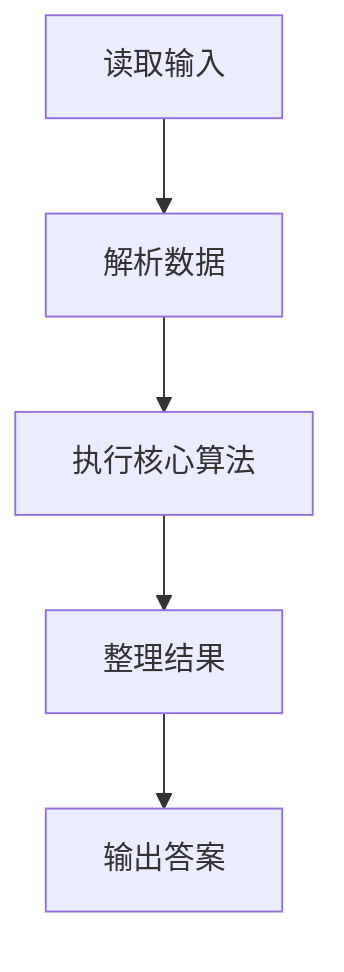
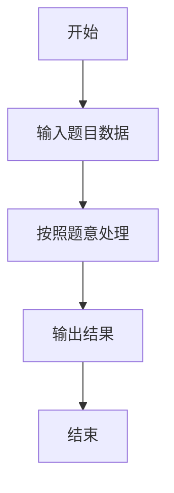

# L3-007 - 天梯地图（30 分）

- **时间限制**: 300 ms
- **内存限制**: 65536 KB
- **代码长度限制**: 16 KB

---

## 题目描述


本题要求你实现一个天梯赛专属在线地图，队员输入自己学校所在地和赛场地点后，该地图应该推荐两条路线：一条是最快到达路线；一条是最短距离的路线。题目保证对任意的查询请求，地图上都至少存在一条可达路线。

### 输入格式:

输入在第一行给出两个正整数`N`（2 $$\le$$ `N` $$\le$$ 500）和`M`，分别为地图中所有标记地点的个数和连接地点的道路条数。随后`M`行，每行按如下格式给出一条道路的信息：

```
V1 V2 one-way length time
```

其中`V1`和`V2`是道路的两个端点的编号（从0到`N`-1）；如果该道路是从`V1`到`V2`的单行线，则`one-way`为1，否则为0；`length`是道路的长度；`time`是通过该路所需要的时间。最后给出一对起点和终点的编号。

### 输出格式:

首先按下列格式输出最快到达的时间`T`和用节点编号表示的路线：

```
Time = T: 起点 => 节点1 => ... => 终点
```

然后在下一行按下列格式输出最短距离`D`和用节点编号表示的路线：

```
Distance = D: 起点 => 节点1 => ... => 终点
```

如果最快到达路线不唯一，则输出几条最快路线中最短的那条，题目保证这条路线是唯一的。而如果最短距离的路线不唯一，则输出途径节点数最少的那条，题目保证这条路线是唯一的。

如果这两条路线是完全一样的，则按下列格式输出：

```
Time = T; Distance = D: 起点 => 节点1 => ... => 终点
```

### 输入样例 1：
```in
10 15
0 1 0 1 1
8 0 0 1 1
4 8 1 1 1
5 4 0 2 3
5 9 1 1 4
0 6 0 1 1
7 3 1 1 2
8 3 1 1 2
2 5 0 2 2
2 1 1 1 1
1 5 0 1 3
1 4 0 1 1
9 7 1 1 3
3 1 0 2 5
6 3 1 2 1
5 3
```

### 输出样例 1：
```out
Time = 6: 5 => 4 => 8 => 3
Distance = 3: 5 => 1 => 3
```

### 输入样例 2：
```in
7 9
0 4 1 1 1
1 6 1 3 1
2 6 1 1 1
2 5 1 2 2
3 0 0 1 1
3 1 1 3 1
3 2 1 2 1
4 5 0 2 2
6 5 1 2 1
3 5
```

### 输出样例 2：
```out
Time = 3; Distance = 4: 3 => 2 => 5
```

## 示例

### 示例 1

**输入:**
```
10 15
0 1 0 1 1
8 0 0 1 1
4 8 1 1 1
5 4 0 2 3
5 9 1 1 4
0 6 0 1 1
7 3 1 1 2
8 3 1 1 2
2 5 0 2 2
2 1 1 1 1
1 5 0 1 3
1 4 0 1 1
9 7 1 1 3
3 1 0 2 5
6 3 1 2 1
5 3
```

**输出:**
```
Time = 6: 5 => 4 => 8 => 3
Distance = 3: 5 => 1 => 3
```

### 示例 2

**输入:**
```
7 9
0 4 1 1 1
1 6 1 3 1
2 6 1 1 1
2 5 1 2 2
3 0 0 1 1
3 1 1 3 1
3 2 1 2 1
4 5 0 2 2
6 5 1 2 1
3 5
```

**输出:**
```
Time = 3; Distance = 4: 3 => 2 => 5
```

### 解题思路

本题的 Ruby 实现采用排序、贪心与顺序模拟。程序先读取题目输入，建立与题意对应的数据结构，按照约束完成核心计算，并按规定格式输出结果。具体实现以同目录的 main.rb 为准。

### 代码流程说明

1. 读取并解析标准输入，转换为题目所需的数据结构。
2. 按题意执行核心算法，维护中间状态并处理边界情况。
3. 整理计算结果，按照输出格式生成答案。

### 代码实现

完整实现位于同目录的 [main.rb](./L3-007_天梯地图/main.rb)，以下代码与该入口文件保持一致。

```ruby
# frozen_string_literal: true
require_relative '../gplt_runtime'
def entry
  path = lambda do |pre, s, t|
    a = []
    while ((t != (-1)))
      a.append(t)
      if ((t == s))
        break
      end
      t = pre[t]
    end
    return py_slice(a, nil, nil, (-1))
  end
  main = lambda do ||
    a = (py_map(->(x) { py_int(x) }, py_tokens).to_a)
    if (!py_truth(a))
      return
    end
    n, m = py_slice(a, nil, 2, nil)
    p = 2
    adj = py_iterable(py_range(n)).flat_map { |_|; [[]] }
    for _ in py_range(m)
      u, v, one, l, t = py_slice(a, p, (p + 5), nil)
      p += 5
      adj[u].append([v, l, t])
      if (!py_truth(one))
        adj[v].append([u, l, t])
      end
    end
    s, t = py_slice(a, p, (p + 2), nil)
    inf = (10 ** 30)
    dt, dl, pt = [([inf] * n), ([inf] * n), ([(-1)] * n)]
    dt[s] = 0
    dl[s] = 0
    pq = [[0, 0, s]]
    while py_truth(pq)
      tm, le, u = pq.shift
      if (([tm, le] != [dt[u], dl[u]]))
        next
      end
      for v, x, y in adj[u]
        z = [(tm + y), (le + x)]
        if ((z < [dt[v], dl[v]]))
          dt[v], dl[v] = z
          pt[v] = u
          pq.push([z[0], z[1], v]); pq.sort!
        end
      end
    end
    dd, dc, pd = [([inf] * n), ([inf] * n), ([(-1)] * n)]
    dd[s] = 0
    dc[s] = 1
    pq = [[0, 1, s]]
    while py_truth(pq)
      d, c, u = pq.shift
      if (([d, c] != [dd[u], dc[u]]))
        next
      end
      for v, x, y in adj[u]
        z = [(d + x), (c + 1)]
        if ((z < [dd[v], dc[v]]))
          dd[v], dc[v] = z
          pd[v] = u
          pq.push([z[0], z[1], v]); pq.sort!
        end
      end
    end
    a1, a2 = [path.call(pt, s, t), path.call(pd, s, t)]
    if ((a1 == a2))
      py_print(("Time = %s; Distance = %s: " % [dt[t], dd[t]] + py_map(->(x) { py_str(x) }, a1).join(" => ")), sep: " ", ending: "\n")
      else
        py_print(("Time = %s: " % [dt[t]] + py_map(->(x) { py_str(x) }, a1).join(" => ")), sep: " ", ending: "\n")
        py_print(("Distance = %s: " % [dd[t]] + py_map(->(x) { py_str(x) }, a2).join(" => ")), sep: " ", ending: "\n")
    end
  end
  main.call
end
entry
```

### 代码流程图



### 解题流程图


