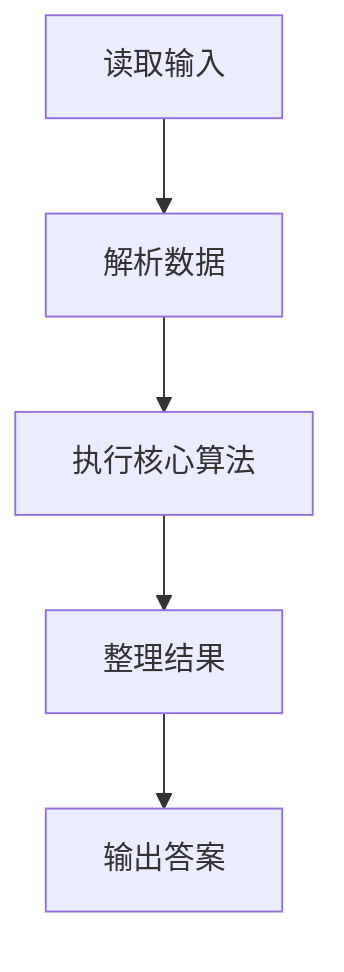
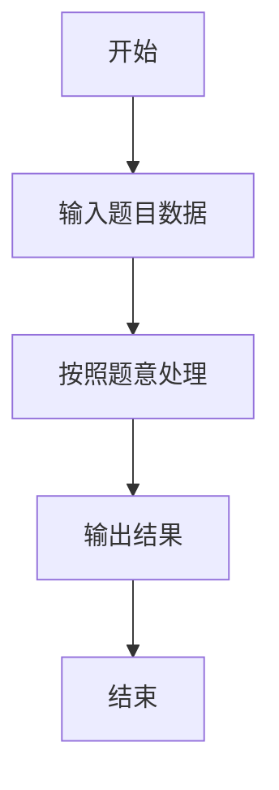

# L3-008 - 喊山（30 分）

- **时间限制**: 150 ms
- **内存限制**: 65536 KB
- **代码长度限制**: 16 KB

---

## 题目描述


喊山，是人双手围在嘴边成喇叭状，对着远方高山发出“喂—喂喂—喂喂喂……”的呼唤。呼唤声通过空气的传递，回荡于深谷之间，传送到人们耳中，发出约定俗成的“讯号”，达到声讯传递交流的目的。原来它是彝族先民用来求援呼救的“讯号”，慢慢地人们在生活实践中发现了它的实用价值，便把它作为一种交流工具世代传袭使用。（图文摘自：http://news.xrxxw.com/newsshow-8018.html）


一个山头呼喊的声音可以被临近的山头同时听到。题目假设每个山头最多有两个能听到它的临近山头。给定任意一个发出原始信号的山头，本题请你找出这个信号最远能传达到的地方。

### 输入格式:

输入第一行给出3个正整数`n`、`m`和`k`，其中`n`（$$\le$$10000）是总的山头数（于是假设每个山头从1到`n`编号）。接下来的`m`行，每行给出2个不超过`n`的正整数，数字间用空格分开，分别代表可以听到彼此的两个山头的编号。这里保证每一对山头只被输入一次，不会有重复的关系输入。最后一行给出`k`（$$\le$$10）个不超过`n`的正整数，数字间用空格分开，代表需要查询的山头的编号。

### 输出格式:

依次对于输入中的每个被查询的山头，在一行中输出其发出的呼喊能够连锁传达到的最远的那个山头。注意：被输出的首先必须是被查询的个山头能连锁传到的。若这样的山头不只一个，则输出编号最小的那个。若此山头的呼喊无法传到任何其他山头，则输出0。

### 输入样例:
```in
7 5 4
1 2
2 3
3 1
4 5
5 6
1 4 5 7
```

### 输出样例:
```out
2
6
4
0
```

## 示例

### 示例 1

**输入:**
```
7 5 4
1 2
2 3
3 1
4 5
5 6
1 4 5 7
```

**输出:**
```
2
6
4
0
```

### 解题思路

本题的 Ruby 实现采用字符串解析与规则处理。程序先读取题目输入，建立与题意对应的数据结构，按照约束完成核心计算，并按规定格式输出结果。具体实现以同目录的 main.rb 为准。

### 代码流程说明

1. 读取并解析标准输入，转换为题目所需的数据结构。
2. 按题意执行核心算法，维护中间状态并处理边界情况。
3. 整理计算结果，按照输出格式生成答案。

### 代码实现

完整实现位于同目录的 [main.rb](./main.rb)，以下代码与该入口文件保持一致。

```ruby
# frozen_string_literal: true
require_relative '../gplt_runtime'
def entry
  main = lambda do ||
    a = (py_map(->(x) { py_int(x) }, py_tokens).to_a)
    if (!py_truth(a))
      return
    end
    n, m, k = py_slice(a, nil, 3, nil)
    p = 3
    g = py_iterable(py_range((n + 1))).flat_map { |_|; [[]] }
    for _ in py_range(m)
      u, v = py_slice(a, p, (p + 2), nil)
      p += 2
      g[u].append(v)
      g[v].append(u)
    end
    out = []
    for s in py_slice(a, p, (p + k), nil)
      d = ([(-1)] * (n + 1))
      d[s] = 0
      q = [s]
      while py_truth(q)
        u = q.popleft()
        for v in g[u]
          if ((d[v] < 0))
            d[v] = (d[u] + 1)
            q.append(v)
          end
        end
      end
      best = py_max(d)
      if ((best <= 0))
        out.append("0")
        else
          out.append(py_str(py_min(py_iterable(py_enumerate(d)).flat_map { |__item_0|; i, x = __item_0; next [] unless py_truth(((x == best))); [i] })))
      end
    end
    py_print(out.join("\n"), sep: " ", ending: "\n")
  end
  main.call
end
entry
```

### 代码流程图



### 解题流程图


