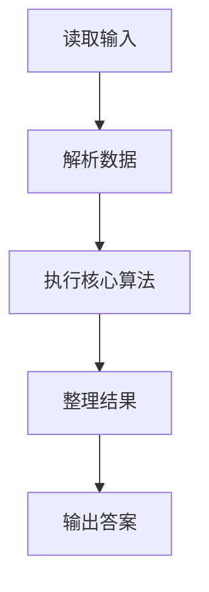
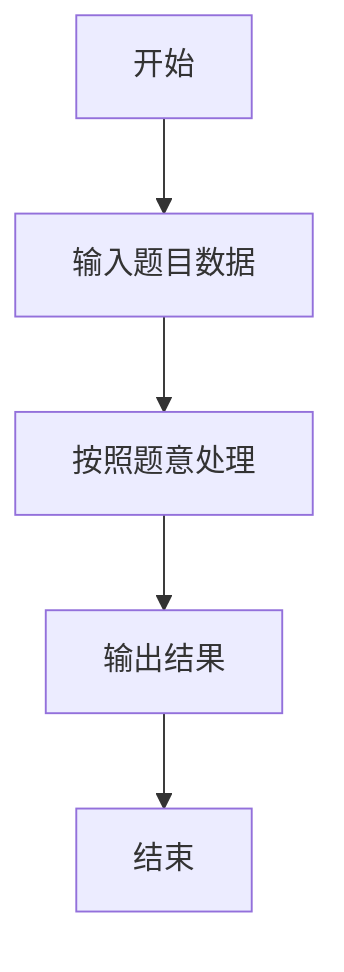

# L3-009 - 长城（30 分）

- **时间限制**: 500 ms
- **内存限制**: 65536 KB
- **代码长度限制**: 16 KB

---

## 题目描述


正如我们所知，中国古代长城的建造是为了抵御外敌入侵。在长城上，建造了许多烽火台。每个烽火台都监视着一个特定的地区范围。一旦某个地区有外敌入侵，值守在对应烽火台上的士兵就会将敌情通报给周围的烽火台，并迅速接力地传递到总部。

现在如图1所示，若水平为南北方向、垂直为海拔高度方向，假设长城就是依次相联的一系列线段，而且在此范围内的任一垂直线与这些线段有且仅有唯一的交点。


**图 1**

进一步地，假设烽火台只能建造在线段的端点处。我们认为烽火台本身是没有高度的，每个烽火台只负责向北方（图1中向左）瞭望，而且一旦有外敌入侵，只要敌人与烽火台之间未被山体遮挡，哨兵就会立即察觉。当然，按照这一军规，对于南侧的敌情各烽火台并不负责任。一旦哨兵发现敌情，他就会立即以狼烟或烽火的形式，向其南方的烽火台传递警报，直到位于最南侧的总部。

以图2中的长城为例，负责守卫的四个烽火台用蓝白圆点示意，最南侧的总部用红色圆点示意。如果红色星形标示的地方出现敌情，将被哨兵们发现并沿红色折线将警报传递到总部。当然，就这个例子而言只需两个烽火台的协作，但其他位置的敌情可能需要更多。

然而反过来，即便这里的4个烽火台全部参与，依然有不能覆盖的（黄色）区域。


**图 2**

另外，为避免歧义，我们在这里约定，与某个烽火台的视线刚好相切的区域都认为可以被该烽火台所监视。以图3中的长城为例，若A、B、C、D点均共线，且在D点设置一处烽火台，则A、B、C以及线段BC上的任何一点都在该烽火台的监视范围之内。


**图 3**

好了，倘若你是秦始皇的太尉，为不致出现更多孟姜女式的悲剧，如何在保证长城安全的前提下，使消耗的民力（建造的烽火台）最少呢？

### 输入格式:

输入在第一行给出一个正整数`N`（3 $$\le$$ `N` $$\le 10^5$$），即刻画长城边缘的折线顶点（含起点和终点）数。随后`N`行，每行给出一个顶点的`x`和`y`坐标，其间以空格分隔。注意顶点从南到北依次给出，第一个顶点为总部所在位置。坐标为区间$$[-10^9, 10^9)$$内的整数，且没有重合点。

### 输出格式:

在一行中输出所需建造烽火台（不含总部）的最少数目。

### 输入样例:
```in
10
67 32
48 -49
32 53
22 -44
19 22
11 40
10 -65
-1 -23
-3 31
-7 59
```

### 输出样例:
```out
2
```

## 示例

### 示例 1

**输入:**
```
10
67 32
48 -49
32 53
22 -44
19 22
11 40
10 -65
-1 -23
-3 31
-7 59
```

**输出:**
```
2
```

### 解题思路

本题的 Ruby 实现采用字符串解析与规则处理。程序先读取题目输入，建立与题意对应的数据结构，按照约束完成核心计算，并按规定格式输出结果。具体实现以同目录的 main.rb 为准。

### 代码流程说明

1. 读取并解析标准输入，转换为题目所需的数据结构。
2. 按题意执行核心算法，维护中间状态并处理边界情况。
3. 整理计算结果，按照输出格式生成答案。

### 代码实现

完整实现位于同目录的 [main.rb](./L3-009_长城/main.rb)，以下代码与该入口文件保持一致。

```ruby
# frozen_string_literal: true
require_relative '../gplt_runtime'
def entry
  cross = lambda do |a, b, c|
    return (((b[0] - a[0]) * (c[1] - a[1])) - ((b[1] - a[1]) * (c[0] - a[0])))
  end
  main = lambda do ||
    a = (py_map(->(x) { py_int(x) }, py_tokens).to_a)
    if (!py_truth(a))
      return
    end
    n = a[0]
    p = 1
    pts = py_iterable(py_range(n)).flat_map { |i|; [[a[(p + (2 * i))], a[((p + (2 * i)) + 1)]]] }
    if ((n <= 2))
      py_print(0, sep: " ", ending: "\n")
      return
    end
    stack = [pts[0], pts[1]]
    ans = 0
    for q in py_slice(pts, 2, nil, nil)
      popped = false
      while (((py_len(stack) >= 2)) && ((cross.call(stack[(-2)], stack[(-1)], q) <= 0)))
        stack.pop()
        popped = true
      end
      if (!py_truth(popped))
        ans += 1
      end
      stack.append(q)
    end
    py_print(ans, sep: " ", ending: "\n")
  end
  main.call
end
entry
```

### 代码流程图



### 解题流程图


