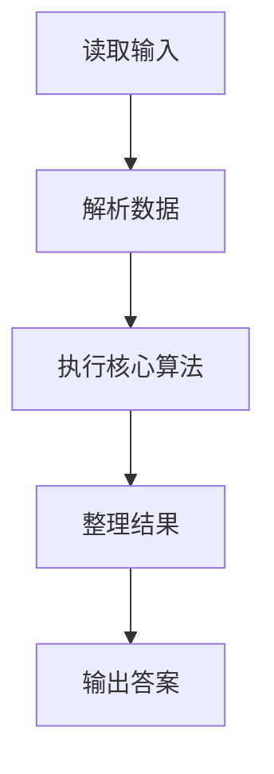
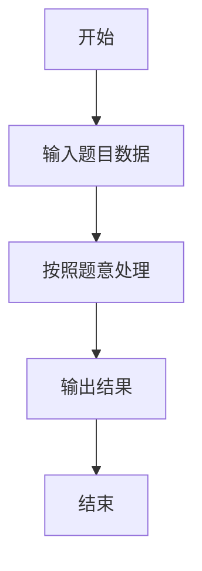

# L3-010 - 是否完全二叉搜索树（30 分）

- **时间限制**: 400 ms
- **内存限制**: 65536 KB
- **代码长度限制**: 16 KB

---

## 题目描述


将一系列给定数字顺序插入一个初始为空的二叉搜索树（定义为左子树键值大，右子树键值小），你需要判断最后的树是否一棵完全二叉树，并且给出其层序遍历的结果。

### 输入格式:

输入第一行给出一个不超过20的正整数`N`；第二行给出`N`个互不相同的正整数，其间以空格分隔。

### 输出格式:

将输入的`N`个正整数顺序插入一个初始为空的二叉搜索树。在第一行中输出结果树的层序遍历结果，数字间以1个空格分隔，行的首尾不得有多余空格。第二行输出`YES`，如果该树是完全二叉树；否则输出`NO`。

### 输入样例 1：
```in
9
38 45 42 24 58 30 67 12 51
```

### 输出样例 1：
```out
38 45 24 58 42 30 12 67 51
YES
```

### 输入样例 2：
```in
8
38 24 12 45 58 67 42 51
```

### 输出样例 2：
```out
38 45 24 58 42 12 67 51
NO
```

## 示例

### 示例 1

**输入:**
```
9
38 45 42 24 58 30 67 12 51
```

**输出:**
```
38 45 24 58 42 30 12 67 51
YES
```

### 示例 2

**输入:**
```
8
38 24 12 45 58 67 42 51
```

**输出:**
```
38 45 24 58 42 12 67 51
NO
```

### 解题思路

本题的 Ruby 实现采用字符串解析与规则处理。程序先读取题目输入，建立与题意对应的数据结构，按照约束完成核心计算，并按规定格式输出结果。具体实现以同目录的 main.rb 为准。

### 代码流程说明

1. 读取并解析标准输入，转换为题目所需的数据结构。
2. 按题意执行核心算法，维护中间状态并处理边界情况。
3. 整理计算结果，按照输出格式生成答案。

### 代码实现

完整实现位于同目录的 [main.rb](./main.rb)，以下代码与该入口文件保持一致。

```ruby
# frozen_string_literal: true
require_relative '../gplt_runtime'
def entry
  node_class = Class.new do
    attr_accessor 'left', 'right', 'x'
    define_method(:initialize) do |x|
      self.x = x
      self.left = nil
      self.right = nil
    end
  end
  main = lambda do ||
    a = (py_map(->(x) { py_int(x) }, py_tokens).to_a)
    if (!py_truth(a))
      return
    end
    root = nil
    for x in py_slice(a, 1, (1 + a[0]), nil)
      if ((root.equal?(nil)))
        root = node_class.new(x)
        next
      end
      u = root
      while py_truth(true)
        if ((x > u.x))
          if ((u.left.equal?(nil)))
            u.left = node_class.new(x)
            break
          end
          u = u.left
          else
            if ((u.right.equal?(nil)))
              u.right = node_class.new(x)
              break
            end
            u = u.right
        end
      end
    end
    q = [root]
    out = []
    gap = false
    ok = true
    while py_truth(q)
      u = q.popleft()
      if ((u.equal?(nil)))
        gap = true
        next
      end
      if py_truth(gap)
        ok = false
      end
      out.append(py_str(u.x))
      q.extend([u.left, u.right])
    end
    py_print(out.join(" "), sep: " ", ending: "\n")
    py_print((ok ? "YES" : "NO"), sep: " ", ending: "\n")
  end
  main.call
end
entry
```

### 代码流程图



### 解题流程图


