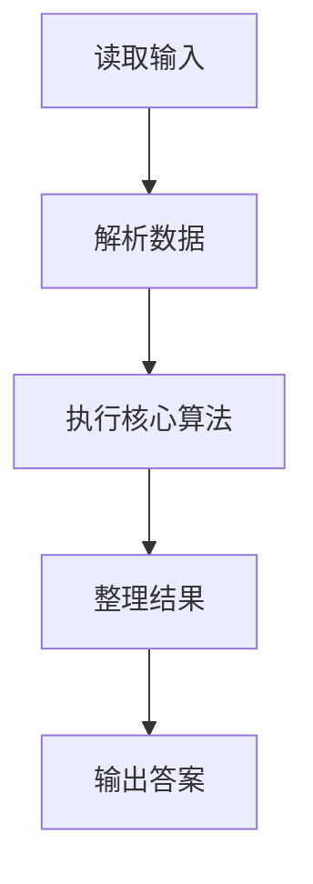
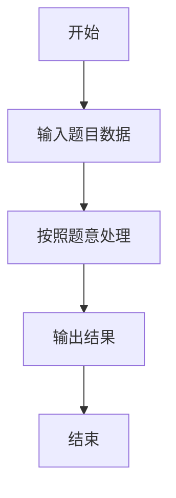

# L3-011 - 直捣黄龙（30 分）

- **时间限制**: 150 ms
- **内存限制**: 65536 KB
- **代码长度限制**: 16 KB

---

## 题目描述


本题是一部战争大片 —— 你需要从己方大本营出发，一路攻城略地杀到敌方大本营。首先时间就是生命，所以你必须选择合适的路径，以最快的速度占领敌方大本营。当这样的路径不唯一时，要求选择可以沿途解放最多城镇的路径。若这样的路径也不唯一，则选择可以有效杀伤最多敌军的路径。

### 输入格式:

输入第一行给出 2 个正整数 N（2 $$\le$$ N $$\le$$ 200，城镇总数）和 K（城镇间道路条数），以及己方大本营和敌方大本营的代号。随后 N-1 行，每行给出除了己方大本营外的一个城镇的代号和驻守的敌军数量，其间以空格分隔。再后面有 K 行，每行按格式`城镇1 城镇2 距离`给出两个城镇之间道路的长度。这里设每个城镇（包括双方大本营）的代号是由 3 个大写英文字母组成的字符串。

### 输出格式:

按照题目要求找到最合适的进攻路径（题目保证速度最快、解放最多、杀伤最强的路径是唯一的），并在第一行按照格式`己方大本营->城镇1->...->敌方大本营`输出。第二行顺序输出最快进攻路径的条数、最短进攻距离、歼敌总数，其间以 1 个空格分隔，行首尾不得有多余空格。

### 输入样例:
```in
10 12 PAT DBY
DBY 100
PTA 20
PDS 90
PMS 40
TAP 50
ATP 200
LNN 80
LAO 30
LON 70
PAT PTA 10
PAT PMS 10
PAT ATP 20
PAT LNN 10
LNN LAO 10
LAO LON 10
LON DBY 10
PMS TAP 10
TAP DBY 10
DBY PDS 10
PDS PTA 10
DBY ATP 10
```

### 输出样例:
```out
PAT->PTA->PDS->DBY
3 30 210
```

## 示例

### 示例 1

**输入:**
```
10 12 PAT DBY
DBY 100
PTA 20
PDS 90
PMS 40
TAP 50
ATP 200
LNN 80
LAO 30
LON 70
PAT PTA 10
PAT PMS 10
PAT ATP 20
PAT LNN 10
LNN LAO 10
LAO LON 10
LON DBY 10
PMS TAP 10
TAP DBY 10
DBY PDS 10
PDS PTA 10
DBY ATP 10
```

**输出:**
```
PAT->PTA->PDS->DBY
3 30 210
```

### 解题思路

本题的 Ruby 实现采用排序、贪心与顺序模拟。程序先读取题目输入，建立与题意对应的数据结构，按照约束完成核心计算，并按规定格式输出结果。具体实现以同目录的 main.rb 为准。

### 代码流程说明

1. 读取并解析标准输入，转换为题目所需的数据结构。
2. 按题意执行核心算法，维护中间状态并处理边界情况。
3. 整理计算结果，按照输出格式生成答案。

### 代码实现

完整实现位于同目录的 [main.rb](./main.rb)，以下代码与该入口文件保持一致。

```ruby
# frozen_string_literal: true
require_relative '../gplt_runtime'
def entry
  main = lambda do ||
    z = py_input_data.split
    if (!py_truth(z))
      return
    end
    n, k = py_slice(z, 0, 2, nil)
    n = py_int(n)
    k = py_int(k)
    start, py_end = py_slice(z, 2, 4, nil)
    p = 4
    names = [start]
    ids = {start => 0}
    enemy = [0]
    for _ in py_range((n - 1))
      name = z[p]
      e = py_int(z[(p + 1)])
      p += 2
      ids[name] = py_len(names)
      names.append(name)
      enemy.append(e)
    end
    g = py_iterable(names).flat_map { |_|; [[]] }
    for _ in py_range(k)
      u, v, w = py_slice(z, p, (p + 3), nil)
      p += 3
      u = ids[u]
      v = ids[v]
      w = py_int(w)
      g[u].append([v, w])
      g[v].append([u, w])
    end
    s, t = [0, ids[py_end]]
    inf = (10 ** 30)
    dist = ([inf] * n)
    cnt = ([0] * n)
    towns = ([(-1)] * n)
    kills = ([(-1)] * n)
    pre = ([(-1)] * n)
    dist[s] = 0
    cnt[s] = 1
    towns[s] = 0
    kills[s] = 0
    pq = [[0, 0, 0, s]]
    while py_truth(pq)
      d, neg_town, neg_kill, u = pq.shift
      if (((d != dist[u])) || (((-neg_town) != towns[u])) || (((-neg_kill) != kills[u])))
        next
      end
      for v, w in g[u]
        nd = (d + w)
        if ((nd < dist[v]))
          dist[v] = nd
          cnt[v] = cnt[u]
          towns[v] = (towns[u] + 1)
          kills[v] = (kills[u] + enemy[v])
          pre[v] = u
          pq.push([nd, (-towns[v]), (-kills[v]), v]); pq.sort!
          else
            if ((nd == dist[v]))
              cnt[v] += cnt[u]
              nt = (towns[u] + 1)
              nothing = (towns[u] + 1)
              nk = (kills[u] + enemy[v])
              if (([nt, nk] > [towns[v], kills[v]]))
                towns[v] = nt
                kills[v] = nk
                pre[v] = u
                pq.push([nd, (-nt), (-nk), v]); pq.sort!
              end
            end
        end
      end
    end
    route = []
    u = t
    while ((u != (-1)))
      route.append(names[u])
      u = pre[u]
    end
    py_print(py_slice(route, nil, nil, (-1)).join("->"), sep: " ", ending: "\n")
    py_print(cnt[t], dist[t], kills[t], sep: " ", ending: "\n")
  end
  main.call
end
entry
```

### 代码流程图



### 解题流程图


