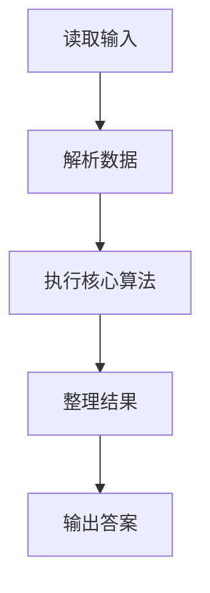
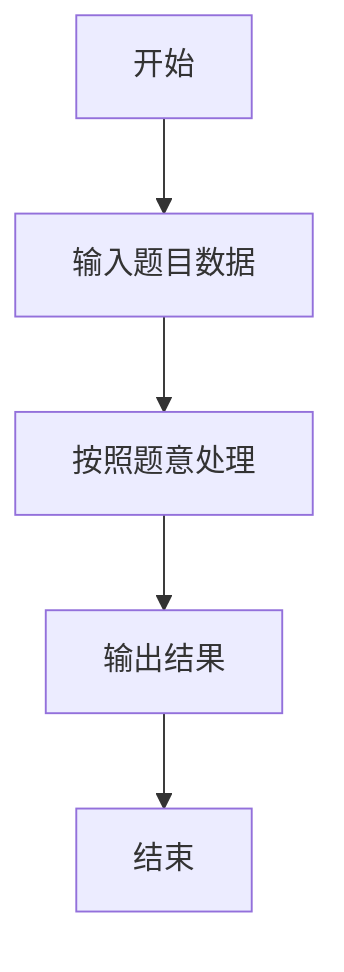

# L3-012 - 水果忍者（30 分）

- **时间限制**: 250 ms
- **内存限制**: 65536 KB
- **代码长度限制**: 16 KB

---

## 题目描述


2010年风靡全球的“水果忍者”游戏，想必大家肯定都玩过吧？（没玩过也没关系啦~）在游戏当中，画面里会随机地弹射出一系列的水果与炸弹，玩家尽可能砍掉所有的水果而避免砍中炸弹，就可以完成游戏规定的任务。如果玩家可以一刀砍下画面当中一连串的水果，则会有额外的奖励，如图1所示。


**图 1**

现在假如你是“水果忍者”游戏的玩家，你要做的一件事情就是，将画面当中的水果一刀砍下。这个问题看上去有些复杂，让我们把问题简化一些。我们将游戏世界想象成一个二维的平面。游戏当中的每个水果被简化成一条一条的垂直于水平线的竖直线段。而一刀砍下我们也仅考虑成能否找到一条直线，使之可以穿过所有代表水果的线段。


**图 2**

如图2所示，其中绿色的垂直线段表示的就是一个一个的水果；灰色的虚线即表示穿过所有线段的某一条直线。可以从上图当中看出，对于这样一组线段的排列，我们是可以找到一刀切开所有水果的方案的。

另外，我们约定，如果某条直线恰好穿过了线段的端点也表示它砍中了这个线段所表示的水果。假如你是这样一个功能的开发者，你要如何来找到一条穿过它们的直线呢？

### 输入格式:

输入在第一行给出一个正整数`N`（$$\le 10^4$$），表示水果的个数。随后`N`行，每行给出三个整数$$x$$、$$y_1$$、$$y_2$$，其间以空格分隔，表示一条端点为$$(x, y_1)$$和$$(x, y_2)$$的水果，其中$$y_1 > y_2$$。注意：给出的水果输入集合一定存在一条可以将其全部穿过的直线，不需考虑不存在的情况。坐标为区间 $$[-10^6, 10^6)$$ 内的整数。

### 输出格式:

在一行中输出穿过所有线段的直线上具有**整数**坐标的任意两点$$p_1(x_1, y_1)$$和$$p_2(x_2, y_2)$$，格式为 $$x_1\quad y_1\quad x_2\quad y_2$$。注意：本题答案不唯一，由特殊裁判程序判定，但一定存在四个坐标全是整数的解。

### 输入样例:
```in
5
-30 -52 -84
38 22 -49
-99 -22 -99
48 59 -18
-36 -50 -72
```

### 输出样例:
```out
-99 -99 -30 -52
```

## 示例

### 示例 1

**输入:**
```
5
-30 -52 -84
38 22 -49
-99 -22 -99
48 59 -18
-36 -50 -72
```

**输出:**
```
-99 -99 -30 -52
```

### 解题思路

本题的 Ruby 实现采用字符串解析与规则处理。程序先读取题目输入，建立与题意对应的数据结构，按照约束完成核心计算，并按规定格式输出结果。具体实现以同目录的 main.rb 为准。

### 代码流程说明

1. 读取并解析标准输入，转换为题目所需的数据结构。
2. 按题意执行核心算法，维护中间状态并处理边界情况。
3. 整理计算结果，按照输出格式生成答案。

### 代码实现

完整实现位于同目录的 [main.rb](./main.rb)，以下代码与该入口文件保持一致。

```ruby
# frozen_string_literal: true

# L3-012 水果忍者
# 设直线为 y = kx + b。对固定的有理斜率 k，所有水果给出的
# b 区间必须有公共交集；由当前最紧的上下界不断收缩斜率区间。
# 使用整数分数，因而最终输出的两点始终是整数坐标。

tokens = STDIN.read.split.map!(&:to_i)
exit if tokens.empty?
n = tokens.shift
x = Array.new(n)
high = Array.new(n)
low = Array.new(n)
n.times do |i|
  x[i] = tokens.shift
  y1 = tokens.shift
  y2 = tokens.shift
  high[i] = [y1, y2].max
  low[i] = [y1, y2].min
end

compare = lambda do |a, b|
  left = a[0] * b[1]
  right = b[0] * a[1]
  left <=> right
end
normalize = lambda do |num, den|
  if den.negative?
    [-num, -den]
  else
    [num, den]
  end
end

lower_bound = nil
upper_bound = nil
current = [0, 1]

100.times do
  best_lower = nil
  best_upper = nil
  p = q = 0
  n.times do |i|
    lower_value = low[i] * current[1] - current[0] * x[i]
    upper_value = high[i] * current[1] - current[0] * x[i]
    if best_lower.nil? || lower_value > best_lower
      best_lower = lower_value
      p = i
    end
    if best_upper.nil? || upper_value < best_upper
      best_upper = upper_value
      q = i
    end
  end

  if best_lower <= best_upper
    x1 = x[p]
    y1 = low[p]
    puts "#{x1} #{y1} #{x1 + current[1]} #{y1 + current[0]}"
    exit
  end

  dx = x[q] - x[p]
  if dx.positive?
    bound = normalize.call(high[q] - low[p], dx)
    if upper_bound.nil? || compare.call(bound, upper_bound).negative?
      upper_bound = bound
    end
  elsif dx.negative?
    bound = normalize.call(high[q] - low[p], dx)
    if lower_bound.nil? || compare.call(bound, lower_bound).positive?
      lower_bound = bound
    end
  end

  if lower_bound && compare.call([0, 1], lower_bound).negative?
    current = lower_bound.dup
  elsif upper_bound && compare.call([0, 1], upper_bound).positive?
    current = upper_bound.dup
  else
    current = [0, 1]
  end
end
```

### 代码流程图



### 解题流程图


