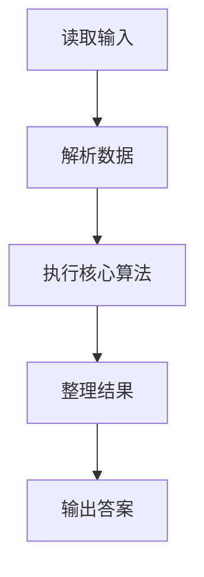
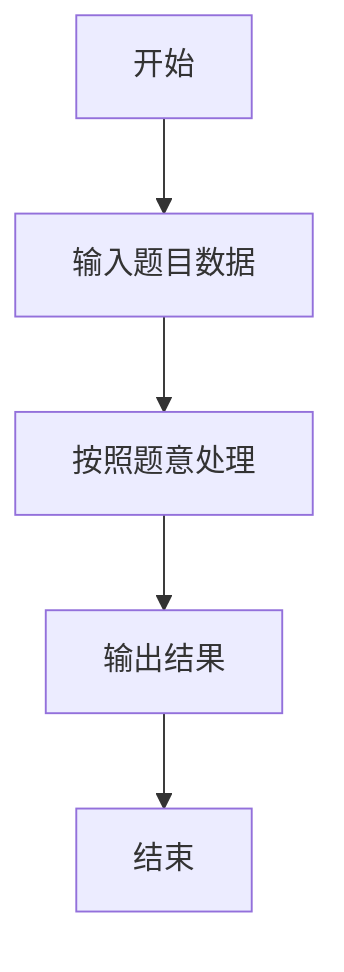

# L3-015 - 球队“食物链”（30 分）

- **时间限制**: 2000 ms
- **内存限制**: 131072 KB
- **代码长度限制**: 16 KB

---

## 题目描述


某国的足球联赛中有$$N$$支参赛球队，编号从1至$$N$$。联赛采用主客场双循环赛制，参赛球队两两之间在双方主场各赛一场。

联赛战罢，结果已经尘埃落定。此时，联赛主席突发奇想，希望从中找出一条包含所有球队的“食物链”，来说明联赛的精彩程度。“食物链”为一个1至$$N$$的排列{ $$T_1$$ $$T_2$$ $$\cdots$$ $$T_N$$ }，满足：球队$$T_1$$战胜过球队$$T_2$$，球队$$T_2$$战胜过球队$$T_3$$，$$\cdots$$，球队$$T_{(N-1)}$$战胜过球队$$T_N$$，球队$$T_N$$战胜过球队$$T_1$$。

现在主席请你从联赛结果中找出“食物链”。若存在多条“食物链”，请找出字典序最小的。

注：排列{ $$a_1$$ $$a_2$$ $$\cdots$$ $$a_N$$}在字典序上小于排列{ $$b_1$$ $$b_2$$ $$\cdots$$ $$b_N$$ }，当且仅当存在整数$$K$$（$$1 \le K \le N$$），满足：$$a_K < b_K$$且对于任意小于$$K$$的正整数$$i$$，$$a_i=b_i$$。

### 输入格式:

输入第一行给出一个整数$$N$$（$$2 \le N \le 20$$），为参赛球队数。随后$$N$$行，每行$$N$$个字符，给出了$$N\times N$$的联赛结果表，其中第$$i$$行第$$j$$列的字符为球队$$i$$在主场对阵球队$$j$$的比赛结果：`W`表示球队$$i$$战胜球队$$j$$，`L`表示球队$$i$$负于球队$$j$$，`D`表示两队打平，`-`表示无效（当$$i=j$$时）。输入中无多余空格。

### 输出格式:

按题目要求找到“食物链”$$T_1$$ $$T_2$$ $$\cdots$$ $$T_N$$，将这$$N$$个数依次输出在一行上，数字间以1个空格分隔，行的首尾不得有多余空格。若不存在“食物链”，输出“No Solution”。

### 输入样例 1：
```in
5
-LWDW
W-LDW
WW-LW
DWW-W
DDLW-
```

### 输出样例 1：
```out
1 3 5 4 2
```

### 输入样例 2：
```in
5
-WDDW
D-DWL
DD-DW
DDW-D
DDDD-
```

### 输出样例 2：
```out
No Solution
```

## 示例

### 示例 1

**输入:**
```
5
-LWDW
W-LDW
WW-LW
DWW-W
DDLW-
```

**输出:**
```
1 3 5 4 2
```

### 示例 2

**输入:**
```
5
-WDDW
D-DWL
DD-DW
DDW-D
DDDD-
```

**输出:**
```
No Solution
```

### 解题思路

本题的 Ruby 实现采用图遍历或搜索。程序先读取题目输入，建立与题意对应的数据结构，按照约束完成核心计算，并按规定格式输出结果。具体实现以同目录的 main.rb 为准。

### 代码流程说明

1. 读取并解析标准输入，转换为题目所需的数据结构。
2. 按题意执行核心算法，维护中间状态并处理边界情况。
3. 整理计算结果，按照输出格式生成答案。

### 代码实现

完整实现位于同目录的 [main.rb](./main.rb)，以下代码与该入口文件保持一致。

```ruby
# frozen_string_literal: true
require_relative '../gplt_runtime'
def entry
  main = lambda do ||
    lines = py_lines
    if (!py_truth(lines))
      return
    end
    n = py_int(lines[0])
    win = py_iterable(py_range(n)).flat_map { |i|; [py_iterable(lines[(i + 1)].strip()).flat_map { |c|; [((c == "W"))] }] }
    allmask = ((1 << n) - 1)
    for start in py_range(n)
      can = lambda do |mask, u|
        if ((mask == allmask))
          return win[u][start]
        end
        for v in py_range(n)
          if ((!py_truth(((mask >> v) & 1))) && py_truth(win[u][v]) && py_truth(can.call((mask | (1 << v)), v)))
            return true
          end
        end
        return false
      end
      dfs = lambda do |mask, u, path|
        if ((mask == allmask))
          return (win[u][start] ? path : nil)
        end
        for v in py_range(n)
          if ((!py_truth(((mask >> v) & 1))) && py_truth(win[u][v]) && py_truth(can.call((mask | (1 << v)), v)))
            r = dfs.call((mask | (1 << v)), v, (path + [v]))
            if ((!r.equal?(nil)))
              return r
            end
          end
        end
        return nil
      end
      if py_truth(can.call((1 << start), start))
        r = dfs.call((1 << start), start, [start])
        if ((!r.equal?(nil)))
          py_print(*py_iterable(r).flat_map { |x|; [(x + 1)] }, sep: " ", ending: "\n")
          return
        end
      end
    end
    py_print("No Solution", sep: " ", ending: "\n")
  end
  main.call
end
entry
```

### 代码流程图



### 解题流程图


