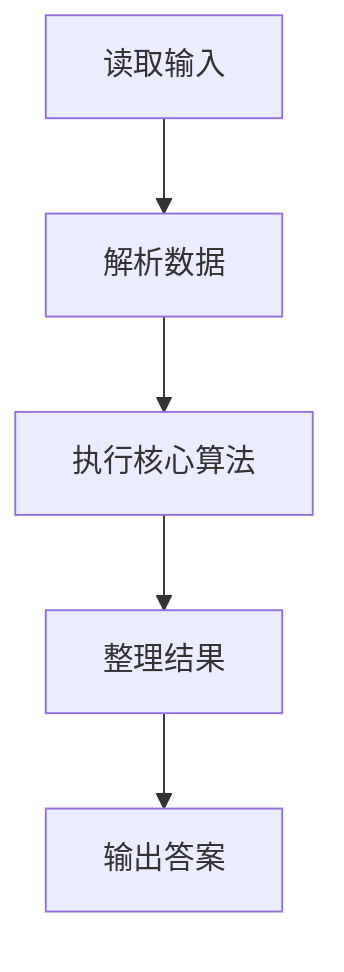
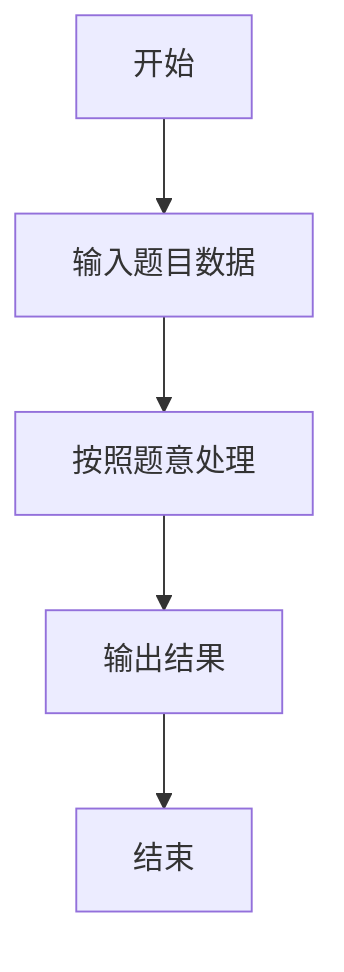

# L3-016 - 二叉搜索树的结构（30 分）

- **时间限制**: 400 ms
- **内存限制**: 65536 KB
- **代码长度限制**: 16 KB

---

## 题目描述


二叉搜索树或者是一棵空树，或者是具有下列性质的二叉树： 若它的左子树不空，则左子树上所有结点的值均小于它的根结点的值；若它的右子树不空，则右子树上所有结点的值均大于它的根结点的值；它的左、右子树也分别为二叉搜索树。（摘自百度百科）

给定一系列互不相等的整数，将它们顺次插入一棵初始为空的二叉搜索树，然后对结果树的结构进行描述。你需要能判断给定的描述是否正确。例如将{ 2 4 1 3 0 }插入后，得到一棵二叉搜索树，则陈述句如“2是树的根”、“1和4是兄弟结点”、“3和0在同一层上”（指自顶向下的深度相同）、“2是4的双亲结点”、“3是4的左孩子”都是正确的；而“4是2的左孩子”、“1和3是兄弟结点”都是不正确的。

### 输入格式:

输入在第一行给出一个正整数$$N$$（$$\le 100$$），随后一行给出$$N$$个互不相同的整数，数字间以空格分隔，要求将之顺次插入一棵初始为空的二叉搜索树。之后给出一个正整数$$M$$（$$\le 100$$），随后$$M$$行，每行给出一句待判断的陈述句。陈述句有以下6种：

- `A is the root`，即"`A`是树的根"；
- `A and B are siblings`，即"`A`和`B`是兄弟结点"；
- `A is the parent of B`，即"`A`是`B`的双亲结点"；
- `A is the left child of B`，即"`A`是`B`的左孩子"；
- `A is the right child of B`，即"`A`是`B`的右孩子"；
- `A and B are on the same level`，即"`A`和`B`在同一层上"。

题目保证所有给定的整数都在整型范围内。

### 输出格式:

对每句陈述，如果正确则输出`Yes`，否则输出`No`，每句占一行。

### 输入样例:
```in
5
2 4 1 3 0
8
2 is the root
1 and 4 are siblings
3 and 0 are on the same level
2 is the parent of 4
3 is the left child of 4
1 is the right child of 2
4 and 0 are on the same level
100 is the right child of 3
```

### 输出样例:
```out
Yes
Yes
Yes
Yes
Yes
No
No
No
```

## 示例

### 示例 1

**输入:**
```
5
2 4 1 3 0
8
2 is the root
1 and 4 are siblings
3 and 0 are on the same level
2 is the parent of 4
3 is the left child of 4
1 is the right child of 2
4 and 0 are on the same level
100 is the right child of 3
```

**输出:**
```
Yes
Yes
Yes
Yes
Yes
No
No
No
```

### 解题思路

本题的 Ruby 实现采用并查集或连通性维护。程序先读取题目输入，建立与题意对应的数据结构，按照约束完成核心计算，并按规定格式输出结果。具体实现以同目录的 main.rb 为准。

### 代码流程说明

1. 读取并解析标准输入，转换为题目所需的数据结构。
2. 按题意执行核心算法，维护中间状态并处理边界情况。
3. 整理计算结果，按照输出格式生成答案。

### 代码实现

完整实现位于同目录的 [main.rb](./main.rb)，以下代码与该入口文件保持一致。

```ruby
# frozen_string_literal: true
require_relative '../gplt_runtime'
lines = py_lines
n = lines.shift.to_i
values = []
values.concat(lines.shift.split.map(&:to_i)) while values.length < n
Node = Struct.new(:value, :left, :right, :parent, :depth)
root = nil
nodes = {}
values.each do |value|
  if root.nil?
    root = Node.new(value, nil, nil, nil, 0)
    nodes[value] = root
    next
  end
  current = root
  loop do
    if value < current.value
      if current.left
        current = current.left
      else
        current.left = Node.new(value, nil, nil, current, current.depth + 1)
        nodes[value] = current.left
        break
      end
    elsif current.right
      current = current.right
    else
      current.right = Node.new(value, nil, nil, current, current.depth + 1)
      nodes[value] = current.right
      break
    end
  end
end
q = lines.shift.to_i
answers = lines.first(q).map do |line|
  words = line.split
  a = nodes[words[0].to_i]
  result =
    if line.include?('root')
      a == root
    elsif line.include?('siblings')
      b = nodes[words[2].to_i]
      a && b && a.parent && a.parent == b.parent
    elsif line.include?('left child')
      child = nodes[words[-1].to_i]
      a && child && child.left == a
    elsif line.include?('right child')
      child = nodes[words[-1].to_i]
      a && child && child.right == a
    elsif line.include?('parent of')
      child = nodes[words[-1].to_i]
      a && child && child.parent == a
    elsif line.include?('same level')
      b = nodes[words[2].to_i]
      a && b && a.depth == b.depth
    else
      false
    end
  result ? 'Yes' : 'No'
end
py_print(answers.join("\n"))
```

### 代码流程图



### 解题流程图


