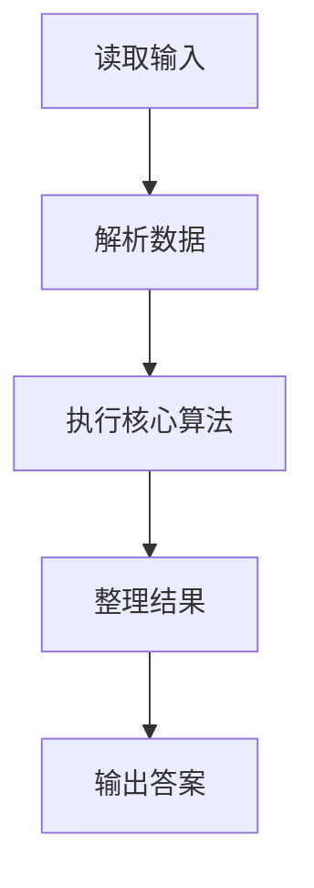
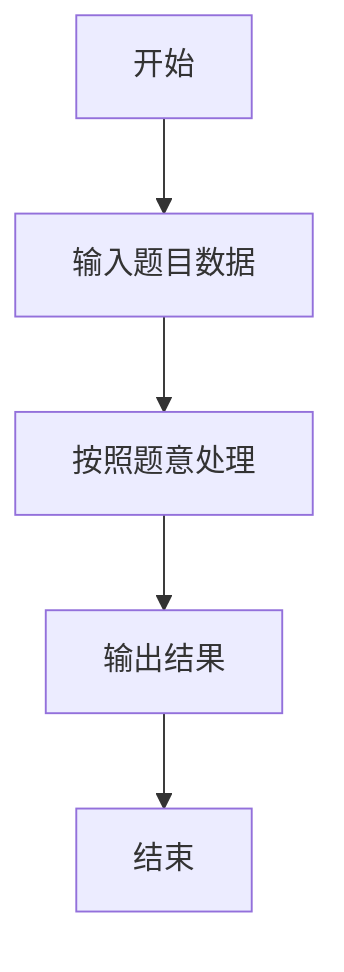

# L3-017 - 森森快递（30 分）

- **时间限制**: 400 ms
- **内存限制**: 65536 KB
- **代码长度限制**: 16 KB

---

## 题目描述


森森开了一家快递公司，叫森森快递。因为公司刚刚开张，所以业务路线很简单，可以认为是一条直线上的$$N$$个城市，这些城市从左到右依次从0到$$(N-1)$$编号。由于道路限制，第$$i$$号城市（$$i=0, \cdots , N-2$$）与第$$(i+1)$$号城市中间往返的运输货物重量在同一时刻不能超过$$C_i$$公斤。

公司开张后很快接到了$$Q$$张订单，其中$$j$$张订单描述了某些指定的货物要从$$S_j$$号城市运输到$$T_j$$号城市。这里我们简单地假设所有货物都有无限货源，森森会不定时地挑选其中一部分货物进行运输。安全起见，这些货物不会在中途卸货。

为了让公司整体效益更佳，森森想知道如何安排订单的运输，能使得运输的货物重量最大且符合道路的限制？要注意的是，发货时间有可能是任何时刻，所以我们安排订单的时候，必须保证共用同一条道路的所有货车的总重量不超载。例如我们安排1号城市到4号城市以及2号城市到4号城市两张订单的运输，则这两张订单的运输同时受2-3以及3-4两条道路的限制，因为两张订单的货物可能会同时在这些道路上运输。

### 输入格式:

输入在第一行给出两个正整数$$N$$和$$Q$$（$$2 \le N \le 10^5$$, $$1 \le Q \le 10^5$$），表示总共的城市数以及订单数量。

第二行给出$$(N-1)$$个数，顺次表示相邻两城市间的道路允许的最大运货重量$$C_i$$（$$i=0, \cdots , N-2$$）。题目保证每个$$C_i$$是不超过$$2^{31}$$的非负整数。

接下来$$Q$$行，每行给出一张订单的起始及终止运输城市编号。题目保证所有编号合法，并且不存在起点和终点重合的情况。

### 输出格式:

在一行中输出可运输货物的最大重量。

### 输入样例:
```in
10 6
0 7 8 5 2 3 1 9 10
0 9
1 8
2 7
6 3
4 5
4 2
```

### 输出样例:
```out
7
```

## 示例

### 示例 1

**输入:**
```
10 6
0 7 8 5 2 3 1 9 10
0 9
1 8
2 7
6 3
4 5
4 2
```

**输出:**
```
7
```

### 解题思路

本题的 Ruby 实现采用排序、贪心与顺序模拟。程序先读取题目输入，建立与题意对应的数据结构，按照约束完成核心计算，并按规定格式输出结果。具体实现以同目录的 main.rb 为准。

### 代码流程说明

1. 读取并解析标准输入，转换为题目所需的数据结构。
2. 按题意执行核心算法，维护中间状态并处理边界情况。
3. 整理计算结果，按照输出格式生成答案。

### 代码实现

完整实现位于同目录的 [main.rb](./main.rb)，以下代码与该入口文件保持一致。

```ruby
# frozen_string_literal: true
require_relative '../gplt_runtime'
v = py_tokens.map(&:to_i)
n, q = v.shift(2)
capacity = v.shift(n - 1)
orders = q.times.map { a, b = v.shift(2); a > b ? [b, a] : [a, b] }.sort_by { |l, r| r }
answer = 0
orders.each do |l, r|
  take = capacity[l...r].min
  next unless take && take.positive?
  (l...r).each { |i| capacity[i] -= take }
  answer += take
end
py_print(answer)
```

### 代码流程图



### 解题流程图


