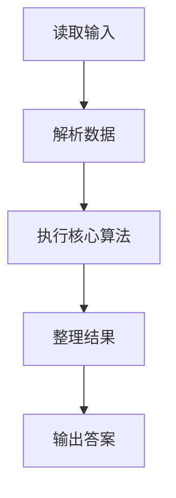
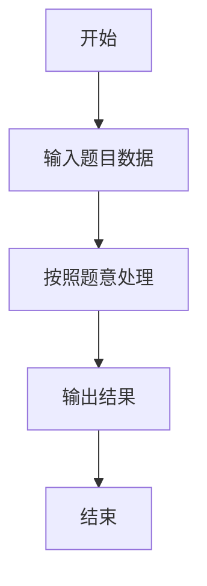

# L3-019 - 代码排版（30 分）

- **时间限制**: 150 ms
- **内存限制**: 65536 KB
- **代码长度限制**: 16 KB

---

## 题目描述


某编程大赛中设计有一个挑战环节，选手可以查看其他选手的代码，发现错误后，提交一组测试数据将对手挑落马下。为了减小被挑战的几率，有些选手会故意将代码写得很难看懂，比如把所有回车去掉，提交所有内容都在一行的程序，令挑战者望而生畏。

为了对付这种选手，现请你编写一个代码排版程序，将写成一行的程序重新排版。当然要写一个完美的排版程序可太难了，这里只简单地要求处理C语言里的for、while、if-else这三种特殊结构，而将其他所有句子都当成顺序执行的语句处理。输出的要求如下：

- 默认程序起始没有缩进；每一级缩进是 2 个空格；
- 每行开头除了规定的缩进空格外，不输出多余的空格；
- 顺序执行的程序体是以分号“;”结尾的，遇到分号就换行；
- 在一对大括号“{”和“}”中的程序体输出时，两端的大括号单独占一行，内部程序体每行加一级缩进，即：

```
{
  程序体
}
```

- for的格式为：

```
for (条件) {
  程序体
}
```

- while的格式为：

```
while (条件) {
  程序体
}
```

- if-else的格式为：

```
if (条件) {
  程序体
}
else {
  程序体
}
```

### 输入格式:

输入在一行中给出不超过 331 个字符的非空字符串，以回车结束。题目保证输入的是一个语法正确、可以正常编译运行的 main 函数模块。

### 输出格式:

按题面要求的格式，输出排版后的程序。

### 输入样例:
```in
int main()  {int n, i;  scanf("%d", &n);if( n>0)n++;else if (n<0) n--; else while(n<10)n++; for(i=0;  i<n; i++ ){ printf("n=%d\n", n);}return  0; }
```

### 输出样例:
```out
int main()
{
  int n, i;
  scanf("%d", &n);
  if ( n>0) {
    n++;
  }
  else {
    if (n<0) {
      n--;
    }
    else {
      while (n<10) {
        n++;
      }
    }
  }
  for (i=0;  i<n; i++ ) {
    printf("n=%d\n", n);
  }
  return  0;
}
```

## 示例

### 示例 1

**输入:**
```
int main()  {int n, i;  scanf("%d", &n);if( n>0)n++;else if (n<0) n--; else while(n<10)n++; for(i=0;  i<n; i++ ){ printf("n=%d\n", n);}return  0; }
```

**输出:**
```
int main()
{
  int n, i;
  scanf("%d", &n);
  if ( n>0) {
    n++;
  }
  else {
    if (n<0) {
      n--;
    }
    else {
      while (n<10) {
        n++;
      }
    }
  }
  for (i=0;  i<n; i++ ) {
    printf("n=%d\n", n);
  }
  return  0;
}
```

### 解题思路

本题的 Ruby 实现采用字符串解析与规则处理。程序先读取题目输入，建立与题意对应的数据结构，按照约束完成核心计算，并按规定格式输出结果。具体实现以同目录的 main.rb 为准。

### 代码流程说明

1. 读取并解析标准输入，转换为题目所需的数据结构。
2. 按题意执行核心算法，维护中间状态并处理边界情况。
3. 整理计算结果，按照输出格式生成答案。

### 代码实现

完整实现位于同目录的 [main.rb](./L3-019_代码排版/main.rb)，以下代码与该入口文件保持一致。

```ruby
# frozen_string_literal: true
require_relative '../gplt_runtime'
def entry
  formatter_class = Class.new do
    attr_accessor 'control', 'kw', 'n', 'one', 'out', 'p', 'paren', 's', 'semi', 'skip', 'stat'
    define_method(:initialize) do |s|
      self.s = s
      self.n = py_len(s)
      self.p = 0
      self.out = []
    end
    define_method(:skip) do ||
      while (((self.p < self.n)) && py_truth((self.s[self.p].to_s.match?(/\A\s+\z/))))
        self.p += 1
      end
    end
    define_method(:kw) do |w|
      return (py_truth(py_startswith_at(self.s, w, self.p)) && ((((self.p + py_len(w)) == self.n)) || (!py_truth((py_truth((self.s[(self.p + py_len(w))].to_s.match?(/\A[[:alnum:]]+\z/))) || ((self.s[(self.p + py_len(w))] == "_")))))))
    end
    define_method(:paren) do ||
      start = self.p
      dep = 0
      quote = nil
      esc = false
      while ((self.p < self.n))
        c = self.s[self.p]
        if py_truth(esc)
          esc = false
          else
            if py_truth(quote)
              if ((c == "\\"))
                esc = true
                else
                  if ((c == quote))
                    quote = nil
                  end
              end
              else
                if (py_in(c, "\"'"))
                  quote = c
                  else
                    if ((c == "("))
                      dep += 1
                      else
                        if ((c == ")"))
                          dep -= 1
                          if ((dep == 0))
                            self.p += 1
                            return py_slice(self.s, start, self.p, nil)
                          end
                        end
                    end
                end
            end
        end
        self.p += 1
      end
      return py_slice(self.s, start, nil, nil)
    end
    define_method(:semi) do ||
      i = self.p
      dep = 0
      quote = nil
      esc = false
      while ((i < self.n))
        c = self.s[i]
        if py_truth(esc)
          esc = false
          else
            if py_truth(quote)
              if ((c == "\\"))
                esc = true
                else
                  if ((c == quote))
                    quote = nil
                  end
              end
              else
                if (py_in(c, "\"'"))
                  quote = c
                  else
                    if ((c == "("))
                      dep += 1
                      else
                        if ((c == ")"))
                          dep = py_max(0, (dep - 1))
                          else
                            if (((c == ";")) && ((dep == 0)))
                              return i
                            end
                        end
                    end
                end
            end
        end
        i += 1
      end
      return (self.n - 1)
    end
    define_method(:one) do |ind|
      self.skip()
      if ((self.p >= self.n))
        return
      end
      if py_truth(self.kw("if"))
        self.control("if", ind)
        else
          if py_truth(self.kw("for"))
            self.control("for", ind)
            else
              if py_truth(self.kw("while"))
                self.control("while", ind)
                else
                  if ((self.s[self.p] == "{"))
                    self.out.append((("  " * ind) + "{"))
                    self.p += 1
                    self.stat((ind + 1))
                    self.skip()
                    if (((self.p < self.n)) && ((self.s[self.p] == "}")))
                      self.out.append((("  " * ind) + "}"))
                      self.p += 1
                    end
                    else
                      j = self.semi()
                      self.out.append((("  " * ind) + py_slice(self.s, self.p, (j + 1), nil).strip()))
                      self.p = (j + 1)
                  end
              end
          end
      end
    end
    define_method(:stat) do |ind|
      while py_truth(true)
        self.skip()
        if (((self.p >= self.n)) || ((self.s[self.p] == "}")))
          return
        end
        self.one(ind)
      end
    end
    define_method(:control) do |name, ind|
      self.p += py_len(name)
      self.skip()
      cond = ((((self.p < self.n)) && ((self.s[self.p] == "("))) ? self.paren() : "")
      self.out.append(((((("  " * ind) + name) + " ") + cond) + " {"))
      self.skip()
      if (((self.p < self.n)) && ((self.s[self.p] == "{")))
        self.p += 1
        self.stat((ind + 1))
        self.skip()
        if (((self.p < self.n)) && ((self.s[self.p] == "}")))
          self.p += 1
        end
        else
          self.one((ind + 1))
      end
      self.out.append((("  " * ind) + "}"))
      if ((name == "if"))
        save = self.p
        self.skip()
        if py_truth(self.kw("else"))
          self.p += 4
          self.skip()
          self.out.append((("  " * ind) + "else {"))
          if py_truth(self.kw("if"))
            self.control("if", (ind + 1))
            else
              if (((self.p < self.n)) && ((self.s[self.p] == "{")))
                self.p += 1
                self.stat((ind + 1))
                self.skip()
                if (((self.p < self.n)) && ((self.s[self.p] == "}")))
                  self.p += 1
                end
                else
                  self.one((ind + 1))
              end
          end
          self.out.append((("  " * ind) + "}"))
          else
            self.p = save
        end
      end
    end
    define_method(:run) do ||
      self.skip()
      j = self.s.index("{") || -1
      if ((j >= 0))
        self.out.append(py_slice(self.s, self.p, j, nil).strip())
        self.out.append("{")
        self.p = (j + 1)
        self.stat(1)
        self.skip()
        if (((self.p < self.n)) && ((self.s[self.p] == "}")))
          self.out.append("}")
          self.p += 1
        end
        else
          self.stat(0)
      end
      return (self.out.join("\n") + "\n")
    end
  end
  main = lambda do ||
    s = py_input_data
    if py_truth(s.strip())
      py_print(formatter_class.new(s).run(), sep: " ", ending: "")
    end
  end
  main.call
end
entry
```

### 代码流程图



### 解题流程图


