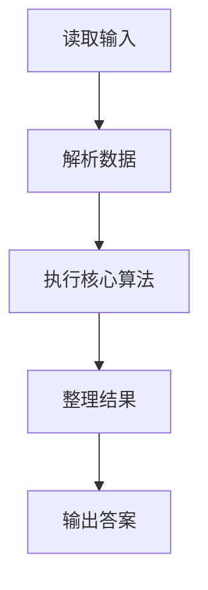
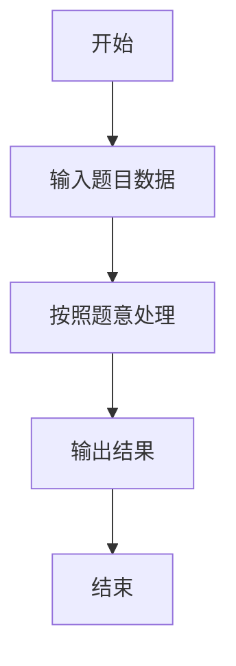

# L3-020 - 至多删三个字符（30 分）

- **时间限制**: 400 ms
- **内存限制**: 65536 KB
- **代码长度限制**: 16 KB

---

## 题目描述


给定一个全部由小写英文字母组成的字符串，允许你至多删掉其中 3 个字符，结果可能有多少种不同的字符串？

### 输入格式:

输入在一行中给出全部由小写英文字母组成的、长度在区间 [4, $$10^6$$] 内的字符串。

### 输出格式:

在一行中输出至多删掉其中 3 个字符后不同字符串的个数。

### 输入样例:
```in
ababcc
```

### 输出样例:
```out
25
```

## 示例

### 示例 1

**输入:**
```
ababcc
```

**输出:**
```
25
```

### 解题思路

本题的 Ruby 实现采用字符串解析与规则处理。程序先读取题目输入，建立与题意对应的数据结构，按照约束完成核心计算，并按规定格式输出结果。具体实现以同目录的 main.rb 为准。

### 代码流程说明

1. 读取并解析标准输入，转换为题目所需的数据结构。
2. 按题意执行核心算法，维护中间状态并处理边界情况。
3. 整理计算结果，按照输出格式生成答案。

### 代码实现

完整实现位于同目录的 [main.rb](./L3-020_至多删三个字符/main.rb)，以下代码与该入口文件保持一致。

```ruby
# frozen_string_literal: true
require_relative '../gplt_runtime'
s = py_readline
kmax = 3
hist = Array.new(5) { Array.new(kmax + 1, 0) }
f = [1, 0, 0, 0]
hist[0] = f.dup
last = Array.new(26, -1)
s.chars.each_with_index do |ch, index|
  i = index + 1
  previous = last[ch.ord - 97]
  nf = Array.new(kmax + 1, 0)
  kmax.times do |k|
    nf[k] = f[k] + (k.positive? ? f[k - 1] : 0)
    if previous >= 0 && i - previous <= k
      nf[k] -= hist[(previous - 1) % 5][k - (i - previous)]
    end
  end
  nf[kmax] = f[kmax] + f[kmax - 1]
  if previous >= 0 && i - previous <= kmax
    nf[kmax] -= hist[(previous - 1) % 5][kmax - (i - previous)]
  end
  f = nf
  hist[i % 5] = f.dup
  last[ch.ord - 97] = i
end
py_print(f.sum)
```

### 代码流程图



### 解题流程图


