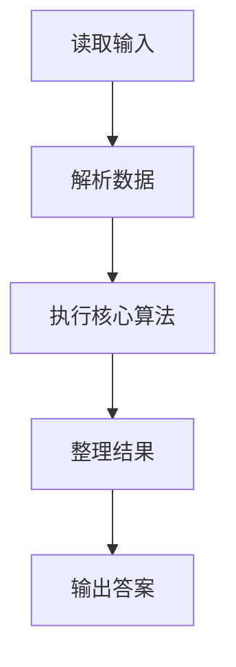
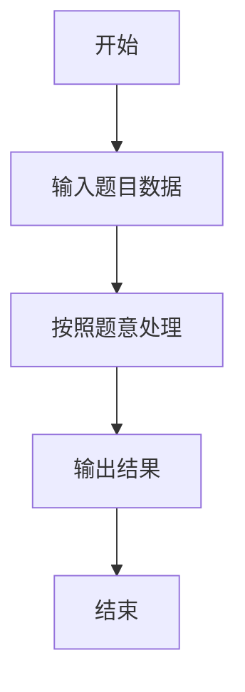

# L3-021 - 神坛（30 分）

- **时间限制**: 8000 ms
- **内存限制**: 65536 KB
- **代码长度限制**: 16 KB

---

## 题目描述


在古老的迈瑞城，巍然屹立着 n 块神石。长老们商议，选取 3 块神石围成一个神坛。因为神坛的能量强度与它的面积成反比，因此神坛的面积越小越好。特殊地，如果有两块神石坐标相同，或者三块神石共线，神坛的面积为 `0.000`。

长老们发现这个问题没有那么简单，于是委托你编程解决这个难题。

### 输入格式:

输入在第一行给出一个正整数 n（3 $$\le$$ n $$\le$$ 5000）。随后 n 行，每行有两个整数，分别表示神石的横坐标、纵坐标（$$-10^9 \le$$ 横坐标、纵坐标 $$< 10^9$$）。

### 输出格式:

在一行中输出神坛的最小面积，四舍五入保留 3 位小数。

### 输入样例:
```in
8
3 4
2 4
1 1
4 1
0 3
3 0
1 3
4 2
```

### 输出样例:
```out
0.500
```

## 示例

### 示例 1

**输入:**
```
8
3 4
2 4
1 1
4 1
0 3
3 0
1 3
4 2
```

**输出:**
```
0.500
```

### 解题思路

本题的 Ruby 实现采用排序、贪心与顺序模拟。程序先读取题目输入，建立与题意对应的数据结构，按照约束完成核心计算，并按规定格式输出结果。具体实现以同目录的 main.rb 为准。

### 代码流程说明

1. 读取并解析标准输入，转换为题目所需的数据结构。
2. 按题意执行核心算法，维护中间状态并处理边界情况。
3. 整理计算结果，按照输出格式生成答案。

### 代码实现

完整实现位于同目录的 [main.rb](./main.rb)，以下代码与该入口文件保持一致。

```ruby
# frozen_string_literal: true
require_relative '../gplt_runtime'
v = py_tokens.map(&:to_i)
n = v.shift
points = n.times.map { [v.shift, v.shift] }
best = Float::INFINITY
points.each_with_index do |(x, y), i|
  vectors = []
  points.each_with_index do |(xx, yy), j|
    next if i == j
    dx = xx - x; dy = yy - y
    vectors << [Math.atan2(dy, dx), dx, dy]
  end
  vectors.sort!
  vectors.each_with_index do |(_, x1, y1), j|
    _, x2, y2 = vectors[(j + 1) % vectors.length]
    best = [best, (x1 * y2 - y1 * x2).abs].min
  end
end
py_print(format('%.3f', best / 2.0))
```

### 代码流程图



### 解题流程图


