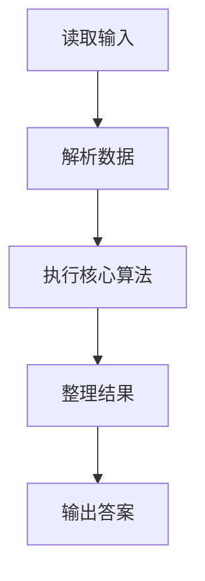
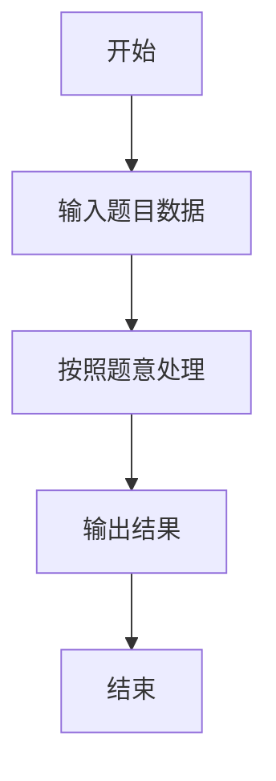

# L3-022 - 地铁一日游（30 分）

- **时间限制**: 550 ms
- **内存限制**: 65536 KB
- **代码长度限制**: 16 KB

---

## 题目描述


森森喜欢坐地铁。这个假期，他终于来到了传说中的地铁之城——魔都，打算好好过一把坐地铁的瘾！

魔都地铁的计价规则是：起步价 2 元，出发站与到达站的最短距离（即**计费距离**）每 K 公里增加 1 元车费。

例如取 **K** = 10，动安寺站离魔都绿桥站为 40 公里，则车费为 2 + 4 = 6 元。

为了获得最大的满足感，森森决定用以下的方式坐地铁：在某一站上车（不妨设为地铁站 **A**），则对于所有车费相同的到达站，森森只会在计费距离最远的站或线路末端站点出站，然后用森森美图 App 在站点外拍一张认证照，再按同样的方式前往下一个站点。

坐着坐着，森森突然好奇起来：在给定出发站的情况下（在出发时森森也会拍一张照），他的整个旅程中能够留下哪些站点的认证照？

地铁是铁路运输的一种形式，指在地下运行为主的城市轨道交通系统。一般来说，地铁由若干个站点组成，并有多条不同的线路双向行驶，可类比公交车，当两条或更多条线路经过同一个站点时，可进行**换乘**，更换自己所乘坐的线路。举例来说，魔都 1 号线和 2 号线都经过人民广场站，则乘坐 1 号线到达人民广场时就可以换乘到 2 号线前往 2 号线的各个站点。换乘不需出站（也拍不到认证照），因此森森乘坐地铁时换乘不受限制。

### 输入格式:

输入第一行是三个正整数 **N**、**M** 和 **K**，表示魔都地铁有 **N** 个车站 (1 &leq; **N** &leq; 200)，**M** 条线路 (1 &leq; **M** &leq; 1500)，最短距离每超过 **K** 公里 (1 &leq; **K** &leq; 10<sup>6</sup>)，加 1 元车费。

接下来 **M** 行，每行由以下格式组成：

<站点1><空格><距离><空格><站点2><空格><距离><空格><站点3> ... <站点X-1><空格><距离><空格><站点X>

其中站点是一个 1 到 **N** 的编号；两个站点编号之间的距离指两个站在该线路上的距离。两站之间距离是一个不大于 10<sup>6</sup> 的正整数。一条线路上的站点互不相同。

**注意**：两个站之间可能有多条直接连接的线路，且距离不一定相等。

再接下来有一个正整数 **Q** (1 &leq; **Q** &leq; 200)，表示森森尝试从 **Q** 个站点出发。

最后有 **Q** 行，每行一个正整数 **X<sub>i</sub>**，表示森森尝试从编号为 **X<sub>i</sub>** 的站点出发。

### 输出格式:

对于森森每个尝试的站点，输出一行若干个整数，表示能够到达的站点编号。站点编号从小到大排序。

### 输入样例:
```in
6 2 6
1 6 2 4 3 1 4
5 6 2 6 6
4
2
3
4
5
```

### 输出样例:
```out
1 2 4 5 6
1 2 3 4 5 6
1 2 4 5 6
1 2 4 5 6
```

## 示例

### 示例 1

**输入:**
```
6 2 6
1 6 2 4 3 1 4
5 6 2 6 6
4
2
3
4
5
```

**输出:**
```
1 2 4 5 6
1 2 3 4 5 6
1 2 4 5 6
1 2 4 5 6
```

### 解题思路

本题的 Ruby 实现采用排序、贪心与顺序模拟。程序先读取题目输入，建立与题意对应的数据结构，按照约束完成核心计算，并按规定格式输出结果。具体实现以同目录的 main.rb 为准。

### 代码流程说明

1. 读取并解析标准输入，转换为题目所需的数据结构。
2. 按题意执行核心算法，维护中间状态并处理边界情况。
3. 整理计算结果，按照输出格式生成答案。

### 代码实现

完整实现位于同目录的 [main.rb](./main.rb)，以下代码与该入口文件保持一致。

```ruby
# frozen_string_literal: true
require_relative '../gplt_runtime'
lines = py_lines
n, m, k = lines.shift.split.map(&:to_i)
inf = 1 << 60
dist = Array.new(n + 1) { Array.new(n + 1, inf) }
(1..n).each { |i| dist[i][i] = 0 }
terminal = Array.new(n + 1, false)
m.times do
  z = lines.shift.split.map(&:to_i)
  stations = z.each_slice(2).map(&:first)
  distances = z.each_slice(2).map(&:last)
  terminal[stations.first] = true
  terminal[stations.last] = true
  stations.each_cons(2).with_index do |(a, b), i|
    w = distances[i]
    dist[a][b] = [dist[a][b], w].min
    dist[b][a] = [dist[b][a], w].min
  end
end
(1..n).each do |mid|
  (1..n).each do |i|
    next if dist[i][mid] >= inf
    (1..n).each do |j|
      candidate = dist[i][mid] + dist[mid][j]
      dist[i][j] = candidate if candidate < dist[i][j]
    end
  end
end
successors = Array.new(n + 1) { Set.new }
(1..n).each do |i|
  groups = Hash.new { |h, key| h[key] = [] }
  (1..n).each do |j|
    next if i == j || dist[i][j] >= inf
    groups[2 + dist[i][j] / k] << j
  end
  groups.each_value do |group|
    farthest = group.map { |j| dist[i][j] }.max
    group.each { |j| successors[i] << j if dist[i][j] == farthest || terminal[j] }
  end
end
q = lines.shift.to_i
answers = q.times.map do
  start = lines.shift.to_i
  seen = { start => true }
  queue = [start]
  until queue.empty?
    successors[queue.shift].each do |next_station|
      next if seen[next_station]
      seen[next_station] = true
      queue << next_station
    end
  end
  seen.keys.sort.join(' ')
end
py_print(answers.join("\n"))
```

### 代码流程图



### 解题流程图


