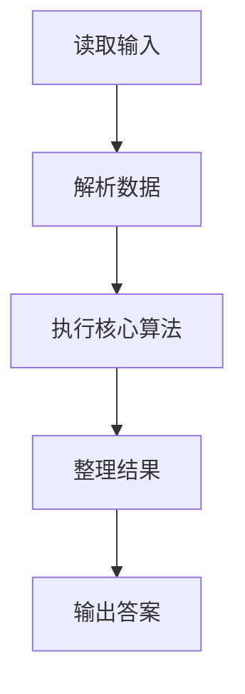
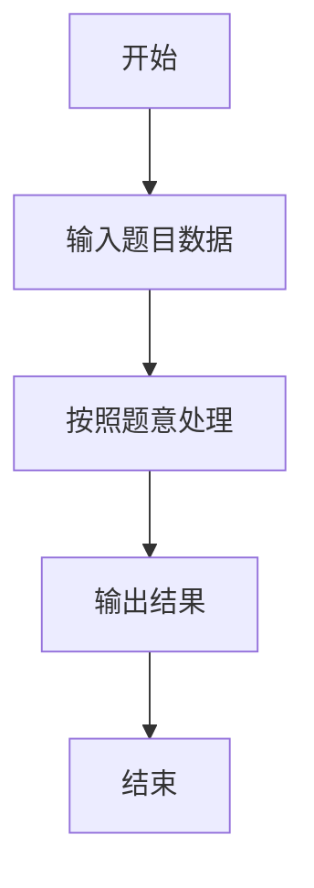

# L3-025 - 那就别担心了（30 分）

- **时间限制**: 400 ms
- **内存限制**: 65536 KB
- **代码长度限制**: 16 KB

---

## 题目描述


下图转自“英式没品笑话百科”的新浪微博 —— 所以无论有没有遇到难题，其实都不用担心。


博主将这种逻辑推演称为“逻辑自洽”，即从某个命题出发的所有推理路径都会将结论引导到同一个最终命题（开玩笑的，千万别以为这是真正的逻辑自洽的定义……）。现给定一个更为复杂的逻辑推理图，本题就请你检查从一个给定命题到另一个命题的推理是否是“逻辑自洽”的，以及存在多少种不同的推理路径。例如上图，从“你遇到难题了吗？”到“那就别担心了”就是一种“逻辑自洽”的推理，一共有 3 条不同的推理路径。

### 输入格式:

输入首先在一行中给出两个正整数 $$N$$（$$1 < N \le 500$$）和 $$M$$，分别为命题个数和推理个数。这里我们假设命题从 1 到 $$N$$ 编号。

接下来 $$M$$ 行，每行给出一对命题之间的推理关系，即两个命题的编号 `S1 S2`，表示可以从 `S1` 推出 `S2`。题目保证任意两命题之间只存在最多一种推理关系，且任一命题不能循环自证（即从该命题出发推出该命题自己）。

最后一行给出待检验的两个命题的编号 `A B`。

### 输出格式:

在一行中首先输出从 `A` 到 `B` 有多少种不同的推理路径，然后输出 `Yes` 如果推理是“逻辑自洽”的，或 `No` 如果不是。

题目保证输出数据不超过 $$10^9$$。

### 输入样例 1：
```in
7 8
7 6
7 4
6 5
4 1
5 2
5 3
2 1
3 1
7 1
```

### 输出样例 1：
```out
3 Yes
```

### 输入样例 2：
```in
7 8
7 6
7 4
6 5
4 1
5 2
5 3
6 1
3 1
7 1
```

### 输出样例 2：
```out
3 No
```

## 示例

### 示例 1

**输入:**
```
7 8
7 6
7 4
6 5
4 1
5 2
5 3
2 1
3 1
7 1
```

**输出:**
```
3 Yes
```

### 示例 2

**输入:**
```
7 8
7 6
7 4
6 5
4 1
5 2
5 3
6 1
3 1
7 1
```

**输出:**
```
3 No
```

### 解题思路

本题的 Ruby 实现采用图遍历或搜索。程序先读取题目输入，建立与题意对应的数据结构，按照约束完成核心计算，并按规定格式输出结果。具体实现以同目录的 main.rb 为准。

### 代码流程说明

1. 读取并解析标准输入，转换为题目所需的数据结构。
2. 按题意执行核心算法，维护中间状态并处理边界情况。
3. 整理计算结果，按照输出格式生成答案。

### 代码实现

完整实现位于同目录的 [main.rb](./L3-025_那就别担心了/main.rb)，以下代码与该入口文件保持一致。

```ruby
# frozen_string_literal: true
require_relative '../gplt_runtime'
v = py_tokens.map(&:to_i)
n, m = v.shift(2)
graph = Array.new(n + 1) { [] }
m.times { graph[v.shift] << v.shift }
s, target = v.shift(2)
reachable = Array.new(n + 1, false)
queue = [s]; reachable[s] = true
until queue.empty?
  u = queue.shift
  graph[u].each { |w| next if reachable[w]; reachable[w] = true; queue << w }
end
unless reachable[target]
  py_print('0 No')
  exit
end
color = Array.new(n + 1, 0)
cycle = false
dfs = lambda do |u|
  color[u] = 1
  graph[u].each do |w|
    next unless reachable[w]
    cycle = true if color[w] == 1
    dfs.call(w) if color[w].zero?
  end
  color[u] = 2
end
n.times { |i| dfs.call(i + 1) if reachable[i + 1] && color[i + 1].zero? }
can = Array.new(n + 1, false)
can[target] = true
reverse = Array.new(n + 1) { [] }
graph.each_with_index { |edges, u| edges.each { |w| reverse[w] << u } }
queue = [target]
until queue.empty?
  u = queue.shift
  reverse[u].each { |w| next if can[w]; can[w] = true; queue << w }
end
consistent = !cycle && (1..n).all? { |i| !reachable[i] || can[i] }
indeg = Array.new(n + 1, 0)
(1..n).each { |u| graph[u].each { |w| indeg[w] += 1 if reachable[u] && reachable[w] } }
queue = (1..n).select { |i| reachable[i] && indeg[i].zero? }
order = []
until queue.empty?
  u = queue.shift; order << u
  graph[u].each do |w|
    next unless reachable[w]
    indeg[w] -= 1
    queue << w if indeg[w].zero?
  end
end
paths = Array.new(n + 1, 0); paths[s] = 1
order.each { |u| graph[u].each { |w| paths[w] += paths[u] if reachable[w] && u != target } }
py_print("#{paths[target]} #{consistent ? 'Yes' : 'No'}")
```

### 代码流程图



### 解题流程图


