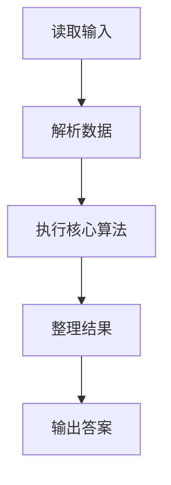
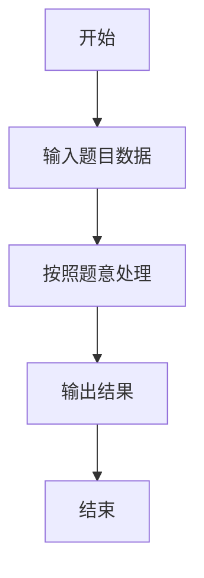

# L3-026 - 传送门（30 分）

- **时间限制**: 3500 ms
- **内存限制**: 524288 KB
- **代码长度限制**: 16 KB

---

## 题目描述


平面上有 $$2n$$ 个点，它们的坐标分别是 $$(1, 0), (2, 0), \cdots (n, 0)$$ 和 $$(1, 10^9), (2, 10^9), \cdots, (n, 10^9)$$。我们称这些点中所有 $$y$$ 坐标为 $$0$$ 的点为“起点”，所有 $$y$$ 坐标为 $$10^9$$ 的点为终点。一个机器人将从坐标为 $$(x, 0)$$ 的起点出发向 $$y$$ 轴正方向移动。显然，该机器人最后会到达某个终点，我们设该终点的 $$x$$ 坐标为 $$f(x)$$。

在上述条件下，显然有 $$f(x) = x$$。不过这样的数学模型就太无趣了，因此我们对上述数学模型做一些小小的改变。我们将会对模型进行 $$q$$ 次修改，每一次修改都是以下两种操作之一：

* \+ $$x'$$ $$x''$$ $$y$$: 在 $$(x', y)$$ 与 $$(x'', y)$$ 处增加一对传送门。当机器人碰到其中一个传送门时，它会立刻被传送到另一个传送门处。数据保证进行该操作时，$$(x', y)$$ 与 $$(x'', y)$$ 处当前不存在传送门。
* \- $$x'$$ $$x''$$ $$y$$: 移除 $$(x', y)$$ 与 $$(x'', y)$$ 处的一对传送门。数据保证这对传送门存在。

求每次修改后 $$\sum\limits_{x=1}^n xf(x)$$ 的值。

### 输入格式:

第一行输入两个整数 $$n$$ 与 $$q$$ ($$2 \le n \le 10^5$$, $$1 \le q \le 10^5$$)，代表起点和终点的数量以及修改的次数。

接下来 $$q$$ 行中，第 $$i$$ 行输入一个字符 $$op_i$$ 以及三个整数 $$x'_i$$, $$x''_i$$ and $$y_i$$ ($$op_i \in \{\text{`+' (ascii: 43)}, \text{`-' (ascii: 45)}\}$$, $$1 \le x'_i < x''_i \le n$$, $$1 \le y_i < 10^9$$)，代表第 $$i$$ 次修改的内容。修改顺序与输入顺序相同。

### 输出格式:

输出 $$q$$ 行，其中第 $$i$$ 行包含一个整数代表第 $$i$$ 次修改后的答案。

### 输入样例:
```in
5 4
+ 1 3 1
+ 1 4 3
+ 2 5 2
- 1 4 3
```

### 输出样例:
```out
51
48
39
42
```

## 示例

### 示例 1

**输入:**
```
5 4
+ 1 3 1
+ 1 4 3
+ 2 5 2
- 1 4 3
```

**输出:**
```
51
48
39
42
```

### 解题思路

本题的 Ruby 实现采用排序、贪心与顺序模拟。程序先读取题目输入，建立与题意对应的数据结构，按照约束完成核心计算，并按规定格式输出结果。具体实现以同目录的 main.rb 为准。

### 代码流程说明

1. 读取并解析标准输入，转换为题目所需的数据结构。
2. 按题意执行核心算法，维护中间状态并处理边界情况。
3. 整理计算结果，按照输出格式生成答案。

### 代码实现

完整实现位于同目录的 [main.rb](./L3-026_传送门/main.rb)，以下代码与该入口文件保持一致。

```ruby
# frozen_string_literal: true
require_relative '../gplt_runtime'
v = py_input_data.split
n, q = v.shift(2).map(&:to_i)
active = {}
answers = []
q.times do
  op = v.shift
  x, y, level = v.shift(3).map(&:to_i)
  key = [x, y, level]
  op == '+' ? active[key] = true : active.delete(key)
  where = (0..n).to_a
  active.keys.sort_by { |_, _, l| l }.each do |a, b, _|
    where[a], where[b] = where[b], where[a]
  end
  answers << (1..n).sum { |i| i * where[i] }
end
py_print(answers.join("\n"))
```

### 代码流程图



### 解题流程图


