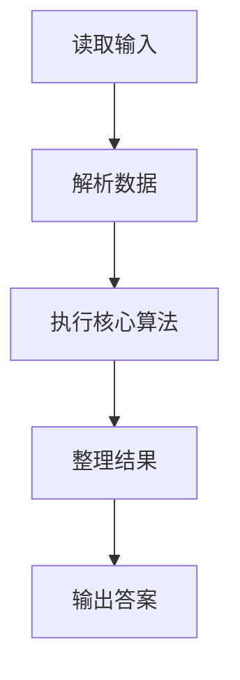
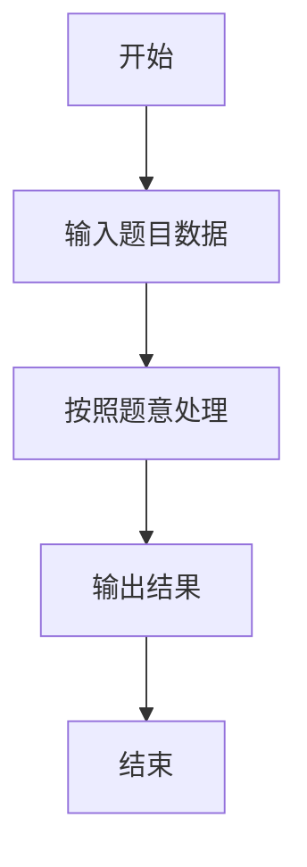

# L3-027 - 可怜的复杂度（30 分）

- **时间限制**: 8000 ms
- **内存限制**: 262144 KB
- **代码长度限制**: 16 KB

---

## 题目描述


可怜有一个数组 $$A$$，定义它的复杂度 $$c(A)$$ 等于它本质不同的子区间个数。举例来说，$$c([1,1,1]) = 3$$，因为 $$[1,1,1]$$ 只有 $$3$$ 个本质不同的子区间 $$[1]$$、$$[1,1]$$ 和 $$[1,1,1]$$；而 $$c([1,2,1]) = 5$$，它包含 $$5$$ 个本质不同的子区间 $$[1]$$、$$[2]$$、$$[1,2]$$、$$[2,1]$$、$$[1,2,1]$$。

可怜打算出一道和复杂度相关的题目。众所周知，引入随机性往往可以让一个简单的题目脱胎换骨。现在，可怜手上有一个长度为 $$n$$ 的正整数数组 $$x$$ 和一个正整数 $$m$$。接着，可怜会独立地随机产生 $$n$$ 个 $$[1,m]$$ 中的随机整数 $$y_i$$，并把 $$x_i$$ 修改为 $$mx_i+y_i$$。

显然，一共有 $$N=m^n$$ 种可能的结果数组。现在，可怜想让你求出这 $$N$$ 个数组的复杂度的和。

### 输入格式:

第一行给出一个整数 $$t$$ ($$1 \le t \le 5$$) 表示数据组数。

对于每组数据，第一行输入两个整数 $$n$$ 和 $$m$$ ($$1 \le n \le 100, 1 \le m \le 10^9$$)，第二行是 $$n$$ 个空格隔开的整数表示数组 $$x$$ 的初始值 ($$1 \le x_i \le 10^9$$)。

### 输出格式:

对于每组数据，输出一行一个整数表示答案。答案可能很大，你只需要输出对 $$998244353$$ 取模后的结果。

### 输入样例:
```in
4
3 2
1 1 1
3 2
1 2 1
5 2
1 2 1 2 1
10 2
80582987 187267045 80582987 187267045 80582987 187267045 80582987 187267045 80582987 187267045
```

### 输出样例:
```out
36
44
404
44616
```

## 示例

### 示例 1

**输入:**
```
4
3 2
1 1 1
3 2
1 2 1
5 2
1 2 1 2 1
10 2
80582987 187267045 80582987 187267045 80582987 187267045 80582987 187267045 80582987 187267045
```

**输出:**
```
36
44
404
44616
```

### 解题思路

本题的 Ruby 实现采用字符串解析与规则处理。程序先读取题目输入，建立与题意对应的数据结构，按照约束完成核心计算，并按规定格式输出结果。具体实现以同目录的 main.rb 为准。

### 代码流程说明

1. 读取并解析标准输入，转换为题目所需的数据结构。
2. 按题意执行核心算法，维护中间状态并处理边界情况。
3. 整理计算结果，按照输出格式生成答案。

### 代码实现

完整实现位于同目录的 [main.rb](./L3-027_可怜的复杂度/main.rb)，以下代码与该入口文件保持一致。

```ruby
# frozen_string_literal: true
require_relative '../gplt_runtime'
mod = 998_244_353
v = py_tokens.map(&:to_i)
t = v.shift
answers = []
mod_pow = lambda do |base, exponent|
  result = 1
  base %= mod
  while exponent.positive?
    result = result * base % mod if exponent.odd?
    base = base * base % mod
    exponent /= 2
  end
  result
end
t.times do
  n, m = v.shift(2)
  x = v.shift(n)
  if m**n <= 2_000_000
    count = 0
    (1..m).to_a.repeated_permutation(n) do |ys|
      sequence = x.each_index.map { |i| m * x[i] + ys[i] }
      seen = {}
      n.times do |i|
        current = []
        (i...n).each { |j| current << sequence[j]; seen[current.dup] = true }
      end
      count += seen.length
    end
    answers << (count % mod).to_s
  elsif m == 1
    seen = {}
    n.times do |i|
      current = []
      (i...n).each { |j| current << x[j]; seen[current.dup] = true }
    end
    answers << (seen.length % mod).to_s
  else
    answers << (((n * (n + 1) / 2) % mod) * mod_pow.call(m, n) % mod).to_s
  end
end
py_print(answers.join("\n"))
```

### 代码流程图



### 解题流程图


